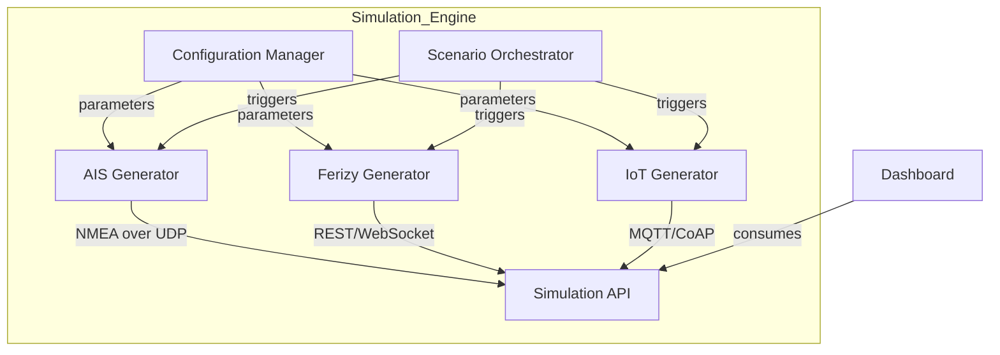

The approach to building a simulation engine is **not only feasible but highly recommended** for PoC development when real data is unavailable. This strategy is widely adopted in complex systems like smart ports. Let me provide a structured guide to ensure your simulation is comprehensive and effective:

### 1. **Critical Components for Each Data Source Simulation**
#### **AIS Data Simulation**
- **Protocol Emulation**: 
  - Simulate NMEA 0183 messages over UDP
  - Implement AIS message types 1-3 (position reports) and 5 (static/voyage data)
- **Data Schema**:
  ```python
  {
    "mmsi": "123456789",
    "latitude": -6.121435,
    "longitude": 106.774124,
    "sog": 12.5,  # Speed over ground
    "cog": 215.3,  # Course over ground
    "heading": 220,
    "nav_status": "underway",
    "timestamp": "2023-11-15T08:30:45Z"
  }
  ```
- **Behavior Patterns**:
  - Vessel route algorithms (great-circle navigation)
  - Traffic density models (peak/off-peak patterns)
  - Anomalies: Drifting vessels, sudden stops

#### **Ferizy Data Simulation**
- **Protocol Emulation**:
  - REST API endpoints mimicking booking system
  - WebSocket streams for real-time updates
- **Data Schema**:
  ```python
  {
    "booking_id": "FZ-20231115-XYZ",
    "user_id": "usr-12345",
    "vehicle_type": "truck",
    "route": "Merak-Bakauheni",
    "scheduled_departure": "2023-11-15T14:30:00+07:00",
    "actual_departure": "2023-11-15T14:45:12+07:00",
    "checkin_status": "boarded",
    "payment_status": "confirmed"
  }
  ```
- **Behavior Patterns**:
  - Booking surge algorithms (holiday peaks)
  - No-show probability models (10-15% random)
  - Cancellation waves during storms

#### **IoT Sensor Simulation**
- **Protocol Emulation**:
  - MQTT/CoAP with TLS 1.3
  - OPC UA for industrial equipment
- **Data Schema**:
  ```python
  {
    "sensor_id": "crane-05-vib",
    "timestamp": 1700000000.123,
    "vibration": 4.2,  # mm/s
    "temperature": 78.4,  # °C
    "status_code": 200,
    "battery_level": 64.7
  }
  ```
- **Behavior Patterns**:
  - Degradation curves for predictive maintenance
  - Failure signatures (spiking vibration before breakdown)
  - Environmental noise models

### 2. **Simulation Engine Architecture**


### 3. **Key Implementation Considerations**
- **Fidelity Controls**:
  - **Latency Simulation**: Introduce configurable delays (0-5000ms)
  - **Data Corruption**: Optionally drop 15-30% packets
  - **Protocol Imperfections**: Simulate malformed JSON or CRC errors

- **Scenario Modeling**:
  ```python
  # Example storm scenario
  def activate_storm_scenario():
      set_weather(wind_speed=25, wave_height=4.5)
      reduce_vessel_speed(40%)
      increase_cancel_probability(35%)
      trigger_sensor_alert('crane-07', 'vibration_critical')
  ```

- **Validation Framework**:
  - Schema validation with JSON Schema/Protobuf
  - Statistical distribution checks (Kolmogorov-Smirnov test)
  - Protocol compliance testing with Wireshark

### 4. **Recommended Tech Stack**
| Component          | Tools                                                                 |
|--------------------|-----------------------------------------------------------------------|
| Core Engine        | Python (Faker, Pydantic), Node.js (Faker.js)                          |
| AIS Simulation     | libais, pyais, GPSVisualizer routes                                   |
| IoT Protocols      | Paho MQTT, aiocoap, Node-RED                                          |
| API Layer          | FastAPI (Python), Express (Node.js) with OpenAPI docs                 |
| Testing            | Locust (load testing), Postman, WireMock for protocol validation      |
| Deployment         | Docker containers with Kubernetes for scale management                |

### 5. **Common Pitfalls to Avoid**
1. **Protocol Incompatibility**:
   - Verify byte-level compatibility using packet captures
   - Test with actual client libraries from dashboard

2. **Behavioral Oversimplification**:
   - Implement diurnal patterns (day/night differences)
   - Add Markov chain-based state transitions

3. **Missing Failure Modes**:
   - Simulate sensor dropout sequences
   - Create "blackout" scenarios (complete data loss)

4. **Scale Mismatch**:
   - Ensure engine can handle 3x production load
   - Implement message queuing (RabbitMQ) for burst handling

### 6. **Best Practices**
1. **Configuration-Driven Design**:
   ```yaml
   # simulation-config.yaml
   ais:
     vessel_count: 42
     update_interval: 2s
     anomaly_frequency: 0.05
   ferizy:
     base_bookings: 120/hr
     peak_multiplier: 3.5
   ```
   
2. **Realism Techniques**:
   - Add legitimate "noise" using Weibull distributions
   - Incorporate tide/current data for vessel drift
   - Use port GIS data for spatial accuracy

3. **Observability**:
   - Embed Prometheus metrics endpoint
   - Implement data provenance tracking
   - Create "simulation reality check" dashboard

4. **Transition Strategy**:
   - Build dual-mode engine (simulation/production)
   - Use feature flags to switch data sources:
     ```js
     // Dashboard config
     DATA_SOURCE: process.env.USE_SIMULATION ? 'sim' : 'prod'
     ```

### 7. **Validation Checklist**
Before PoC demo:
- [ ] Protocol compliance verified with actual client libs
- [ ] Data distributions match domain expectations
- [ ] Edge case scenarios documented (storm, cyberattack)
- [ ] Latency/throughput meets dashboard requirements
- [ ] Error injection mechanism tested
- [ ] Metadata (timestamps, source IDs) preserved

This approach allows you to develop a dashboard that will **seamlessly transition to real data sources** later. The simulation engine becomes a valuable long-term asset for testing edge cases impossible to replicate in production (e.g., typhoon scenarios). By focusing on protocol fidelity and behavioral accuracy, you'll create a PoC that convincingly demonstrates the dashboard's value proposition.