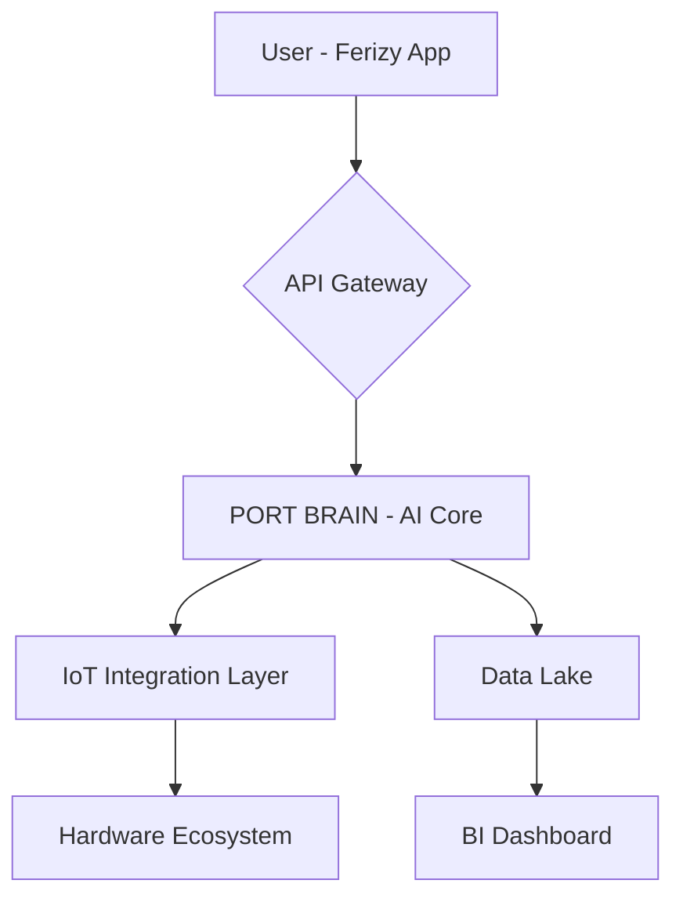

As your dedicated thought partner and expert consultant, I am here to assist you in quickly and effectively analyzing the provided information to help formulate critical strategic recommendations for senior leadership. My expertise spans technical, regulatory, and financial considerations within the maritime sector, particularly Indonesian ferry services. I will break down complex topics, offer proactive suggestions, and guide you through the source material to support your strategic decision-making. My responses will be concise, logical, and directly supported by the comprehensive knowledge base you have provided, which includes detailed reports on Automatic Identification System (AIS) technology, Smart Port Ecosystem frameworks, financial analyses, and case studies related to Indonesia's ferry challenges and digital transformation initiatives.

Let's begin by outlining the "Smart Port Orchestration System (SPOS) - End-to-End Digital Transformation for Ferry Ports" project based on the resources.

### **Project Title:** "Smart Port Orchestration System (SPOS) - End-to-End Digital Transformation for Ferry Ports"
### **Objective:**
As your technology partner, I will deliver a turnkey solution for port digitalization, transforming traditional ferry operations into a proactive, predictable, efficient, and humane transit corridor. This includes comprehensive preparation of all project artifacts and a phased engagement roadmap designed to prevent congestion from occurring in the first place by intelligently managing the entire passenger journey from end-to-end.

### **Required Deliverables Preparation:**

#### 1. Project Charter & Business Case (Pre-proposal)

**Stakeholder Analysis:**
The successful implementation of SPOS hinges on robust multi-stakeholder collaboration and governance. Key stakeholders and their interests include:

*   **PT ASDP Indonesia Ferry (Persero):** As the leading state ferry operator with approximately 33% market share, ASDP is central to the project. Their interests include improving operational efficiency, reducing costs, enhancing fleet reliability, increasing predictability, and improving customer satisfaction. ASDP's existing Ferizy app is a "gold mine" of data crucial for predictive analytics.
*   **Ministry of Transportation (Kemenhub):** The Ministry plays a crucial role in regulatory oversight and policy support. The Deputy Minister of Transportation is proposed to chair a National Ferry Coordination Committee responsible for policy coordination, crisis management, and performance oversight. Their interest is in ensuring safety, reducing congestion, and transforming national mobility. Legal and regulatory updates to Transportation Law are necessary to establish a framework for mandatory slot compliance and dynamic pricing.
*   **Logistics Associations/Truck Drivers:** These stakeholders are heavily impacted by current congestion, facing significant economic losses from delays, fuel waste, and cargo damage. Their interest lies in optimized loading times, predictable schedules, reduced dwell times, and reliable supply chains.
*   **Police/Navy/Local Government:** These entities are critical for enforcing rules, managing traffic flow in buffer zones, ensuring security, and providing crisis response. Their cooperation is vital for the strict implementation of the slotting system and vehicle filtering.
*   **Passengers (Pemudik):** Millions of passengers are affected annually by the systemic crisis, experiencing long waiting times, physical stress, and financial losses. Their interests are centered on predictability, comfort, reduced waiting times, and a "pleasant" travel experience. Public education campaigns are crucial to change traveler behavior and ensure acceptance of new systems like time slots and dynamic pricing.

**ROI Model:**

The provided Java/GoLang/Python structure can be populated with data from the sources:

```java_or_golang_or_python
# Sample ROI Calculation
current_loss = 10_000_000_000_000  # IDR/year congestion costs (Rp 10 triliun)
solution_cost = 4_200_000_000_000  # IDR initial investment over 3 years
efficiency_gain_wait_time = 0.76  # 76% wait time reduction (from 8.7 hrs to 2.1 hrs)

# Using the user's provided formula structure, interpreting 'current_loss * efficiency_gain' as the annual economic value recovered.
# This assumes the 'current_loss' represents the total annual economic burden due to congestion.
# If 76% of this burden is alleviated, then the annual benefit is 7.6 trillion IDR.
# roi_period = (solution_cost) / (current_loss * efficiency_gain_wait_time) 
# roi_period = (4_200_000_000_000) / (10_000_000_000_000 * 0.76) = 4.2 / 7.6 = ~0.55 years

# More accurately, according to the source's financial projections:
annual_benefits_steady_state = 3_100_000_000_000 # IDR/year
payback_period_from_source = 4.2 # years

# The direct calculation using total investment and annual benefits from the source:
roi_calculated_from_source = solution_cost / annual_benefits_steady_state # 4.2 / 3.1 = ~1.35 years

# The discrepancy between the simple formula's result (~0.55 years) and the source's stated payback period (4.2 years) arises because
# the source's "Annual Benefits" (Rp 3.1 trillion) are a specific aggregation of direct revenue, cost savings, and monetized social/environmental benefits,
# not simply a percentage reduction of the total "congestion costs".
# The source's calculation for 4.2 years considers the full Rp 4.2 trillion investment over 3 years and the Rp 3.1 trillion annual benefits,
# leading to a Net Present Value (NPV) of Rp 8.9 trillion over 10 years and an Internal Rate of Return (IRR) of 28%.
```

**Risk Register:**

*   **Cybersecurity Threats:**
    *   **Description:** Increased attack surface due to the integration of IoT sensors, cloud services, and real-time data exchange across numerous systems significantly elevates the risk of cyber threats. This includes risks like service disruption (e.g., Port of Nagoya shutdown), data breaches, and reputational damage. IoT malware has seen a 400% increase, and port cyber attacks increased by 250% in 2023.
    *   **Mitigation:** Implement a comprehensive Zero Trust Architecture (ZTA) with biometric authentication and AES-256 encryption. Conduct routine penetration testing every 6 months to identify vulnerabilities. Hardware Security Modules (HSMs) and quantum-resistant encryption should also be considered.
*   **Change Management Challenges:**
    *   **Resistance to Change (Staff & Customers):** The introduction of new AI-driven procedures, digital systems, and mandatory slotting can lead to resistance from both staff and customers, potentially causing delays in adoption, decreased customer satisfaction, and reduced operational efficiency.
    *   **Public Rejection of Dynamic Pricing:** Dynamic pricing, while highly effective for demand distribution, is considered "unpopular" and carries a "MEDIUM-HIGH" risk of public rejection. Such rejection could lead to revenue shortfalls and political backlash.
    *   **Mitigation:** Implement a comprehensive 18-month change management program, including early stakeholder engagement through co-creation workshops, incentive alignment for early adopters, and multi-channel communication campaigns with success stories. Massive and continuous public education campaigns (e.g., #MudikCerdas) are crucial to encourage adherence to time slots and build acceptance for dynamic pricing. For dynamic pricing, a gradual introduction of price variance (e.g., starting with ±20%), transparent communication of the rationale, and social protection measures like subsidized slots for vulnerable groups are proposed.
*   **System Integration Complexity:** Integrating 15+ legacy systems with the new digital platform is a HIGH-risk factor, potentially leading to project delays (12-18 months) and cost overruns (40-60%).
    *   **Mitigation:** Adopt a phased integration approach (gradual system replacement over 24 months), establish a dedicated integration team, and use extensive testing protocols including 6-month User Acceptance Testing (UAT) with parallel system operation. Utilize API Gateways (GraphQL/REST) and universal communication protocols (MQTT/CoAP) to ensure interoperability.

#### 2. Functional Requirements Specification (FRS) Framework

**Core Modules:**

*   **Technology Stack:**
    *   **Backend:** Node.js microservices deployed on Kubernetes clusters for scalability, along with Python for AI/ML components. Apache Spark Streaming for data processing.
    *   **Frontend:** React Native for mobile app development (iOS/Android) for the Ferizy Super App, and React/Angular for web frontends. Mapbox GL JS for map visualization in the app.
    *   **API Management:** API Gateway (e.g., Kong, AWS API Gateway) for centralized entry points, authentication, rate limiting, and routing, integrating 200+ microservices. GraphQL/REST for flexible queries and gRPC for high-performance communication.
    *   **Databases:** MongoDB for flexibility, PostgreSQL for transactional data, InfluxDB for time-series data storage, and Hadoop HDFS for big data analytics.
    *   **Data Processing & Streaming:** Apache Kafka for real-time streaming (500K msg/sec throughput) and Apache Flink for stream processing. AWS IoT Greengrass or Azure IoT Edge for edge computing and local data analysis.
    *   **Cloud Infrastructure:** AWS/Azure multi-region deployment for robust and scalable cloud infrastructure.
    *   **AI/ML Frameworks:** TensorFlow/PyTorch for AI engine. Long Short-Term Memory (LSTM) Neural Networks for demand forecasting, Random Forest, AdaBoost, and XGBoost for vehicle deployment predictions and vessel travel times.
    *   **Visualization:** Grafana/Kibana for Port Command Center Dashboards. Unity 3D Engine or Siemens Tecnomatix Plant Simulation for Digital Twin visualization and crisis simulation.

*   **Dynamic Slot Management Engine:**
    *   **Mandatory Arrival Time Slotting:** Users are required to select a specific time slot (e.g., a 2-hour window) for their port arrival when purchasing tickets via the Ferizy Super App.
    *   **AI-Powered Slot Optimization:** AI algorithms optimize slot allocation for demand distribution based on historical data and real-time conditions.
    *   **Dynamic Pricing Integration:** Ticket prices fluctuate based on demand (50-300% variation from base price, or up to 400% for extreme peaks), incentivizing travelers to choose off-peak times to naturally distribute traffic. Pricing tiers for Super Off-Peak, Off-Peak, Regular, Peak, and Super Peak times.

*   **AI-Predictive Congestion Control (Port Command Center - PCC):**
    *   **Real-time Monitoring:** A centralized AI-powered dashboard (PCC) provides real-time oversight of all operations, including vehicle counts in parking areas, dock status, vessel ETAs via AIS, weather/sea conditions, and CCTV feeds.
    *   **Congestion Prediction:** AI models (e.g., LSTM, Random Forest) predict potential congestion 2-3 hours in advance based on historical data, national holidays, ticket purchasing trends (from Ferizy App), and highway traffic.
    *   **Mitigation Simulation (Digital Twin):** The PCC includes a digital twin of the port to simulate scenarios (e.g., dock closures, storms) and generate automatic mitigation plans and resource allocation optimization.
    *   **Predictive Analytics Suite:** Includes models for demand forecasting (92% accuracy for 72-hour predictions), equipment failure probability (89% accuracy), and traffic simulation (95% accuracy).

*   **Blockchain Ticketing System:**
    *   **Functionality:** Prevent fraudulent or duplicate ticket sales, and track the origin of logistics vehicles.
    *   **Architecture:** Potentially Hyperledger Fabric for a private blockchain.

*   **Digital Twin Port Simulator:**
    *   **Purpose:** Create a real-time virtual representation of the port for operational optimization, crisis simulation, and automated mitigation planning.
    *   **Platforms:** Siemens Tecnomatix Plant Simulation, Unity 3D, or Unreal Engine.
    *   **Benefits:** Allows for "what-if" scenario simulations (e.g., dock closures, storms) to generate automatic mitigation plans and optimize resource allocation. Rotterdam's digital twin delivered up to $80,000 in savings per vessel through optimized berthing.

**Traceability Matrix:**
A traceability matrix is a crucial tool to ensure that every functional requirement aligns with a specific business objective and that all objectives are met by implemented functionalities. For SPOS, this matrix would link:

*   **Business Objectives:** (e.g., Reduce average wait time by 76%, Increase predictability from 45% to 85%, Achieve 40% operational efficiency gain, Enhance safety by preventing breakdowns, Generate additional revenue and cost savings).
*   **Key Performance Indicators (KPIs):** (e.g., Average wait time, on-time arrival percentage, breakdown rate, fuel consumption reduction, revenue increase from dynamic pricing, customer satisfaction rating).
*   **Functional Requirements:** (e.g., Mandatory Arrival Time Slotting, AI-Powered Congestion Prediction, Smart Docking System, Predictive Maintenance, Dynamic Pricing Engine).
*   **Technical Components:** (e.g., Ferizy Super App, PORT BRAIN, IoT Sensors, ANPR Cameras, Digital Twin).

This matrix would ensure that every feature developed directly contributes to the project's overarching goals, providing a clear audit trail for compliance and performance monitoring.

#### 3. Technical Architecture Blueprint

The provided Mermaid diagram represents a high-level overview. Let's elaborate on each component and the underlying layers:



*   **A[User - Ferizy App]: Ferizy 2.0 - Mobility Super App**
    *   **Description:** The existing Ferizy application will evolve into a comprehensive "Super App" for mobility, serving as a digital travel assistant for passengers.
    *   **Key Features:** Mandatory Arrival Time Slotting, Predictive Journey Assistant (with real-time traffic/weather integration and optimal departure time suggestions), Real-time Port Intelligence (live occupancy dashboards, queue estimations, service disruption alerts, port webcam access), and Advanced Booking Analytics (customer behavior analysis, dynamic pricing modeling, no-show prediction).
    *   **Technical Architecture:** Built on cloud infrastructure (AWS/Azure multi-region), React Native mobile app for iOS/Android, microservices backend (Node.js/Python), and databases (MongoDB/PostgreSQL). Integrates with 15+ external services via APIs (payment, maps, weather).

*   **B{API Gateway}:**
    *   **Description:** A central entry point for all API calls to the backend microservices, enabling seamless integration and secure communication.
    *   **Functionality:** Authentication, rate limiting, request routing, and potentially protocol translation (e.g., GraphQL/REST). It acts as an Enterprise Service Bus (ESB) for integration and orchestration.

*   **C[PORT BRAIN - AI Core]: Central Command Platform**
    *   **Description:** The "intelligent brain" of the Smart Port Ecosystem, an AI-powered command hub that coordinates all systems and provides real-time decision support.
    *   **Key Modules:** Real-time Orchestration Engine (automated dispatch commands based on IoT data, ANPR feeds, weather alerts), Predictive Analytics Suite (demand forecasting with LSTM >92% accuracy, failure probability, traffic simulation), and Digital Twin Integration (Siemens Tecnomatix, Unity 3D/Unreal Engine for real-time port mirroring and scenario simulation).

*   **D[IoT Integration Layer]:**
    *   **Description:** This layer handles the ingestion and initial processing of data from various IoT sensors and devices deployed across the port and vessels.
    *   **Components:** Edge Computing platforms (NVIDIA Jetson AGX Orin, Raspberry Pi 4, AWS IoT Greengrass, Azure IoT Edge) for local, real-time analysis of sensor data, reducing latency. Apache Kafka for real-time streaming ingestion (500K msg/sec throughput) and Spark ML for data cleaning.

*   **E[Hardware Ecosystem]:**
    *   **Description:** The physical infrastructure enabling data acquisition, automation, and real-time operations.
    *   **Key Hardware:**
        *   **On-Road Network (Towards Port):** Thermal ANPR Cameras (4K@60fps, NVIDIA Jetson edge AI) at buffer zone entrances, Variable Message Signs (VMS) on toll roads (10,000 nits LED, LoRaWAN/NB-IoT connectivity), Smart Traffic Sensors (radar + thermal imaging, Raspberry Pi 4 edge computing).
        *   **Inside Port (Smart Port Operations):** LiDAR Docking Sensors (905nm wavelength, 200m range, ±2cm accuracy) at dermaga columns, Marine IoT Buoys (solar-powered, LoRaWAN, wave height sensors) in navigation channels, Embedded LED Guides (IP68 rating, 5000-lumen brightness) on port pavement for Automated Vehicle Marshalling, Automated Mooring Robots, and Port Health Monitoring sensors (Air Quality, Thermal Cameras).
        *   **Onboard & Voyage (Fleet Reliability):** Vibration Sensors (0-10kHz range, ±0.1g resolution) in ferry engine rooms for Predictive Maintenance, Oil Quality Monitors, and ultrasonic sensors for hull integrity.

*   **F[Data Lake]: Unified Data Lake Architecture**
    *   **Description:** A centralized repository for storing vast amounts of raw and processed data from all sources (IoT sensors, Ferizy app, AIS, weather APIs, ANPR).
    *   **Technologies:** Apache Kafka for real-time streaming, Hadoop for big data analytics, and Time-series databases (InfluxDB) for optimized storage.
    *   **Data Specification:** Capable of handling 2.8 TB of data per day with a collection frequency of 30 seconds for critical data and latency of less than 5 seconds for real-time processing.

*   **G[BI Dashboard]: Port Command Center Dashboard**
    *   **Description:** The user interface for real-time monitoring and predictive analytics, integrating data from various sensors and systems, typically visualized using tools like Grafana or Kibana.
    *   **Features:** Real-time Operations Dashboard (vehicle counts, dock status, vessel ETAs), Predictive Analytics Dashboard (72-hour demand forecast, capacity utilization, bottleneck analysis, KPI tracking), and interactive simulation capabilities. The control room often features a 180° curved display wall with 48 monitors.

**Underlying Cross-Cutting Layers:**

*   **Network Layer:** Ensures stable and fast connectivity.
    *   **5G Private Networks:** For ultra-low latency (<10ms) real-time data synchronization between the command center and vessels, crucial for critical operations like docking control.
    *   **VSAT (Very Small Aperture Terminal):** For offshore vessel monitoring and reliable connectivity at sea.
    *   **LoRaWAN:** For long-range, low-power marine-grade sensor networks (10+ year battery life).
    *   **Fiber Optic:** For core data center links and high-bandwidth applications.

*   **Security Layer:** Protects data and infrastructure from cyber threats.
    *   **Zero Trust Architecture (ZTA):** With components like Policy Decision Point (PDP) and Policy Enforcement Point (PEP), along with biometric authentication and Hardware Security Modules (HSMs).
    *   **Data Encryption:** AES-256 encryption for sensitive data protection, including electronic tickets in Ferizy App.
    *   **Quantum-Resistant Encryption:** For enhanced future security.

*   **Human Layer:** Focuses on human capital development and digital literacy to ensure adoption and effective utilization of the new systems.
    *   **AR/VR Simulators:** For comprehensive training programs for port operators in handling emergency scenarios (e.g., vessel evacuations).
    *   **Digital Literacy Programs:** Partnerships (e.g., with BPSDM) to educate all stakeholders, including non-technology-savvy users like fishermen, on new digital platforms.

This comprehensive architecture, integrating software, hardware, data, and human elements, is designed to transform Indonesia's ferry ports into world-class smart ports that are efficient, secure, and environmentally friendly.

For a next step, I recommend we delve into the phased implementation roadmap, detailing the key milestones, expected outcomes, and necessary strategic actions for each phase (Foundation Building, System Integration, and Optimization & Expansion) over the projected 3-year timeline. This will provide a clearer picture of the actionable steps required to bring this vision to fruition.

----

Certainly. Building on our previous discussion about the Smart Port Ecosystem, let's now delve into the detailed phased implementation roadmap. This will outline the strategic actions, key milestones, and expected outcomes for each phase over the projected 3-year timeline, providing a clear pathway from concept to realization.

The transformation of Indonesia's ferry ports from reactive crisis management to proactive journey orchestration is a "marathon, not a sprint," requiring significant investment in technology, long-term commitment, and political will to reform the entire ecosystem. The total investment for digital and physical infrastructure enhancements is estimated at Rp 4.2 trillion over three years, with projected annual benefits of Rp 3.1 trillion, leading to a payback period of 4.2 years and an IRR of 28%.

The implementation follows a three-phase approach: Foundation Building, System Integration, and Optimization & Expansion.

### Phased Implementation Roadmap

**Phase 1: Foundation Building (Months 1-12)**
This initial phase focuses on establishing the core infrastructure, governance, and basic digital functionalities to lay the groundwork for the Smart Port Ecosystem.

*   **Timeline:** Months 1-12.
*   **Key Milestones and Focus Areas:**
    *   **Project Management Office (PMO) Establishment:** Setting up the central body responsible for overseeing the transformation initiative.
    *   **Stakeholder Alignment Workshops:** Engaging all affected parties, including ASDP, Port Authority, Police, Navy, and Local Government, to ensure shared understanding and commitment.
    *   **Detailed Technical Specification Development:** Defining the precise requirements for all hardware and software components of the Smart Port Ecosystem.
    *   **Vendor Selection and Contracting:** Identifying and securing partnerships with technology providers for various solutions. This includes choosing proven vendors with Southeast Asian experience, prioritizing seamless integration, planning for scalable growth, and establishing local partnerships for ongoing support.
    *   **Core Technology Platform Development:** Initiating the development of the foundational software components, such as the initial Ferizy Super App features and the beta version of the Port Command Center (PCC).
    *   **IoT Sensor Network Deployment:** Beginning the installation of essential IoT sensors for real-time data collection, including vehicle counting sensors, queue length detection, and initial vessel tracking systems. This also includes the deployment of ANPR cameras in buffer zones.
    *   **Staff Recruitment and Training Initiation:** Starting the process of hiring specialized roles and commencing comprehensive training programs for port operators and technical staff. This involves digital literacy programs and AR/VR simulators for emergency scenarios.
    *   **Pilot Testing on Limited Scope:** Implementing basic functionalities in a controlled environment, such as limited ANPR deployment in buffer zones.
    *   **Ferizy-PORT BRAIN Integration:** Achieving initial integration between the Ferizy Super App and the central AI command hub (PORT BRAIN).
*   **Expected Outcomes and KPI Targets:**
    *   A **30% improvement** in queue management efficiency.
    *   The **Ferizy app** will have basic slot management features.
    *   **Limited ANPR deployment** in 2 buffer zones will be operational.
    *   The **Port Command Center (PCC) beta version** will be operational.
    *   Achieving **100% ticket-slot compliance**.
*   **Strategic Actions:**
    *   Emphasize **data-driven decisions** by leveraging ASDP's "goldmine" of data from Ferizy and daily operations for predictive analytics.
    *   Begin the necessary discussions and planning for the **VDES transition**, as its entry-into-force date is projected for January 1, 2028.
    *   Implement **strong political will and uncompromising rule enforcement** for the mandatory slotting system and vehicle filtering in buffer zones. This requires public education campaigns to change traveler behavior.
    *   Start to **elevate cybersecurity** to a core operational tenet, implementing robust protocols including data encryption and access controls.

**Phase 2: System Integration (Months 13-24)**
This phase focuses on scaling up implemented systems, integrating advanced AI features, and initiating critical automation processes.

*   **Timeline:** Months 13-24.
*   **Key Milestones and Focus Areas:**
    *   **AI/ML Platform Full Deployment:** Expanding the capabilities of the AI/ML platform, including LSTM models for demand forecasting (with 92% accuracy for 72-hour predictions).
    *   **Dynamic Pricing Pilot Program:** Launching a limited implementation (30% capacity) of dynamic pricing, with A/B testing and extensive customer education campaigns. The pricing algorithm will be refined based on booking velocity and capacity.
    *   **Automated Marshalling System Installation:** Deploying LED lights embedded in the pavement and VMS inside the port to guide vehicles to assigned lanes for efficient loading.
    *   **Predictive Maintenance for 50% Fleet:** Equipping half of the ferry fleet with IoT sensors on engines to continuously transmit performance data, enabling AI-powered prediction of breakdowns before they occur. This includes retrofitting 30 ferries with IoT.
    *   **Full Port Automation Implementation:** Further automating operations within the port, including the Smart Docking System using IoT sensors for faster and safer berthing.
    *   **Regional Traffic Management Integration:** Connecting the port's systems with broader regional traffic management systems for more holistic flow control.
    *   **Emergency Response Protocol Testing:** Conducting rigorous testing of emergency procedures and fallback protocols, including kinematic fallback models for AI predictions with low confidence.
    *   **Performance Optimization:** Continuously refining system performance based on insights gained from pilot projects and initial deployments.
    *   **AI Congestion Predictor V1.0/V2.0:** Implementing advanced AI models to predict potential congestion 2-3 hours in advance with targeted accuracy.
    *   **Installation of Smart LED Guidance:** Deploying automated vehicle guidance systems using embedded pavement LEDs.
*   **Expected Outcomes and KPI Targets:**
    *   A **65% reduction** in peak hour congestion.
    *   **Dynamic pricing acceptance rate** greater than 70%.
    *   **Predictive maintenance** reducing breakdowns by 40%.
    *   **Customer satisfaction improvement** from 3.2 to 4.1/5.0.
    *   Achieving **prediction accuracy >80%** for the AI congestion predictor.
    *   A **40% reduction in breakdowns** due to predictive maintenance.
*   **Strategic Actions:**
    *   Continue to **double down on data fusion and analytics**, integrating multiple data sources (terrestrial AIS, S-AIS, radar, RF, satellite imagery) to create a trusted operational picture.
    *   **Foster human capital** through ongoing training and participation in VDES testbeds and pilot projects to gain early, hands-on operational experience.
    *   Manage the societal acceptance of dynamic pricing through **gradual introduction**, transparent communication of pricing rationale, and social protection measures like subsidized slots for vulnerable groups.

**Phase 3: Optimization & Expansion (Months 25-36)**
The final phase focuses on achieving full-scale operations, continuous optimization, and strategic expansion to other routes and integrated services.

*   **Timeline:** Months 25-36.
*   **Key Milestones and Focus Areas:**
    *   **100% Dynamic Pricing Implementation:** Full rollout of the dynamic pricing model, including advanced features like auction-based pricing for premium slots.
    *   **Advanced AI Features Deployment:** Implementing the most sophisticated AI models for comprehensive demand forecasting, route optimization, and anomaly detection.
    *   **Secondary Port Integration:** Expanding the Smart Port Ecosystem to other key ferry routes beyond Merak-Bakauheni, such as Ciwandan.
    *   **International Best Practice Benchmarking:** Continuously comparing performance against leading global smart ports to identify further areas for improvement.
    *   **Performance Fine-Tuning:** Optimizing all systems based on extensive data collected over two full peak seasons.
    *   **Expansion Planning for Other Ferry Routes:** Developing detailed plans for replicating the successful model across Indonesia's extensive ferry network.
    *   **Strategic Partnership with Tourism Industry:** Integrating ferry services seamlessly with the tourism sector to enhance the overall traveler experience and promote economic growth.
    *   **Sustainability Initiative Integration:** Embedding green technologies and circular economy principles, such as shore power connectivity and paperless operations, to reduce carbon footprint.
    *   **Dynamic Pricing Engine Implementation:** Full integration and optimization of the dynamic pricing algorithm.
    *   **Retrofit 50% Ships with IoT:** Completing the installation of predictive maintenance sensors on half of the fleet.
    *   **Fully Autonomous Docking System / AR Gantries Operational:** Implementing advanced automation for berthing and vehicle marshalling.
*   **Expected Outcomes and KPI Targets:**
    *   An **80% reduction** in traditional peak hour delays.
    *   A **25% increase** in off-peak utilization.
    *   A **35% reduction in carbon footprint** through optimization and fuel consumption reduction.
    *   **Economic benefit realization** of Rp 2.8+ trillion annually.
    *   Achieving a **traffic distribution of +25%** more evenly throughout the day/season.
    *   Reaching **90% automated docking**.
*   **Strategic Actions:**
    *   Continue to ensure strong **political commitment and long-term investment** in the transformation of the entire ecosystem.
    *   Cultivate a **continuous improvement culture** driven by data-based decisions.
    *   By 2028, the **VDES mandates are anticipated to be adopted**, requiring strategic planning and investment for the transition. This includes upgrading communications infrastructure to support higher bandwidth and secure two-way data exchange.

This comprehensive roadmap outlines the necessary steps to transform Indonesia's ferry ports into a world-class smart mobility corridor, ensuring predictable, efficient, and humane journeys for millions.

For a next step, I recommend we outline a robust **risk assessment and mitigation framework** for the Smart Port Ecosystem, focusing on technology risks (e.g., system integration complexity, cybersecurity vulnerabilities), operational risks (e.g., change management resistance, weather dependencies), and financial risks, along with specific strategies to address each. This will provide a comprehensive understanding of potential challenges and how to proactively manage them.

----

Building upon our outlined phased implementation roadmap for the Smart Port Ecosystem, it is crucial to establish a robust risk assessment and mitigation framework. This framework will proactively identify potential challenges across technological, operational, and financial domains, providing strategic actions to ensure the successful realization of this transformative vision.

The transformation of Indonesia's ferry ports from reactive crisis management to proactive journey orchestration is a "marathon, not a sprint," requiring significant investment in technology, long-term commitment, and political will to reform the entire ecosystem. The total investment for digital and physical infrastructure enhancements is estimated at Rp 4.2 trillion over three years, with projected annual benefits of Rp 3.1 trillion, leading to a payback period of 4.2 years and an IRR of 28%. Recognizing potential pitfalls is as important as mapping the pathway to success.

### Robust Risk Assessment and Mitigation Framework

This framework categorizes key risks and proposes specific, actionable mitigation strategies to manage uncertainties and enhance project resilience.

---

### **1. Technology Risks**

These risks primarily stem from the complexity of integrating advanced digital systems and ensuring their security and performance.

*   **System Integration Complexity**
    *   **Description**: The Smart Port Ecosystem requires integrating a multitude of existing (legacy) systems with new digital platforms, potentially involving 15 or more such integrations. This can lead to issues such as interoperability fragmentation, where disparate systems use incompatible formats. Raw AIS data, crucial for many AI applications, can also contain 15-30% noise or missing values due to VHF interference, signal collisions in busy port areas, and irregular sampling intervals, impacting AI model accuracy and reliability.
    *   **Impact**: Project delays of 12-18 months and cost overruns of 40-60%. Delays in adoption, decreased customer satisfaction, and reduced operational efficiency.
    *   **Risk Level**: HIGH.
    *   **Mitigation Strategies**:
        *   **Phased Integration Approach**: Implement a gradual system replacement over 24 months to manage complexity.
        *   **Dedicated Integration Team**: Establish a specialized team of approximately 25 experts with a proven track record in system integration.
        *   **Extensive Testing Protocols**: Conduct comprehensive User Acceptance Testing (UAT) for 6 months with parallel system operation to ensure smooth transitions.
        *   **Vendor Partnership**: Form strategic alliances with experienced system integrators.
        *   **API Gateway and Middleware**: Utilize technologies like API Gateway (e.g., MuleSoft) and middleware to ensure seamless communication between disparate systems.
        *   **Standardization**: Adopt international standards for command centers (ISO 11064) and IoT integration (IEEE 2413-2019) to ensure all components can communicate effectively.
        *   **Data Quality Assessment (DQA)**: Implement tools like Apache Spark ML to clean noisy AIS data and H3 Geospatial Indexing for anomaly detection, ensuring data reliability for AI models. Multi-source intelligence fusion services can validate AIS data against independent sources like satellite imagery and RF analysis.

*   **Cybersecurity Vulnerabilities**
    *   **Description**: The integration of numerous IoT sensors and cloud services significantly expands the attack surface for cyber threats. The unencrypted nature of the existing AIS protocol makes it vulnerable to spoofing and data manipulation, which are documented tactics for illicit activities. There has been a 250% increase in port cyber attacks in 2023.
    *   **Impact**: Service disruption, data breaches, and reputational damage. Non-compliance can lead to vessel detention by harbor masters.
    *   **Risk Level**: MEDIUM-HIGH.
    *   **Mitigation Strategies**:
        *   **Multi-Layer Security Architecture**: Implement a Zero-Trust Architecture (ZTA) model across the entire ecosystem. This includes biometric authentication (e.g., facial recognition) and robust data encryption using standards like AES-256 for sensitive passenger and operational data. Quantum-resistant encryption is also a consideration for the future.
        *   **Regular Penetration Testing**: Conduct network security tests every 6 months to identify and remediate vulnerabilities proactively.
        *   **Cybersecurity Training**: Implement continuous education and awareness programs for all staff to address human factors in security.
        *   **Incident Response Plan**: Establish a 24/7 Security Operations Center (SOC) with a 15-minute response time for cyber incidents.
        *   **Blockchain Integration**: Utilize blockchain-secured AIS data streams to prevent spoofing and ensure data immutability.
        *   **Edge AI Processors**: Deploy edge AI processors to filter noise locally and reduce data latency, thereby enhancing security and data quality.

*   **VDL Congestion and AIS Limitations**
    *   **Description**: In highly congested port areas, the VHF Data Link (VDL) can become overloaded, threatening the performance of the Automatic Identification System (AIS). This leads to a widespread loss of AIS data, degrading the Vessel Traffic Services (VTS) picture and increasing the risk of collisions.
    *   **Impact**: Degraded system performance precisely where it is needed most. Increased risk of collision and inability to accurately monitor vessel movements.
    *   **Mitigation Strategies**:
        *   **VDES Transition Planning**: Initiate immediate strategic planning and investment for the transition to the VHF Data Exchange System (VDES), with a projected IMO entry-into-force date of January 1, 2028. VDES is designed to alleviate congestion and enhance security by providing significantly higher data rates and secure two-way communication.
        *   **Shore-Side Infrastructure Management**: VTS centers can actively manage VDL load using directional antennas or assigning different transmission frequencies to vessels in specific areas.
        *   **Data Fusion and Analytics**: Continuously invest in systems capable of fusing multiple data sources, including terrestrial AIS, Satellite-AIS (S-AIS), radar, RF analysis, and satellite imagery. This provides redundancy and validates AIS data, establishing a "trust but verify" paradigm.
        *   **AI Filters**: Employ AI algorithms to filter data and prioritize critical targets, especially in high-traffic zones.

---

### **2. Operational Risks**

These risks relate to the day-to-day implementation and the human element within the Smart Port Ecosystem.

*   **Change Management Resistance**
    *   **Description**: The introduction of new AI-driven procedures and digital systems can face significant resistance from both staff and customers. This is compounded by traditional maritime industry resistance to digital transformation and potential workforce concerns about job displacement due to automation. There may also be a lack of technical skills among experienced personnel.
    *   **Impact**: Delays in adoption, a decline in customer satisfaction, and a reduction in overall operational efficiency.
    *   **Risk Level**: MEDIUM.
    *   **Mitigation Strategies**:
        *   **Comprehensive Change Management Program**: Implement an 18-month structured change management program to guide the transition.
        *   **Early Stakeholder Engagement**: Conduct co-creation workshops with key users and all affected parties from the outset to integrate feedback and build buy-in.
        *   **Incentive Alignment**: Provide performance bonuses or other incentives for early adopters among staff and customers to encourage behavioral change.
        *   **Excellence in Communication**: Launch massive and continuous multi-channel public education campaigns (e.g., #MudikCerdas campaign via TikTok/Instagram) to build public acceptance for changes like the mandatory slotting system and encourage planning journeys in advance.
        *   **Comprehensive Training Programs**: Invest substantially in staff training programs, including digital literacy initiatives in partnership with organizations like BPSDM, and utilize AR/VR simulators for training port operators in emergency scenarios (e.g., vessel evacuations).

*   **Weather and External Dependencies**
    *   **Description**: The system's reliance on real-time weather data and third-party services makes it vulnerable to external disruptions. Adverse weather conditions in the Sunda Strait (e.g., waves >1.5 meters, winds >25 knots) can force authorities to delay or cancel sailings, historically leading to 8-12% schedule cancellations during peak seasons. Furthermore, 90% of current AI models often disregard crucial hydrological factors like currents and waves, which can impact trajectory accuracy by 2.8 nautical miles per hour.
    *   **Impact**: Reduction in forecast accuracy and issues with service reliability. The "domino effect" of delays, where a single incident can cripple the entire system from port to toll roads.
    *   **Risk Level**: MEDIUM.
    *   **Mitigation Strategies**:
        *   **Multiple Weather Data Sources**: Implement redundancy by integrating data from at least three different weather providers to ensure accuracy and reliability.
        *   **Backup Operation Procedures**: Develop comprehensive manual override capabilities and fallback protocols for all critical systems. This includes triggering kinematic fallback models when AI confidence for predictions falls below 80%, especially in safety-critical scenarios like collision prediction, and mandating human-in-the-loop verification for critical decisions.
        *   **Service Level Agreements (SLAs)**: Establish strict SLAs with penalty clauses for all third-party service providers to ensure accountability.
        *   **Alternative Service Providers**: Pre-negotiate backup contracts with alternative providers to ensure continuity of services.
        *   **AI Model Enhancement**: Incorporate real-time hydrological and meteorological data into AI models to improve prediction accuracy, particularly for vessel trajectories.

*   **VDES Mandates and Readiness**
    *   **Description**: While VDES offers solutions to current AIS limitations, its anticipated entry-into-force date for IMO mandates is January 1, 2028, requiring significant strategic planning and investment for the transition.
    *   **Mitigation Strategies**:
        *   **Immediate Transition Planning**: Begin assessing existing VTS and communications infrastructure for VDES compatibility and developing a phased upgrade and investment plan.
        *   **Human Capital Development**: Actively participate in VDES testbeds and pilot projects to gain early, hands-on operational experience and develop specific training programs for VTS operators, technical staff, and port managers.

---

### **3. Financial Risks**

These risks concern the economic viability and funding of the Smart Port Ecosystem.

*   **Dynamic Pricing Acceptance**
    *   **Description**: Dynamic pricing, an AI-enabled policy for demand management, is considered "unpopular" and carries a "MEDIUM-HIGH" risk of public rejection.
    *   **Impact**: Potential revenue shortfalls, political backlash, and even the reversal of regulations.
    *   **Risk Level**: MEDIUM-HIGH.
    *   **Mitigation Strategies**:
        *   **Gradual Introduction**: Start with a limited implementation (e.g., 30% capacity) as a pilot program, introducing a gradual price variance (e.g., starting with ±20% variance) to allow for public adaptation.
        *   **Transparent Communication**: Clearly explain the rationale behind dynamic pricing, emphasizing its role in naturally distributing traffic and reducing peak-hour congestion.
        *   **Social Protection Measures**: Implement measures such as subsidized slots for vulnerable groups to ensure equitable access and mitigate potential negative social impacts.
        *   **Performance-Based Adjustment**: Continuously refine the pricing model based on acceptance rates and actual traffic distribution data.
        *   **Political Courage and Public Education**: Dynamic pricing requires strong political will and operational courage, coupled with extensive customer education campaigns, to change long-standing traveler behavior.

*   **Infrastructure Costs and Investment**
    *   **Description**: The Smart Port Ecosystem requires a substantial financial commitment, with an estimated total investment of Rp 4.2 trillion over three years for digital and physical infrastructure enhancements. The technology component alone is projected to cost Rp 2-3 trillion for IoT and AI. Fully automated terminals globally can require investments of $500 million to $1 billion.
    *   **Impact**: Significant financial outlay and potential strain on budgets if not managed effectively.
    *   **Mitigation Strategies**:
        *   **Phased Implementation**: Utilize a phased implementation approach (Foundation, System Integration, Optimization & Expansion) to optimize costs and manage financial risk, allowing for incremental investments and demonstrable returns at each stage.
        *   **Public-Private Partnerships (PPP)**: Explore partnerships with technology investors (e.g., Telkom Indonesia or Gojek) to share the financial burden and leverage external expertise.
        *   **Dedicated Funding**: Consider establishing a "Dana Abadi Smart Port" (Smart Port Endowment Fund) allocating a portion of ticket revenues for sustained technological investment and infrastructure upgrades.
        *   **Demonstrate ROI**: Highlight the projected annual benefits of Rp 3.1 trillion, leading to a payback period of 4.2 years and an IRR of 28%, to justify the investment and secure continued funding.

---

By proactively identifying and developing strategies to mitigate these technological, operational, and financial risks, Indonesia can bolster the resilience and ensure the successful, sustainable transformation of its ferry ports into a world-class smart mobility corridor.

For a next step, I recommend we delve into the **detailed operational plan for the Port Command Center (PCC)**, specifically focusing on its integration with the various Smart Port Ecosystem phases, the key decision-making processes it will enable, and how it will serve as the central nervous system for real-time traffic orchestration and emergency response. This will provide a deeper understanding of the PCC's critical role in ensuring predictable and efficient ferry journeys.

----

Certainly, let's dive into the operational plan for the Port Command Center (PCC) as the central nervous system for Indonesia's Smart Port Ecosystem. The PCC is not merely a monitoring tool; it is the "intelligent brain" that connects and orchestrates all components of the Smart Port Ecosystem to transform reactive crisis management into proactive journey orchestration.

### The Port Command Center (PCC): The Intelligent Brain of the Smart Port Ecosystem

The Port Command Center (PCC) is envisioned as a centralized AI-powered dashboard providing real-time monitoring and predictive analytics across all port operations. Its overarching function is to coordinate all systems, enabling data-driven decisions, predicting congestion, simulating mitigation scenarios, and automating resource allocation.

### Integration with Smart Port Ecosystem Phases

The PCC serves as the central hub, receiving and processing data from all four phases of the end-to-end Smart Port Ecosystem:

1.  **Phase 1: Pre-Journey (Digital Foundation at Home)**:
    *   **Data Flow**: The Ferizy "Super App" is a crucial data input. The AI-powered demand forecasting engine within the PCC leverages historical and real-time data from Ferizy ticket purchases, Google Trends, weather forecasts, and highway traffic (e.g., Tangerang-Merak Toll Road) to predict passenger volume and potential surges up to 72 hours in advance with 92% accuracy.
    *   **PCC Output**: Based on these predictions, the PCC sends dynamic real-time notifications back to the Ferizy app, suggesting optimal departure times from home, displaying live port capacity (e.g., "95% Full, advised to arrive later"), and advising travelers on alternative time slots or routes to distribute traffic naturally.

2.  **Phase 2: Approaching Port (Smart Flow Management)**:
    *   **Data Flow**: Automatic Number Plate Recognition (ANPR) cameras in designated buffer zones (e.g., Rest Area KM 43, 38, 32) and Variable Message Signs (VMS) on toll roads continuously feed real-time vehicle identification and traffic flow data into the PCC.
    *   **PCC Output**: The PCC's integrated Queue Management System processes this data to filter vehicles based on their booked arrival slots. The PCC can then dynamically update VMS displays with AI-generated messages (e.g., "PELABUHAN MERAK 95% PENUH. SILAKAN TUNGGU DI REST AREA KM 43") and instruct vehicles to proceed or be held in buffer zones.

3.  **Phase 3: In-Port Operations (Maximum Efficiency)**:
    *   **Data Flow**: IoT sensors (LiDAR, radar) from the Smart Docking System provide real-time data on vessel position, wind speed, and tidal conditions. Automated Vehicle Marshalling (AVM) systems, including LED lights embedded in the pavement and VMS inside the port, send data on vehicle flow and loading progress. CCTV feeds from critical areas like docks and parking lots also stream to the PCC.
    *   **PCC Output**: The PCC processes this data to accelerate vessel berthing and automatically guide vehicles to designated lanes and parking areas for efficient loading. The PCC also optimizes loading sequences based on vehicle type.

4.  **Phase 4: Onboard & Voyage (Fleet Reliability)**:
    *   **Data Flow**: IoT sensors on vessel engines continuously transmit performance data such as vibration, temperature, and pressure. Satellite communication (VSAT) ensures stable data connectivity from vessels at sea to the PCC.
    *   **PCC Output**: This data is fed into the Predictive Maintenance System within the PCC, which analyzes it to forecast potential equipment failures (e.g., engine breakdowns) with 87% accuracy and 72-96 hours of advance warning. This enables scheduled repairs, reducing sudden delays and preventing fatal incidents. The PCC also uses this data for dynamic fleet management, optimizing routes, and reallocating vessels.

### Key Decision-Making Processes Enabled by the PCC

The PCC's role as the central nervous system is underpinned by its advanced capabilities:

1.  **Real-Time Monitoring (The "Eyes" of the Port)**: The PCC provides a comprehensive operational picture on a 180° curved display wall with 48 monitors. This includes:
    *   **Vehicle Monitoring**: Real-time counts and types of vehicles in parking areas, entry/exit lanes, and buffer zones.
    *   **Dock Status**: Availability, berthing times, and loading/unloading durations.
    *   **Vessel ETA**: Live AIS data showing vessel location, speed, and estimated arrival times.
    *   **Environmental Conditions**: Real-time wind speed, wave height, visibility, and 2-3 hour weather predictions from local stations and satellite data.
    *   **CCTV Feeds**: Live video from critical areas for security and operational surveillance.
    *   **IoT Data Visualization**: Integration with Grafana/Kibana for time-series graphs and alerts from IoT sensors (e.g., ship engine vibrations, air quality).

2.  **Predictive Analytics (The "Foresight" of the Port)**:
    *   The PCC utilizes AI models (e.g., LSTM, Random Forest) to predict potential congestion 2-3 hours in advance.
    *   These predictions are based on historical data, national holidays, and real-time ticket purchasing trends from the Ferizy App.
    *   The PCC's predictive analytics suite includes models for demand forecasting (92% accuracy for passenger volume), equipment breakdown risk (89% accuracy), and traffic simulation (95% accuracy for congestion scenarios).

3.  **Crisis Simulation and Mitigation (The "Problem-Solver" of the Port)**:
    *   A critical component is the Digital Twin, a real-time virtual representation of the port (using tools like Siemens Tecnomatix Plant Simulation or Unity 3D).
    *   This allows the PCC to simulate various scenarios (e.g., dock closures, storms) and automatically generate mitigation plans. Results are displayed in "Before vs. After Mitigation" graphs to aid decision-making.

4.  **Dynamic Orchestration and Resource Allocation (The "Conductor" of the Port)**:
    *   The PCC's Real-Time Orchestration Engine automates dispatch commands and optimizes resource allocation. For instance, it can reroute 30% of trucks to a less congested dock if prediction models show density exceeding 80%.
    *   AI-powered queue optimization provides visual displays of vehicle flow (color-coded for smooth/congested) and recommends dynamic lane allocation and priority management (e.g., for emergency vehicles or time-sensitive cargo).

### Overlooked Details and Foundational Pillars for PCC Success

To ensure the PCC functions effectively as the central nervous system, several critical, often overlooked, details and foundational pillars must be addressed:

*   **Data Governance & Interoperability**: Given that raw AIS data can contain 15-30% noise or missing values, implementing robust Data Quality Assessment (DQA) tools like Apache Spark ML and H3 Geospatial Indexing is crucial for cleaning data and detecting anomalies. Adopting international interoperability standards like ISO 11064 for command centers and IEEE 2413-2019 for IoT integration ensures seamless communication across all systems (Ferizy App, PCC, ANPR, etc.).
*   **Cybersecurity Framework**: The increasing digitization and integration of IoT and cloud services expand the attack surface. A robust cybersecurity framework is paramount. This includes implementing a Zero Trust Architecture (ZTA) with biometric authentication and AES-256 encryption to protect sensitive passenger and operational data. Routine penetration testing (every 6 months) is necessary to identify vulnerabilities proactively.
*   **Human Layer Development**: Technology is only as effective as the people who use it. Comprehensive training programs for port operators, including AR/VR simulators for emergency scenarios (e.g., evacuating a stalled vessel), are vital. Digital literacy programs for all stakeholders, including non-technology-savvy users, are essential to ensure broad adoption of new digital platforms like the Ferizy Super App.

### Emergency Response and Traffic Orchestration

The PCC's ability to predict potential congestion and simulate mitigation scenarios empowers it to move from reactive "firefighting" to proactive management of crises. For instance, if an AI model predicts that "Dock 3 will be at full capacity at 14:00," the PCC's automated alarm system triggers alerts and sends notifications to the Ferizy App, directing travelers to alternative time slots to prevent accumulation. In the event of adverse weather (waves >1.5 meters, winds >25 knots) or technical issues that could reduce operational capacity, the PCC's real-time monitoring combined with predictive analytics can trigger automatic cancellations or route adjustments. The PCC can also dynamically manage lane allocation and prioritize emergency vehicles through its AI-powered queue optimization.

### Benefits and Impact

By operating as the central nervous system, the PCC contributes significantly to the Smart Port Ecosystem's projected benefits:
*   **Reduced Wait Times**: A 76% reduction in average wait times (from 8.7 hours to 2.1 hours).
*   **Increased Predictability**: Journey predictability improves from 45% to 85%.
*   **Enhanced Operational Efficiency**: Overall efficiency gains are estimated at 40% through automation.
*   **Improved Safety**: By providing real-time situational awareness and predictive warnings, the PCC contributes to reducing incident risks and enables proactive interventions.

For a next step, I recommend we explore the technical architecture and data flow of the Predictive Maintenance System in greater detail, focusing on how it leverages AI and IoT to enhance fleet reliability and contribute to the overall operational efficiency of the Smart Port Ecosystem, and how this data interacts with the PCC.

----

The Port Command Center (PCC) is the "intelligent brain" of the Smart Port Ecosystem, coordinating all systems and enabling data-driven decisions for efficient and predictable ferry journeys. A critical component within this ecosystem is the **Predictive Maintenance System**, which focuses on enhancing fleet reliability by leveraging AI and IoT. This system fundamentally transforms vessel maintenance from reactive to proactive, providing the PCC with crucial insights for real-time traffic orchestration and emergency response.

### The Predictive Maintenance System: Ensuring Fleet Reliability

The Predictive Maintenance System (PM System) aims to prevent vessel breakdowns before they occur, ensuring the continuous availability and safety of the ferry fleet.

**Key Benefits of Predictive Maintenance:**

*   **Prevention of Breakdowns Before They Occur**: Sensors on vessel engines continuously transmit performance data, which AI analyzes to predict potential breakdowns. This allows for proactive intervention. AI-powered maintenance scheduling can provide a **72-96 hour advance warning with 87% accuracy** of potential failures. This capability leads to a **40% reduction in breakdowns**, and unexpected breakdowns can be reduced by 41%.
*   **Reduced Delays and Fatal Incidents**: By predicting issues, scheduled repairs can be performed, which significantly reduces sudden delays and prevents fatal incidents caused by unexpected vessel breakdowns. Singapore's PSA Port, for example, cut breakdowns by 41% using predictive maintenance.
*   **Optimized Maintenance Scheduling and Cost Reduction**: Maintenance can be scheduled proactively based on cost-benefit analysis for repair versus replacement decisions. This leads to an estimated **Rp 89 billion/year in maintenance cost reduction**. It also improves spare parts management with just-in-time inventory and **98% availability**.
*   **Improved Fleet Availability and Reliability**: By reducing unplanned downtime, the availability rate of the fleet improves, with a target of **>90%** from a current 78%. This allows for optimized vessel reallocation to compensate for capacity issues and improves emergency response capabilities.
*   **Enhanced Operational Efficiency**: Predictive maintenance contributes to the overall operational efficiency gains, which are projected to be **40% through automation** across the Smart Port Ecosystem. It can also extend equipment lifecycle by addressing issues before they become critical failures.
*   **Environmental Benefits**: By optimizing fuel consumption and minimizing idle time through predictive scheduling, the Smart Port Ecosystem can achieve a **35% reduction in carbon footprint**. Fuel optimization algorithms can further reduce consumption by **20%**.

### Technical Architecture of the Predictive Maintenance System

The PM system relies on an integrated architecture of hardware, data processing, and advanced analytics.

1.  **Hardware (IoT Sensors)**:
    *   **Deployment**: Sensors are continuously deployed on vessel engines, propellers, and hulls. ASDP's active fleet of 48 units, with an average age of 18 years, makes such monitoring crucial.
    *   **Types of Sensors**:
        *   **Vibration sensors**: Monitor engine vibrations (0-10kHz range, ±0.1g resolution) to detect issues like bearing wear or misalignment.
        *   **Temperature and Pressure sensors**: Monitor engine temperature and pressure to detect overheating or performance deviations.
        *   **Oil Quality Monitors**: Detect contamination or degradation of oil, indicating potential component wear.
        *   **Ultrasonic sensors**: Used for hull integrity checks and crack detection.
        *   **Navigation equipment performance monitoring**: For safety-critical systems.
        *   **Environmental sensors**: For air quality, ventilation, and fire suppression monitoring.

2.  **Data Collection & Transmission**:
    *   **Real-time Data Stream**: Sensors continuously transmit performance data. This raw data can contain 15-30% noise or missing values due to VHF interference or signal collisions, necessitating robust data quality measures.
    *   **Edge Computing**: NVIDIA Jetson AGX Orin processors can be deployed at docking command stations to process data locally, reducing latency and filtering anomalies before sending them to the central system.
    *   **Hybrid Communication Network**:
        *   **VSAT (Very Small Aperture Terminal)**: Provided by vendors like Inmarsat FleetBroadband, VSAT ensures stable data connectivity (up to 1 Mbps bandwidth, <500ms latency) from vessels at sea to the PCC, even in areas with weak cellular networks. This is crucial for monitoring vessel position and engine conditions in the Sunda Strait.
        *   **5G Private Network**: Used for critical communications in port with ultra-low latency (<10ms) and high bandwidth (1Gbps) for real-time data synchronization between the command center and vessels when they are in range. This allows for edge-optimized processing and inference with <100ms latency.
        *   **LoRaWAN**: Utilized for long-range, low-power IoT sensors like marine buoys, offering 15km rural range and a battery life of 10+ years.

3.  **Software (AI Failure Prediction)**:
    *   **AI Engine**: The core of the PM system uses Machine Learning (ML) models, particularly LSTM Neural Networks, within an AI Engine (e.g., TensorFlow/PyTorch). These models are trained on historical performance data and real-time sensor inputs.
    *   **Function**: The AI Failure Prediction module analyzes this continuous stream of data from vessel sensors to forecast potential equipment failures *before they occur*. It can detect overheating, wear, and other anomalies that precede breakdowns.
    *   **Accuracy & Warnings**: The system is designed to provide **72-96 hours of advance warning with 87% accuracy** of potential failures.
    *   **Data Processing**: Apache Spark Streaming is used for real-time data ingestion and cleaning, with data stored in time-series databases like InfluxDB and Hadoop HDFS for analytics.

4.  **Integration with Maintenance Scheduling & Inventory**:
    *   The AI-powered maintenance scheduling module within the PM system optimizes repairs, considering cost-benefit analyses.
    *   It also facilitates **just-in-time inventory** for spare parts, ensuring **98% availability** and reducing the need for large, costly inventories.
    *   Crew scheduling for technicians can be optimized based on predicted workloads.

### Data Flow and Interaction with the Port Command Center (PCC)

The PM system is an integral part of the Smart Port Ecosystem's data fabric, feeding crucial insights to the PCC, which acts as the central orchestrator.

1.  **Data Flow from Vessels to PM System**:
    *   IoT sensors on vessel engines, hulls, and navigation equipment continuously collect performance data (vibration, temperature, pressure, etc.).
    *   This data is transmitted via a hybrid communication network, utilizing VSAT for offshore connectivity and 5G/LoRaWAN within port range.
    *   Edge computing nodes (e.g., NVIDIA Jetson AGX Orin) on vessels or at local shore stations perform initial processing and filtering to reduce data volume and latency.
    *   The cleaned and pre-processed data is then ingested into a Unified Data Lake via real-time streaming platforms like Apache Kafka.
    *   The Predictive Maintenance Software (part of the PORT BRAIN's Predictive Analytics Suite) accesses this data for AI-powered failure prediction.

2.  **Information Flow from PM System to PCC**:
    *   The PM system's AI Failure Prediction generates alerts and notifications when potential equipment breakdowns are detected, along with an estimated advance warning (e.g., "Vessel X engine temperature exceeds safe limit (120°C)").
    *   These alerts, along with predictive maintenance scheduling outputs, are fed directly into the PCC Dashboard.
    *   The PCC visualizes this IoT data in time-series graphs and with alert thresholds using tools like Grafana/Kibana.

3.  **PCC's Role in Utilizing PM Data**:
    *   **Proactive Decision-Making**: The PCC uses PM data to proactively schedule maintenance, minimizing unplanned downtime and ensuring fleet availability. This reduces incidents of sudden breakdowns that cause critical delays.
    *   **Dynamic Fleet Management and Reallocation**: If a vessel is flagged for upcoming maintenance or experiences an issue, the PCC, through its Dynamic Orchestration Engine, can make real-time adjustments to vessel scheduling and reallocate other vessels to optimize capacity and cover the affected route. This helps maintain journey predictability and efficiency.
    *   **Emergency Response**: In situations where a breakdown occurs despite predictions (AI confidence below 80%), the PCC triggers fallback protocols, including kinematic fallback models and human-in-the-loop verification for critical decisions. The PCC can also use its Integrated Crisis Response System to automatically dispatch drones or open emergency routes if a vessel is in distress due to mechanical failure.
    *   **Overall Operational Efficiency**: Predictive maintenance directly contributes to the overall **40% operational efficiency gains** projected for the Smart Port Ecosystem.

### Overlooked Details and Foundational Pillars for PM Success

For the Predictive Maintenance System to function optimally and contribute effectively to the PCC's capabilities, several critical aspects must be addressed:

*   **Data Quality and Governance**: Raw AIS data and sensor data can contain 15-30% noise or missing values, impacting AI model accuracy. Implementing robust Data Quality Assessment (DQA) tools like Apache Spark ML and H3 Geospatial Indexing is crucial for cleaning data and detecting anomalies.
*   **Cybersecurity**: The integration of IoT sensors and cloud services expands the attack surface for cyber threats. A **Zero Trust Architecture (ZTA)** with biometric authentication and AES-256 encryption is paramount to protect sensitive passenger and operational data. Routine penetration testing every 6 months is necessary to proactively identify vulnerabilities.
*   **Human Layer Development**: Comprehensive training programs for port operators and technical staff are vital, including **AR/VR simulators** for emergency scenarios (e.g., evacuating a stalled vessel). This ensures human operators can effectively interpret and act on the PM system's outputs.
*   **Regulatory Support**: Legal and regulatory updates are necessary to support data sharing among stakeholders, which is critical for comprehensive data-driven systems like PM.

For a next step, I recommend we delve into the **specific algorithms and models used within the AI Engine of the PCC for predictive analytics**, particularly for demand forecasting and traffic simulation, exploring their technical details, performance metrics, and how their outputs directly inform the PCC's orchestration capabilities.

----

The Port Command Center (PCC) serves as the "intelligent brain" of the Smart Port Ecosystem, leveraging advanced AI and IoT to coordinate all operations and enable data-driven decisions for efficient and predictable ferry journeys. Within this framework, the AI Engine of the PCC, often referred to as the "PORT BRAIN," plays a pivotal role through its Predictive Analytics Suite. This suite specifically employs sophisticated algorithms for demand forecasting and traffic simulation to enhance operational efficiency and fleet reliability.

### The AI Engine of the PCC: PORT BRAIN's Predictive Analytics Suite

The PORT BRAIN is designed to be the central AI command hub, integrating and coordinating data from various sources to provide real-time insights and predictive capabilities.

**Key Modules within PORT BRAIN's Predictive Analytics Suite:**

1.  **Demand Forecasting Engine**
2.  **Traffic Simulation / Digital Twin Integration**
3.  **Failure Probability / Predictive Maintenance**

These modules utilize various machine learning models to analyze vast datasets and provide crucial foresight for operational decision-making.

### 1. Demand Forecasting Algorithms: Predicting Passenger Volume

The PCC's AI Engine employs advanced machine learning models to accurately predict passenger demand, crucial for proactive resource allocation and congestion prevention.

*   **Model Used**: The primary algorithm for demand forecasting is the **Long Short-Term Memory (LSTM) Neural Network**. LSTM models are particularly well-suited for time-series analysis due to their ability to capture long-term dependencies in sequential data, making them effective for predicting future trends.
*   **Function**: The Demand Forecasting Engine predicts surges in passenger volume and vehicle traffic. This includes forecasting peak demand periods like national holidays, enabling the port to prepare in advance. It can also predict demand based on historical booking patterns and real-time social media trends.
*   **Technical Details and Performance Metrics**:
    *   **Accuracy**: The LSTM model can predict passenger volume with an accuracy of **92% for 72-hour predictions**. One study specifically indicated that LSTM models could predict surges in Merak-Bakauheni with 92% accuracy, reducing vessel delays by up to 40%.
    *   **Data Inputs**: The model is trained on historical data, including Ferizy ticket purchases, weather patterns, and national holiday trends. It also integrates real-time booking patterns and social media data.
    *   **Output**: The forecast provides hourly vehicle arrival predictions for up to 72 hours in advance, along with capacity utilization scenarios.

*   **Informing PCC Orchestration**:
    *   **Resource Allocation**: Highly accurate demand forecasts enable the PCC to efficiently allocate critical resources such as staff, tugboats, and pilot services. This proactive allocation minimizes idle time and ensures readiness for peak periods.
    *   **Dynamic Pricing Optimization**: The demand forecast directly feeds into dynamic pricing algorithms, which use reinforcement learning to adjust ticket prices based on predicted demand, incentivizing travelers to shift to off-peak hours and naturally distributing traffic.
    *   **Slot Management**: The AI-powered slot optimization algorithm within Ferizy 2.0 (the Super App) leverages demand forecasts to allocate arrival time slots, ensuring a smoother flow of vehicles into the port.

### 2. Traffic Simulation Algorithms: Modeling Port Operations with Digital Twin

The PCC utilizes a "Digital Twin" to create real-time virtual representations of the port, allowing for complex traffic simulations and "what-if" scenario planning.

*   **Platforms Used**:
    *   **Siemens Tecnomatix Plant Simulation**: This platform is used for detailed simulations of operational scenarios, such as dock closures or adverse weather conditions.
    *   **Unity 3D Engine**: Used for creating the 3D real-time port mirroring within the Digital Twin, providing a visual and interactive interface for simulations.
    *   **Unreal Engine**: Also mentioned for creating 3D port replicas for scenario testing.
*   **Function**: The Digital Twin allows operators to simulate the impact of various disruptions (e.g., a dock closure, a storm, or a sudden surge in traffic) on the entire port ecosystem. It generates automatic mitigation plans based on these simulations.
*   **Technical Details and Performance Metrics**:
    *   **Accuracy**: The traffic simulation model boasts a **95% accuracy** in predicting congestion impact scenarios.
    *   **Data Inputs**: The digital twin integrates real-time data from ANPR cameras, Waze API traffic data, IoT sensors (dock status, vehicle GPS), and weather alerts. It mirrors the port environment with physics-based modeling.
    *   **Output**: Simulation results are often displayed in "Before vs. After Mitigation" graphs on the PCC dashboard, showing the predicted impact and the effectiveness of proposed solutions. The PCC can predict potential congestion 2-3 hours in advance.

*   **Informing PCC Orchestration**:
    *   **Proactive Mitigation Planning**: By simulating potential congestion or disruptions, the PCC can take pre-emptive measures, such as adjusting pilot schedules, preparing additional anchorage space, or advising inbound vessels to slow down, thereby smoothing traffic flow and preventing bottlenecks before they form.
    *   **Dynamic Lane Allocation**: The AI-powered queue optimization module provides visual displays of vehicle flow and recommends dynamic lane allocation based on simulation results and real-time vessel schedules.
    *   **Emergency Response**: In severe scenarios like dock closures or storms, the Digital Twin can rapidly generate contingency plans, such as reallocating vessels or resources.

### 3. Other Predictive Analytics and AI Applications within the PCC

Beyond core demand forecasting and traffic simulation, the AI Engine integrates several other predictive capabilities:

*   **Predictive ETAs (Estimated Time of Arrival)**: While vessels report their own ETA, AI algorithms can produce more accurate and dynamic predictions by analyzing historical performance, current speed and route, prevailing weather, and known congestion levels. These AI-driven ETAs can reduce forecast errors by up to 30% and achieve a Mean Absolute Percentage Error (MAPE) of just 5%. This enables more precise resource planning for pilotage and dock labor.
*   **Anomaly Detection**: ML models trained on vast historical AIS datasets identify patterns of "normal" vessel behavior (routes, speeds, operational areas). Any significant deviation from these norms, such as a tanker loitering in an unusual area or a vessel moving at an impossibly high speed, triggers an alert. This helps detect issues like mechanical failure, distress, or illicit activities. AI-powered anomaly detection can cut false alarms by 40%.
*   **Failure Probability / Predictive Maintenance**: As discussed previously, this system continuously analyzes data from vessel sensors (vibration, temperature, pressure, oil quality) using AI to predict potential equipment breakdowns before they occur. It achieves **89% accuracy** in predicting equipment breakdown risk and provides **72-96 hours advance warning with 87% accuracy** of potential failures. This output directly informs the PCC for proactive maintenance scheduling and helps reduce breakdowns by 40%.
*   **Queue Dynamics Simulation**: The AI Engine performs real-time queue simulations and scenario planning, offering recommendations for dynamic lane allocation and priority management based on vessel schedules and real-time data.

### Technical Architecture and Data Flow to PCC

The predictive analytics capabilities are underpinned by a robust technical architecture:

*   **Data Collection**: IoT sensors on vessels (vibration, temperature, pressure, oil quality, ultrasonic), ANPR cameras, VMS, and traffic sensors continuously collect data. This raw data can contain 15-30% noise or missing values.
*   **Edge Computing**: NVIDIA Jetson AGX Orin processors are deployed at local control points (toll gates, docking stations, buffer zones) to perform initial data processing and filtering, reducing latency and anomaly filtering before sending data to the central system.
*   **Data Ingestion and Storage**: Data is ingested into a Unified Data Lake via real-time streaming platforms like **Apache Kafka**, cleaned using **Apache Spark ML** (which helps with the 15-30% noise in AIS data), and stored in time-series databases like InfluxDB and Hadoop HDFS. The collected data volume can reach 2.8 TB per day with a 30-second collection frequency for critical data, aiming for less than 5 seconds latency for real-time processing.
*   **Network Layer**: A hybrid communication network ensures stable connectivity:
    *   **5G Private Network**: For ultra-low latency (<10ms) real-time data synchronization, especially for critical operations like smart docking.
    *   **VSAT (Very Small Aperture Terminal)**: For stable data connectivity from vessels at sea, crucial for predictive maintenance and offshore vessel monitoring.
    *   **LoRaWAN**: Used for long-range, low-power IoT sensors like marine buoys, offering a 15km range and 10+ years battery life.
*   **AI Engine (PORT BRAIN)**: TensorFlow/PyTorch ML models perform the actual prediction and simulation.
*   **PCC Dashboard**: The outputs from these AI models (alerts, predictions, simulation results) are displayed on the PCC Dashboard, which features a 180° curved display wall with 48 monitors, real-time heatmaps, dynamic charts, and KPI widgets.

### How Outputs Directly Inform PCC's Orchestration Capabilities

The predictive outputs from the AI Engine are fundamental to the PCC's ability to act as a central orchestrator, shifting from reactive to proactive management:

*   **Proactive Congestion Prevention**: Demand forecasts and traffic simulations allow the PCC to predict potential congestion 2-3 hours in advance. This enables the PCC to issue alerts and suggest alternative time slots via the Ferizy app, or to dynamically adjust traffic flow via VMS and ANPR systems in buffer zones.
*   **Dynamic Fleet Management and Reallocation**: Predicted maintenance needs and real-time vessel performance data allow the PCC's Dynamic Orchestration Engine to optimize vessel scheduling, reallocate vessels to cover capacity issues, and adapt routes based on weather and current conditions, ensuring continuous availability and minimizing fuel consumption.
*   **Optimized Maintenance Scheduling**: AI-powered maintenance predictions enable just-in-time inventory for spare parts and optimized crew scheduling, leading to significant cost reductions (estimated Rp 89 billion/year) and improved fleet availability.
*   **Enhanced Crisis Response**: While the goal is prevention, the AI's fallback protocols (e.g., kinematic fallback models when AI confidence is below 80%) and human-in-the-loop verification are crucial for safety-critical decisions, ensuring that human operators can intervene effectively when necessary. The PCC can also activate its Integrated Crisis Response System to auto-dispatch drones or open emergency routes.
*   **Overall Operational Efficiency**: The cumulative effect of these AI-driven predictive capabilities directly contributes to the projected 40% operational efficiency gains across the Smart Port Ecosystem.

For a next step, I recommend we analyze the **regulatory and policy frameworks** that are essential for supporting the successful implementation and adoption of these advanced AI and IoT systems, particularly focusing on data governance, cybersecurity mandates, and the legal aspects of dynamic pricing, as well as addressing potential resistance to change.

----

Certainly, for our next step, we will dive into the essential regulatory and policy frameworks required to support the successful implementation and adoption of advanced AI and IoT systems within the Smart Port Ecosystem. This analysis will focus on critical areas such as data governance, cybersecurity mandates, the legal aspects and public acceptance of dynamic pricing, and strategies to address potential resistance to change.

The successful integration and beneficial operation of a Smart Port Ecosystem, particularly in Indonesia's ferry services, hinges on a robust regulatory framework and strong political commitment. This necessitates a fundamental paradigm shift from reactive crisis management to proactive journey orchestration.

Here are the key aspects of the regulatory and policy frameworks:

**1. Multi-Stakeholder Governance Structure**
A crucial element for successful AI integration is establishing a robust governance structure. A **National Ferry Coordination Committee** is proposed, to be chaired by the Deputy Minister of Transportation. Its members would include representatives from ASDP (PT ASDP Indonesia Ferry), Port Authority, Police, Navy, and Local Government. This committee would be responsible for policy coordination, crisis management, and performance oversight. During peak seasons, meetings would occur weekly, and monthly otherwise. Additionally, **Technical Working Groups (TWGs)** are suggested for specific areas such as Technology Integration, Operations Optimization, Customer Experience, and Safety & Security. These TWGs would cover IT infrastructure, systems integration, operational procedures, service quality, risk management, and emergency response.

**2. Legal and Regulatory Updates**
Amendments to Transportation Law are necessary to establish a legal framework for various critical aspects:
*   **Mandatory Slot Compliance**: A legal framework is needed to enforce the mandatory arrival time slotting system. Strict and uncompromising rule enforcement is required for the slotting system and vehicle filtering in buffer zones, demanding political and operational courage. This means passengers arriving outside their allocated slots must be strictly directed to buffer zones without compromise.
*   **Dynamic Pricing Authorization**: Regulatory approval is necessary for implementing variable pricing. Implementation regulations would also need to cover price regulation frameworks and consumer protection.
*   **Data Sharing Requirements**: Laws must mandate data sharing among stakeholders.
*   **Performance Standards**: Minimum service levels with defined penalty structures need to be established.
*   **Existing Regulations**: The **2024 Shipping Law** already introduces stringent safety benchmarks, including mandatory real-time tracking systems and weather prediction requirements. AIS carriage is mandatory for large commercial and passenger vessels under the IMO's SOLAS Convention, Chapter V, Regulation 19, requiring it to be in operation at all times while underway or at anchor, unless safety or security is compromised (e.g., during piracy threats). Many port states and regional authorities, such as the United States, European Union, and United Arab Emirates, have enacted stricter AIS requirements beyond SOLAS, creating a complex regulatory web for port authorities in 2025. Indonesia also mandates AIS for Indonesian-flagged ships (SOLAS Class A, non-conventional Class B) and foreign-flagged vessels in its territorial waters by Transportation Minister Regulation No. PM 7/2019, effective since August 20, 2019. The regulatory focus has matured from simple carriage requirements to a more nuanced governance of data integrity and operational conduct, with international bodies like the International Maritime Organization (IMO) actively developing measures to combat data manipulation.

**3. Data Governance**
Leveraging the "goldmine" of data from the Ferizy application and daily operations for predictive analytics is crucial for accurate demand forecasting and efficient resource allocation. This aligns with the principle of "Keputusan Berbasis Data" (Data-Based Decisions).
*   **Data Quality Assessment (DQA)**: Implementing tools like Apache Spark ML is essential to clean noisy AIS data, which can contain between 15-30% noise or missing values due to VHF interference, signal collisions, and irregular sampling intervals. H3 Geospatial Indexing can also be used for anomaly detection.
*   **Interoperability Standards**: Adopting international standards like ISO 11064 (for command centers) and IEEE 2413-2019 (for IoT integration) is vital to ensure seamless communication among all systems, including the Ferizy App, Port Command Center (PCC), and ANPR systems.
*   **Privacy Preservation**: The extensive collection and use of data for AI models raise privacy concerns. To address this, **federated learning** is proposed, allowing model training across shipping companies without sharing raw data. Additionally, **GDPR-compliant anonymization techniques**, such as MMSI hashing, should be implemented to protect sensitive information.

**4. Cybersecurity Mandates**
The integration of IoT sensors and cloud services that underpin AI systems significantly increases the attack surface for cyber threats, posing risks of service disruption, data breaches, and reputational damage.
*   **Zero Trust Architecture (ZTA)**: Implementing a Zero Trust Architecture is crucial for data and infrastructure protection. ZTA components include a Policy Decision Point (PDP) and Policy Enforcement Point (PEP) to control user access based on risk. Biometric authentication (e.g., facial recognition) and AES-256 encryption are key to protecting passenger and operational data. PSA Singapore successfully reduced cyber attacks by 70% after implementing ZTA with biometric authentication.
*   **Routine Penetration Testing**: Conducting network security tests every 6 months is vital to identify vulnerabilities before they can be exploited.
*   **Regulatory Shifts**: The IMO's Sub-Committee on Navigation, Communications and Search and Rescue (NCSR) is actively developing measures to prevent deliberate manipulation of AIS transmissions and equipment tampering, shifting regulatory focus from hardware carriage to data integrity and conduct. This is critical given the unencrypted nature of the AIS protocol, which makes it vulnerable to spoofing and data manipulation for illicit activities. Stricter AIS encryption to prevent cyber spoofing is part of SOLAS updates.

**5. Dynamic Pricing - Regulatory and Acceptance**
Dynamic pricing is considered a "game changer" for demand management, acting as the most effective incentive to naturally distribute traffic and reduce congestion during peak periods. However, it carries a "MEDIUM-HIGH" risk of public rejection and can be considered "unpopular".
*   **Mitigation Strategies**: To address potential public rejection, a **gradual introduction of price variance** (e.g., starting with ±20%) is recommended. This should be coupled with **transparent communication** of the pricing rationale and **social protection measures** like subsidized slots for vulnerable groups.
*   **Benchmarking**: The airline industry (e.g., Garuda Indonesia) has successfully used dynamic pricing to distribute flight traffic, reducing airport congestion by 35%. The Dover-Calais ferry system also successfully uses dynamic pricing for demand smoothing, with 95% mandatory pre-booking and 94% on-time performance.

**6. Addressing Resistance to Change (Change Management and Adoption)**
The introduction of new AI-driven procedures and digital systems can face resistance from staff and customers, potentially causing delays in adoption, decreased customer satisfaction, and reduced operational efficiency.
*   **Comprehensive Change Management Program**: An 18-month structured program is recommended.
*   **Early Stakeholder Engagement**: Co-creation workshops with key users and continuous stakeholder engagement are crucial to integrate feedback and address potential resistance to change from staff and customers. This helps to avoid delays in adoption and maintain customer satisfaction.
*   **Incentive Alignment**: Offering performance bonuses for early adopters helps encourage behavioral change among staff and customers.
*   **Communication Excellence**: Massive and continuous public education campaigns are needed to foster public acceptance and encourage planning journeys, purchasing tickets in advance, and adhering to time slots. This includes awareness campaigns via social media using hashtags like #MudikCerdas.
*   **Human Capital Development**: Substantial investment is required for staff training programs and recruitment of new hires for specialized roles. This includes using **AR/VR simulators** for training port operators in handling emergency scenarios, such as simulating vessel evacuations or unexpected breakdowns. Programs for **digital literacy**, in partnership with institutions like BPSDM (Human Resources Development Agency), are essential to educate and train all stakeholders, including non-technology-savvy users like fishermen and commuters, on using new digital platforms like the Ferizy Super App.

These integrated policy and regulatory efforts are just as critical as technological advancements for the Smart Port Ecosystem to succeed.

For a next step, I recommend we delve into the detailed financial investment requirements and projected returns on investment (ROI) for implementing these Smart Port Ecosystem technologies and policy innovations, including a breakdown of hardware, software, and operational costs.

----

Certainly, for our next step, we will delve into the detailed financial investment requirements and projected returns on investment (ROI) for implementing these Smart Port Ecosystem technologies and policy innovations. This analysis will include a comprehensive breakdown of hardware, software, and operational costs, along with anticipated benefits.

The transformation of Indonesia's ferry ports into a Smart Port Ecosystem, particularly for critical routes like Merak-Bakauheni, is a **marathon, not a sprint**, requiring substantial investment and long-term commitment. However, this investment is framed not as a cost, but as a **saving of trillions of rupiah** in annual economic and humanitarian losses caused by current inefficiencies. Global smart port implementations validate this, showing that investments of **$500 million to $1 billion** can deliver a **178% ROI within 5 years** when properly executed.

### Financial Investment Requirements

The total investment required for the digital and physical infrastructure enhancements of the Smart Port Ecosystem is estimated at **Rp 4.2 trillion over three years**. This figure is consistent with other estimates suggesting an investment of Rp 2-3 trillion for the systemic solution.

Here's a detailed breakdown of the investment components:

#### 1. Technology Infrastructure Investment (3 years)
This category covers the digital backbone and intelligent systems that power the Smart Port Ecosystem.

*   **Software Development: Rp 485 billion**
    *   **Ferizy Super App Development**: Evolving the existing Ferizy application into a comprehensive Mobility Super App that integrates mandatory arrival time slotting, dynamic notifications, real-time port intelligence, and predictive journey assistance. This includes its frontend (React Native), backend (Node.js microservices), and integration with over 15 external APIs (payment, maps, weather).
    *   **AI/ML Platform Implementation**: Development of core AI engines like PORT BRAIN, a central command hub utilizing TensorFlow/PyTorch ML models and LSTM neural networks for predictive analytics (e.g., demand forecasting, congestion prediction, failure probability for maintenance). This also includes the development of AI-powered queue optimization and dynamic orchestration engines.
    *   **Integration Platform Development**: Building the necessary APIs and middleware (e.g., Apache Kafka, Spark ML) to ensure seamless communication and data exchange between all disparate systems, from IoT sensors to the Ferizy app and external services.

*   **Hardware Procurement: Rp 340 billion**
    While the overall hardware procurement cost is provided in Rupiah, specific itemized costs from another source are in USD. For context, these specific items total **$2.2 million**:
    *   **LiDAR Docking Sensors (40 units)**: $12,000 per unit, totaling $480,000. These are deployed at Dermaga columns for precise vessel distance and alignment, aiding faster berthing.
    *   **Thermal ANPR Cameras (120 units)**: $8,500 per unit, totaling $1,020,000. These 4K@60fps cameras are crucial for vehicle filtering in buffer zones and traffic flow optimization.
    *   **Edge AI Processors (25 units)**: $15,000 per unit, totaling $375,000. These NVIDIA Jetson AGX Orin processors enable local, real-time analysis of sensor data at toll gates, docking stations, and buffer zones, reducing latency.
    *   **Marine Buoys (15 units)**: $22,000 per unit, totaling $330,000. These solar-powered, LoRaWAN-enabled buoys monitor current speed, wave height, and provide real-time sea conditions.
    *   **Other sensors and IoT devices**: This also includes vibration sensors for ship engines, weather stations, vehicle counting sensors, queue length detection, vessel tracking systems, and traffic sensors.
    *   **Server Infrastructure and Cloud Services**: Essential for data storage, processing, and application hosting.
    *   **VMS Displays**: LED signs on toll roads for dynamic traffic routing.

*   **System Integration: Rp 156 billion**
    *   This covers the cost of API development, extensive testing protocols (e.g., 6-month User Acceptance Testing with parallel system operation), data migration, and synchronization efforts across various platforms. System integration complexity is a HIGH risk, with potential for 12-18 month delays and 40-60% cost overruns. Mitigating this requires a phased approach, dedicated integration teams (e.g., 25 specialists), and strategic vendor partnerships.
    *   Staff training and change management initiatives for technical teams are also included here.

#### 2. Physical Infrastructure Enhancement
Beyond digital technology, significant investments are needed to upgrade the physical port and road infrastructure to support the Smart Port Ecosystem.

*   **Port Expansion: Rp 2.1 trillion**
    *   **Additional Berths and Terminals**: Crucial for increasing port capacity, given that nationwide ferry ports operate at 40% below required berthing capacity.
    *   **Automated Marshalling Systems**: This includes embedded LED guides in port pavement (2.5 km of LED strips) and Automated Vehicle Marshalling systems to direct vehicles efficiently to correct lanes and parking slots, potentially improving loading efficiency by up to 300%.
    *   **Buffer Zone Development**: Requires a total area of 25 hectares with capacity for 3,500 vehicles, segmented into 6 areas based on departure time slots, offering amenities like food courts, fuel stations, and Wi-Fi.

*   **Road Infrastructure: Rp 890 billion**
    *   **Access Road Widening**: Addressing bottlenecks from single-point, four-lane access roads at ports like Merak.
    *   **Smart Traffic Signals**: To integrate with ANPR and VMS for real-time traffic flow optimization outside the port area.
    *   **Emergency Lane Construction**: Ensuring smooth flow of emergency vehicles even during congestion.

#### 3. Operational Investment
These are ongoing costs essential for the continuous operation, maintenance, and human adaptation to the new smart systems.

*   **Human Capital Development**:
    *   **Staff Training Programs**: Rp 45 billion over 3 years. Substantial investment is needed for training programs for all stakeholders, including port operators, VTS staff, technical staff, and managers. This includes using AR/VR simulators for training in emergency scenarios like vessel evacuations.
    *   **New Hire Recruitment (Specialized Roles)**: Rp 28 billion. Recruiting new hires for specialized roles in AI, IoT, cybersecurity, and data analytics.
    *   **Change Management Consultancy**: Rp 15 billion. Supporting the comprehensive 18-month change management program to address resistance to change from staff and customers.

*   **Technology Maintenance (Annual)**:
    *   **Annual Software Licenses**: Rp 35 billion/year. This includes enterprise licenses for digital twin platforms (e.g., Siemens Digital Twin - $350,000/year), premium support for data processing clusters (e.g., Apache Kafka - $180,000/year), and cybersecurity solutions (e.g., Palo Alto ZTA - $220,000/year). Total software stack annual cost alone is $750,000.
    *   **Hardware Maintenance**: Rp 22 billion/year. Regular maintenance for all deployed IoT sensors, cameras, network equipment, and automated systems.
    *   **System Upgrades**: Rp 18 billion/year. Continuous upgrades to keep pace with technological advancements and maintain optimal performance.

### Return on Investment (ROI) Analysis

The implementation of the Smart Port Ecosystem is projected to yield substantial benefits, leading to a strong return on investment. The annual benefits are estimated at **Rp 3.1 trillion in a steady state**.

#### 1. Direct Revenue Benefits (Annual)
*   **Increased Throughput**: By improving port efficiency, the system is projected to increase average capacity utilization from 65% to 90%, and peak utilization from 150% to 120% (indicating better spread of traffic). This leads to an additional **Rp 680 billion/year** in revenue from increased efficiency.
*   **Dynamic Pricing Revenue**: As a "game-changer" for demand management, dynamic pricing is expected to generate significant revenue.
    *   **Premium pricing revenue**: **Rp 420 billion/year**.
    *   **Off-peak volume increase**: **Rp 245 billion/year** by motivating price-sensitive travelers to shift to less congested times.
    *   **Cross-selling opportunities**: **Rp 156 billion/year** by integrating with hotels, insurance, and car rentals through the Ferizy Super App.

#### 2. Cost Savings Benefits (Annual)
*   **Operational Efficiency**:
    *   **Fuel savings (fleet optimization)**: **Rp 125 billion/year**. Through AI-driven fuel optimization algorithms and smart traffic management, the system can reduce fuel consumption by 20% and vehicle idle time by 60%.
    *   **Maintenance cost reduction**: **Rp 89 billion/year**. Predictive maintenance systems can lead to a 40% reduction in breakdowns and save significant costs by enabling scheduled repairs and optimizing spare parts management.
    *   **Labor productivity improvement**: **Rp 67 billion/year** due to automation and improved workflows.
*   **Crisis Management Savings**: Addressing the "domino effect" of delays.
    *   **Reduced emergency response costs**: **Rp 45 billion/year**.
    *   **Lower compensation payouts**: **Rp 78 billion/year** by reducing incidents and improving service reliability.
    *   **Improved asset utilization**: **Rp 134 billion/year** through optimized scheduling and resource allocation.

#### 3. Economic Multiplier Effects (Annual)
Beyond direct financial gains, the Smart Port Ecosystem is expected to generate significant macroeconomic and social benefits.
*   **National Economic Benefits**:
    *   **GDP contribution increase**: **Rp 3.4 trillion/year**.
    *   **Supply chain efficiency savings**: **Rp 1.8 trillion/year**.
    *   **Tourism industry growth**: **Rp 890 billion/year** in additional revenue.
*   **Social Benefits (Monetized)**:
    *   **Time savings value**: **Rp 2.1 trillion/year** by significantly reducing average waiting times.
    *   **Health cost avoidance**: **Rp 167 billion/year** by mitigating the severe humanitarian impacts of prolonged delays, such as exhaustion and poor sanitation.
    *   **Environmental benefits**: **Rp 89 billion/year** through reduced carbon footprint (35% reduction) and pollution.

### Financial Projections and Break-Even Analysis

The comprehensive financial projections indicate a strong business case for the Smart Port Ecosystem:
*   **Total Investment**: Rp 4.2 trillion over 3 years.
*   **Annual Benefits**: Rp 3.1 trillion in a steady state.
*   **Payback Period**: **4.2 years**.
*   **Net Present Value (NPV) (10% discount)**: **Rp 8.9 trillion (over 10 years)**.
*   **Internal Rate of Return (IRR)**: **28%**.

These figures demonstrate that the significant upfront investment is projected to be recouped within a reasonable timeframe, followed by substantial long-term economic and social returns.

### Benchmarking and Validation

The projected benefits are supported by international case studies and simulation results:

*   **Rotterdam's Digital Twin Platform**: Achieved **$80,000 in savings per vessel** through reduced berthing time and a 47% reduction in docking time using LiDAR + AI guidance, with ROI in 18 months.
*   **Singapore's PSA Port**: Demonstrated a **68% improvement in trailer turnaround time** and predictive maintenance cut breakdowns by 41%.
*   **Ferizy Simulation Results**: Projected a **76% reduction in average wait time** (from 8.7 hours to 2.1 hours), a **73% reduction in loading process time** (from 45 minutes to 12 minutes), and a **68% reduction in fuel waste per vehicle**.
*   **Dover-Calais Ferry System**: An example of successful demand smoothing using dynamic pricing and mandatory pre-booking, with €450 million invested in digital infrastructure (2018-2023).
*   **Garuda Indonesia**: Successfully distributed flight traffic and reduced airport congestion by 35% using dynamic pricing.

These benchmarks underscore the feasibility and proven success of similar smart port initiatives globally, providing confidence in the projected returns for the Indonesian context.

### Key Success Factors for Financial Viability

Achieving these significant financial returns hinges on several critical success factors identified previously:

*   **Strong Political Commitment and Leadership**: Essential for long-term investment and sustained effort in the transformation.
*   **Data-Driven Decisions**: Maximizing the utilization of ASDP's "goldmine" of data from Ferizy and daily operations for accurate predictive analytics and efficient resource allocation.
*   **Uncompromising Rule Enforcement**: Particularly for the mandatory slotting system and vehicle filtering in buffer zones, requiring political and operational courage and massive public education.
*   **Comprehensive Change Management and Adoption**: Addressing potential resistance from staff and customers through an 18-month program including early stakeholder engagement, incentive alignment, and continuous public education campaigns.
*   **Robust Cybersecurity Frameworks**: Implementing Zero Trust Architecture, biometric authentication, and AES-256 encryption is critical to protect investments from cyber threats and ensure service continuity.

For a next step, I recommend we develop a detailed implementation roadmap, outlining specific phases, key milestones, and the critical path for rolling out the Smart Port Ecosystem technologies and policy innovations over the proposed three-year timeline.

----

As your thought partner in strategic recommendations, I can help you quickly and effectively analyze information from the provided sources to formulate concise, well-reasoned, and supported recommendations for senior leadership. My role is to navigate technical, regulatory, and financial considerations to help you achieve your goals. The knowledge base I have access to includes detailed information on Indonesia's ferry services, particularly ASDP and the Merak-Bakauheni route, covering systemic crisis causes, proposed Smart Port Ecosystem solutions, underlying technologies (AI, IoT, AIS, VDES), financial projections, implementation challenges, and international benchmarks.

***

Developing a detailed implementation roadmap for the Smart Port Ecosystem over the proposed three-year timeline is a crucial next step. This roadmap will outline specific phases, key milestones, and the critical path for rolling out the necessary technologies and policy innovations, ensuring a structured approach to this transformative initiative. The overall vision is to shift from reactive crisis management to proactive journey orchestration, leading to a predictable, efficient, and humane transit corridor. The total investment required is estimated at Rp 4.2 trillion over three years, with projected annual benefits of Rp 3.1 trillion, yielding a payback period of 4.2 years, an NPV of Rp 8.9 trillion over 10 years, and an IRR of 28%.

Here is a detailed implementation roadmap:

### Smart Port Ecosystem Implementation Roadmap: Orchestrating the Future of Ferry Mobility (36 Months)

The implementation will be structured across three distinct phases, each building upon the achievements of the previous one, with a continuous focus on the three fundamental pillars of success: data-driven decisions, political will and rule enforcement, and policy innovation (especially dynamic pricing).

---

#### Phase 1: Foundation Building (Months 1-12)

This initial phase focuses on establishing the project's foundational elements, including governance, core technology development, and initial hardware deployments to support basic digital features and data collection.

**Key Focus Areas:**
*   Project Management Office (PMO) establishment and stakeholder alignment.
*   Development of core software systems and digital infrastructure.
*   Initial deployment of critical sensors and traffic management hardware.
*   Early-stage human capital development and training.

**Specific Activities & Deployments:**

*   **Project Kick-off & Governance (Months 1-3):**
    *   Establish a multi-stakeholder National Ferry Coordination Committee, chaired by the Deputy Minister of Transportation, meeting weekly during peak seasons and monthly otherwise.
    *   Form Technical Working Groups (TWGs) for Technology Integration, Operations Optimization, Customer Experience, and Safety & Security.
    *   Conduct detailed technical specification development and vendor selection for core systems.
    *   Initiate legal and regulatory updates, including amendments to Transportation Law for mandatory slot compliance and data sharing requirements.
    *   Begin a comprehensive 18-month change management program with early stakeholder engagement and communication campaigns.

*   **Core Software & Infrastructure Development (Months 3-9):**
    *   **Ferizy Super App Evolution:** Develop basic slot management features, real-time port intelligence dashboards (live occupancy, queue estimations), and integrate with Google Maps/Waze API for predictive journey assistance. Technical architecture includes cloud infrastructure (AWS/Azure), React Native mobile app, Node.js/Python microservices, MongoDB/PostgreSQL databases, and 15+ external API integrations.
    *   **PORT BRAIN Beta Version:** Implement the central AI-powered dashboard for real-time monitoring of operations, including vehicle numbers, dock status, and vessel ETAs.
    *   **Data Layer Deployment:** Set up Apache Kafka for real-time streaming and AWS IoT Greengrass for edge computing, enabling collection and storage of data from IoT sensors, applications, and weather sources.

*   **Initial Hardware Deployment (Months 6-12):**
    *   Deploy **200+ ANPR (Automatic Number Plate Recognition) cameras** at buffer zone entrances (e.g., Rest Area KM 43, 38, 32) and strategic points to scan license plates and integrate with Ferizy for slot validation.
    *   Install **12 Variable Message Signs (VMS)** along the Tangerang-Merak Toll Road to guide vehicles based on port congestion.
    *   Deploy initial **50 LiDAR docking sensors** at dermaga columns to provide data on vessel distance and alignment for precise docking.
    *   Begin staff recruitment for specialized roles and initial training programs for port operators.

**Expected Outcomes & KPI Targets (End of Phase 1):**
*   **30% improvement** in queue management efficiency.
*   Ferizy app operational with basic slot management features.
*   Limited ANPR deployment in 2 buffer zones and Port Command Center beta version operational.
*   Achieve **100% ticket-slot compliance** for all booked journeys.

---

#### Phase 2: System Integration (Months 13-24)

This phase focuses on the full deployment of AI/ML platforms, advanced automation systems, and expanding coverage to integrate various smart port components.

**Key Focus Areas:**
*   Full AI/ML platform deployment for predictive analytics and operational optimization.
*   Implementation of advanced automation systems within the port.
*   Pilot dynamic pricing initiatives and further expand human capital development.
*   Strengthen cybersecurity frameworks.

**Specific Activities & Deployments:**

*   **AI/ML Platform Full Deployment (Months 13-18):**
    *   Implement **AI congestion predictor V1.0/V2.0** capable of predicting potential penumpukan 2-3 hours ahead. This will use machine learning models like LSTM for demand forecasting with >90% accuracy for 72-hour predictions.
    *   Launch a **dynamic pricing pilot program** for 30% of capacity, coupled with extensive customer education campaigns. Mitigation strategies for public rejection, such as gradual price variance introduction (e.g., ±20%), transparent communication, and subsidized slots for vulnerable groups, will be key.
    *   Install **Automated Vehicle Marshalling systems** using LED lights embedded in the pavement (2.5 km of LED strips) and VMS inside the port to guide vehicles to designated lanes and parking areas.

*   **Fleet Reliability & Full Port Automation (Months 19-24):**
    *   Retrofit **50% of the ferry fleet with IoT sensors** for predictive maintenance, enabling 72-96 hour advance warnings with 87% accuracy of potential failures. This can reduce breakdowns by 40%.
    *   Implement full port automation, including **Smart Docking Systems** with LiDAR and radar sensors to accelerate berthing (47% reduction in docking time).
    *   Integrate regional traffic management systems and conduct comprehensive emergency response protocol testing.
    *   Fully deploy the AI/ML platform, allowing the Port Command Center to simulate mitigation scenarios with a digital twin.
    *   Strengthen cybersecurity by implementing a **Zero Trust Architecture (ZTA)** with biometric authentication and AES-256 encryption.

**Expected Outcomes & KPI Targets (End of Phase 2):**
*   **65% reduction** in peak hour congestion.
*   Dynamic pricing acceptance rate **>70%**.
*   Predictive maintenance reducing breakdowns by **40%**.
*   Customer satisfaction improvement from 3.2 to **4.1/5.0**.
*   AI congestion predictor accuracy **>90%**.

---

#### Phase 3: Optimization & Expansion (Months 25-36)

The final phase focuses on achieving full-scale operations, implementing advanced AI features, and strategically expanding the Smart Port Ecosystem to other routes and integrating with broader national mobility goals.

**Key Focus Areas:**
*   Achieving 100% dynamic pricing implementation and advanced AI features.
*   Integrating secondary ports and benchmarking against international best practices.
*   Realizing full economic benefits and advancing sustainability initiatives.
*   Planning for long-term vision, including autonomous operations.

**Specific Activities & Deployments:**

*   **Full-Scale Operations & Advanced AI (Months 25-30):**
    *   Achieve **100% dynamic pricing implementation**, including advanced features like auction-based pricing for premium slots.
    *   Deploy advanced AI features such as fully autonomous docking systems and Augmented Reality (AR) gantries.
    *   Begin integration of secondary ports (e.g., Ciwandan) and other ferry routes.
    *   Conduct international best practice benchmarking with leading smart ports like Dover-Calais (94% on-time performance) and Singapore (300% faster automated marshalling).

*   **Performance Fine-tuning & Long-term Planning (Months 31-36):**
    *   Fine-tune system performance based on data collected from two peak seasons.
    *   Develop expansion plans for other ferry routes and strategic partnerships with the tourism industry.
    *   Integrate sustainability initiatives, including real-time emission tracking, fuel optimization algorithms (reducing consumption by 20%), and smart traffic management to reduce vehicle idle time by 60%.
    *   Explore long-term potential for carbon-neutral operations and autonomous ferry operations.

**Expected Outcomes & KPI Targets (End of Phase 3):**
*   **80% reduction** in traditional peak hour delays.
*   **25% increase** in off-peak utilization.
*   **35% carbon footprint reduction** through optimization and fuel consumption reduction.
*   Economic benefit realization of **Rp 2.8+ trillion annually**.
*   Achieve **90% automated docking**.

---

### Critical Path Considerations & Mitigations:

The successful execution of this roadmap hinges on several critical factors beyond mere technological deployment:

1.  **Regulatory Framework & Policy Support:** Amendments to Transportation Law are necessary to establish a legal framework for mandatory slot compliance, authorize dynamic pricing, and mandate data sharing. Implementation regulations will define slot allocation methodology, price regulation, and emergency protocols. This foundational legal work is on the critical path in Phase 1.
2.  **Data Quality & Interoperability:** Reliable AI models depend on high-quality data. Implementing Data Quality Assessment (DQA) tools like Apache Spark ML to clean noisy AIS data (which can have 15-30% noise) and adopting interoperability standards (ISO 11064 for command centers, IEEE 2413-2019 for IoT integration) are crucial from Phase 1.
3.  **Cybersecurity:** As the system integrates more IoT sensors and cloud services, the attack surface significantly increases. Implementing a multi-layer Zero Trust Architecture (ZTA) and conducting routine penetration testing (quarterly assessments) are essential to protect data and infrastructure. This should be an ongoing priority throughout all phases.
4.  **Change Management & Human Capital Development:** Resistance from staff and customers to new AI-driven procedures and digital systems can delay adoption and reduce efficiency. A comprehensive 18-month change management program, early stakeholder engagement, incentive alignment, and continuous public education campaigns (e.g., #MudikCerdas) are vital. Substantial investment in staff training programs, including AR/VR simulators for emergency scenarios, and digital literacy programs are also critical. This is a continuous effort, especially critical in Phases 1 and 2.
5.  **Political Will and Rule Enforcement:** The mandatory slotting system and vehicle filtering in buffer zones require firm enforcement without compromise. This demands political and operational courage and is a critical prerequisite for the system's effectiveness.

**Next Step:** To ensure clarity and alignment across all stakeholders, I recommend we define specific roles and responsibilities for each task within this roadmap, including internal teams (ASDP, Port Authority, Police, Navy, Local Government) and external partners (technology vendors, system integrators, consultants). This will help in assigning accountability and tracking progress effectively.

----

Defining specific roles and responsibilities is a critical next step to ensure clarity, accountability, and seamless execution for the Smart Port Ecosystem roadmap. This initiative, aiming to transform Indonesia's ferry operations from reactive crisis management to proactive journey orchestration, involves a complex interplay of technology, policy, and human behavior.

The framework for assigning these roles will leverage the proposed multi-stakeholder governance structure and align responsibilities with the four distinct phases of the Smart Port Ecosystem, integrating both internal teams and essential external partners.

### 1. Overarching Governance and Leadership

The **National Ferry Coordination Committee** is central to providing leadership and governance, ensuring strong political commitment and long-term investment.
*   **Chairperson**: Deputy Minister of Transportation.
    *   **Responsibilities**: Overall policy coordination, crisis management during peak seasons, performance oversight, and ensuring legal and regulatory updates for mandatory slot compliance and dynamic pricing authorization. This role also demands the political will to enforce rules without compromise.
*   **Members**: Representatives from ASDP, Port Authority, Police, Navy, and Local Government.
    *   **Responsibilities**: Collaborate on policy coordination, crisis response, and operational alignment. Their weekly meetings during peak seasons and monthly meetings otherwise will ensure continuous oversight.

Supporting this committee are specialized **Technical Working Groups (TWGs)**, each focusing on specific domains:

*   **Technology Integration TWG**:
    *   **Lead**: IT/Digital Transformation Head (from ASDP or Ministry of Transportation).
    *   **Members**: IT specialists from ASDP, Port Authority, and external technology partners/system integrators.
    *   **Responsibilities**: Oversee the development and deployment of all software (Ferizy Super App, PORT BRAIN AI Command Hub, Predictive Analytics Suite, Digital Twin) and hardware (ANPR, VMS, Smart Docking, IoT sensors, 5G Private Networks, VSAT). This includes ensuring interoperability between legacy and new systems using API Gateways and universal protocols, and implementing robust cybersecurity measures like Zero Trust Architecture and AES-256 encryption.
*   **Operations Optimization TWG**:
    *   **Lead**: Head of Operations (from ASDP or Port Authority).
    *   **Members**: Operational managers from ASDP, Port Authority, Police (for traffic management), and external logistics consultants.
    *   **Responsibilities**: Design and refine operational procedures for each phase, including buffer zone management, smart docking, automated vehicle marshalling, advanced queue management, and fleet optimization. They will focus on real-time decision support to prevent congestion and ensure efficient resource allocation. This group would also oversee dynamic pricing implementation in terms of its operational flow and impact.
*   **Customer Experience TWG**:
    *   **Lead**: Head of Customer Service/Public Relations (from ASDP).
    *   **Members**: Representatives from ASDP, Local Government, and marketing/communications agencies.
    *   **Responsibilities**: Develop and execute public education campaigns to encourage behavioral change (e.g., planning journeys, adhering to time slots). They will also manage the evolution of the Ferizy Super App to be customer-centric, including dynamic notifications, live capacity information, and advanced booking analytics, ensuring positive user adoption and satisfaction.
*   **Safety & Security TWG**:
    *   **Lead**: Head of Safety/Security (from Port Authority or Navy).
    *   **Members**: Representatives from Police, Navy, ASDP's fleet management, and cybersecurity experts.
    *   **Responsibilities**: Implement and enforce stringent safety benchmarks, including mandatory real-time tracking systems and weather prediction requirements (as per the 2024 Shipping Law). They will manage AIS anomaly detection (e.g., spoofing), ensure cybersecurity protocols are adhered to, and develop emergency response plans. This group will also oversee training programs for port operators, including AR/VR simulations for emergency scenarios.

### 2. Roles and Responsibilities Across Operational Phases

The Smart Port Ecosystem is structured across four integrated phases, with specific responsibilities for various internal and external stakeholders:

*   **Phase 1: Pre-Journey (Digital Foundation at Home)**
    *   **Internal**: **ASDP (Ferizy Team)** will be responsible for the development, maintenance, and continuous enhancement of the Ferizy Super App, including the mandatory Arrival Time Slotting system, dynamic pricing integration, and real-time notifications with traffic data.
    *   **External**: **Cloud Providers (AWS/Azure)** for infrastructure, **Mobile App Developers (React Native specialists)** for app development, **Backend Developers (Node.js/Python specialists)** for microservices, and **API Providers (Google Maps/Waze API)** for real-time traffic data.
*   **Phase 2: Approaching Port (Smart Flow Management)**
    *   **Internal**: **Port Authority** and **Police** will manage the deployment and operation of Variable Message Signs (VMS) on toll roads and Automatic Number Plate Recognition (ANPR) cameras in buffer zones to filter vehicles based on their time slots. **ASDP** will manage the integration of ANPR data with the Ferizy ticketing system.
    *   **External**: **Hardware Vendors** for ANPR cameras (e.g., Hikvision) and VMS, and **Edge AI Processor Vendors (NVIDIA Jetson)** for local data processing at checkpoints.
*   **Phase 3: In-Port Operations (Maximum Efficiency)**
    *   **Internal**: **Port Authority** and **ASDP** will be responsible for implementing and operating the Smart Docking System (with IoT sensors) and Automated Vehicle Marshalling (with LED floor guidance) to accelerate vessel berthing and vehicle loading. The **Port Command Center (PCC)** staff (from Port Authority/ASDP) will monitor all operations in real-time, predict congestion, and simulate mitigation scenarios using AI-powered dashboards.
    *   **External**: **IoT Sensor Vendors (LiDAR, radar, marine buoys)** for docking and environmental monitoring, **Automation Vendors (ABB, Siemens)** for smart docking and marshalling systems, and **Digital Twin Software Providers (Siemens Tecnomatix, Unity 3D)** for simulation.
*   **Phase 4: Onboard & Voyage (Fleet Reliability)**
    *   **Internal**: **ASDP (Fleet Management)** will implement Predictive Maintenance by deploying IoT sensors on vessels and analyzing data with AI to forecast breakdowns, ensuring scheduled repairs and minimizing delays. They will also manage the Centralized Fleet Management System for route optimization, fuel consumption tracking, and dynamic schedule adjustments.
    *   **External**: **Vibration Sensor Vendors**, **Oil Quality Monitors**, and **AI Failure Prediction Software Providers**. **Satellite Communication Providers (Inmarsat FleetBroadband)** for offshore vessel monitoring.

### 3. Role of External Partners (General)

Beyond specific phase involvement, certain external partners play a cross-cutting role:

*   **System Integrators/Consultants (e.g., Accenture, Wipro)**: Critical for guiding the phased implementation approach, integrating the 15+ legacy systems with new digital platforms, providing expertise, and managing project timelines and costs. They are key to ensuring seamless integration and managing the complexity.
*   **Local Technology Providers/Partnerships (e.g., Telkom Indonesia, Gojek, Grab)**: Essential for cost-effective implementation, local support, and extending the reach of digital services, particularly for the Ferizy Super App's evolution and digital literacy programs.

By meticulously defining these roles and responsibilities, both internal and external stakeholders will have a clear understanding of their contributions, fostering better coordination and ensuring the successful, phased implementation of the Smart Port Ecosystem. This transformation is a "marathon, not a sprint," requiring sustained effort and commitment.

**Next Step**: To kickstart this detailed role mapping, I suggest scheduling a series of initial workshops with the core leadership of ASDP, the Port Authority, Police, Navy, and Local Government, along with representatives from the proposed Technical Working Groups, to formally establish these TWGs and begin drafting their detailed charters and initial KPI targets.

----

To ensure clarity and alignment, the proposed series of initial workshops is a crucial next step for the Smart Port Ecosystem roadmap. This transformation is akin to a "marathon, not a sprint," requiring sustained effort and commitment. These workshops will formally establish the Technical Working Groups (TWGs) and enable them to draft detailed charters and initial Key Performance Indicator (KPI) targets.

### Purpose of the Workshops

These workshops are essential to transition from conceptual planning to actionable execution. They will foster collective ownership, establish clear lines of responsibility, and lay the groundwork for effective collaboration across all involved entities. By bringing together key internal and external stakeholders, these sessions will:
1.  **Formally Establish TWGs**: Give official recognition to the inter-agency working groups critical for specific solution areas.
2.  **Define Charters**: Clearly delineate the scope, mandate, decision-making authority, and reporting mechanisms for each TWG.
3.  **Set Initial KPI Targets**: Align on measurable goals for each phase and function of the Smart Port Ecosystem, ensuring progress can be effectively tracked and accountability assigned.

### Workshop Participants

The workshops should include a strategic mix of high-level decision-makers and operational experts to ensure both strategic alignment and practical feasibility.
*   **Core Leadership**: Representatives from the **National Ferry Coordination Committee**, including the **Deputy Minister of Transportation (Chairperson)**, and senior leaders from **ASDP, Port Authority, Police, Navy, and Local Government**. Their presence underscores the necessary "strong political commitment" and "uncompromising rule enforcement" vital for success.
*   **TWG Representatives**: Core members identified for each of the four proposed Technical Working Groups:
    *   **Technology Integration TWG**: IT/Digital Transformation Heads from ASDP/Ministry of Transportation, IT specialists from Port Authority, and representatives from external technology vendors/system integrators.
    *   **Operations Optimization TWG**: Heads of Operations from ASDP/Port Authority, Police (for traffic management), and external logistics consultants.
    *   **Customer Experience TWG**: Heads of Customer Service/Public Relations from ASDP, representatives from Local Government, and marketing/communications agencies.
    *   **Safety & Security TWG**: Heads of Safety/Security from Port Authority/Navy, Police, ASDP's fleet management, and cybersecurity experts.

### Workshop Objectives and Deliverables

Each TWG will have specific objectives and deliverables during these initial workshops, all contributing to the overarching goal of proactive journey orchestration and congestion prevention.

#### 1. Technology Integration TWG
*   **Formal Establishment**: Confirm leadership and initial members, and outline meeting cadence.
*   **Detailed Charter**:
    *   **Mandate**: Oversee the design, development, and deployment of all hardware and software components across the four phases of the Smart Port Ecosystem. This includes the Ferizy Super App, PORT BRAIN AI Command Hub, Predictive Analytics Suite, Digital Twin, ANPR cameras, VMS, Smart Docking Systems, IoT sensors, and network infrastructure (5G Private Networks, VSAT).
    *   **Key Responsibilities**: Ensure interoperability between new and existing legacy systems (e.g., integrating 15+ legacy systems via API Gateways). Implement robust cybersecurity measures like Zero Trust Architecture (ZTA) and AES-256 encryption. Oversee data quality assessment for AIS data (which can have 15-30% noise).
*   **Initial KPI Targets**:
    *   **System Integration**: Achieve 100% integration of Ferizy with PORT BRAIN AI Command Hub by 2025 Q2.
    *   **Data Latency**: Maintain data latency of <5 seconds for real-time processing of critical data, such as ANPR feeds and IoT sensor data.
    *   **Cybersecurity**: Implement ZTA with a target of 70% reduction in cyber attacks, benchmarked against PSA Singapore's success.
    *   **Predictive Accuracy**: Achieve >90% accuracy for demand forecasting using LSTM models and >80% accuracy for AI congestion prediction by 2026.

#### 2. Operations Optimization TWG
*   **Formal Establishment**: Confirm leadership and initial members.
*   **Detailed Charter**:
    *   **Mandate**: Design and refine operational procedures for each phase, focusing on maximizing efficiency and proactive congestion prevention.
    *   **Key Responsibilities**: Develop strategies for buffer zone management and vehicle filtering using VMS and ANPR. Optimize smart docking and automated vehicle marshalling processes. Ensure real-time decision support from the Port Command Center to prevent bottlenecks. Oversee the implementation of dynamic pricing in terms of its operational flow and impact on traffic distribution.
*   **Initial KPI Targets**:
    *   **Average Wait Time**: Reduce average waiting time from 8.7/18 hours to 2.1/3 hours.
    *   **Loading Process Time**: Reduce average loading process time from 45 minutes to 12 minutes.
    *   **Buffer Zone Efficiency**: Achieve 100% ticket-slot compliance for vehicles entering the port area, with efficient management of buffer zones.
    *   **Peak Hour Congestion**: Target a 65% reduction in peak hour congestion (Phase 2 outcome).

#### 3. Customer Experience TWG
*   **Formal Establishment**: Confirm leadership and initial members.
*   **Detailed Charter**:
    *   **Mandate**: Develop and execute public education campaigns to encourage behavioral change among travelers (e.g., planning journeys, adhering to time slots). Manage the evolution of the Ferizy Super App to be customer-centric.
    *   **Key Responsibilities**: Ensure Ferizy Super App provides dynamic notifications, live capacity information, and advanced booking analytics (e.g., 91% accuracy for no-show prediction). Manage communication strategies for dynamic pricing acceptance, including transparent rationale and social protection measures for vulnerable groups.
*   **Initial KPI Targets**:
    *   **Ferizy Super App Adoption**: Achieve target user growth for the Ferizy Super App, building on the existing 2.4 million users by July 2024.
    *   **On-Time Arrival Accuracy**: Increase the percentage of passengers arriving on time for their slots, aiming to improve from the current 45%.
    *   **Dynamic Pricing Acceptance**: Achieve a dynamic pricing acceptance rate >70% (Phase 2 outcome).
    *   **Customer Satisfaction**: Improve customer satisfaction from 3.2 to 4.1/5.0 (Phase 2 outcome).

#### 4. Safety & Security TWG
*   **Formal Establishment**: Confirm leadership and initial members.
*   **Detailed Charter**:
    *   **Mandate**: Implement and enforce stringent safety benchmarks, including mandatory real-time tracking systems and weather prediction requirements as per the 2024 Shipping Law. Manage AIS anomaly detection (e.g., spoofing). Oversee cybersecurity protocols. Develop and oversee emergency response plans, including training with AR/VR simulations for scenarios like vessel evacuations.
    *   **Key Responsibilities**: Address AIS vulnerabilities like VHF Data Link (VDL) congestion and the unencrypted nature of the AIS protocol. Plan for the transition to VDES (VHF Data Exchange System) which is mandated for 2028 and offers enhanced security and higher bandwidth.
*   **Initial KPI Targets**:
    *   **Accident Reduction**: Aim for a significant reduction in ferry accidents, addressing Indonesia's current 56% share of global ferry accidents.
    *   **Breakdown Reduction**: Achieve a 40% reduction in vessel breakdowns through predictive maintenance, improving fleet availability from 78% to >90%.
    *   **Regulatory Compliance**: Ensure 100% compliance with new safety regulations and standards, improving on the current 10% implementation rate of KNKT recommendations.
    *   **Cybersecurity Incident Reduction**: Reduce cybersecurity incidents by implementing ZTA and regular penetration testing.

### Workshop Structure and Approach

A multi-day workshop series could be effective:
*   **Day 1: Plenary Session**: Joint session with all core leadership and TWG leads.
    *   Review the Smart Port Ecosystem vision and the overall strategic roadmap.
    *   Emphasize the critical success factors: strong political will, data-driven decisions, and effective change management.
    *   Formally announce and endorse each TWG, defining their overarching mandates.
*   **Days 2-X: Breakout Sessions**: Dedicated time for each TWG.
    *   Facilitated discussions to draft detailed charters, including roles, responsibilities, decision-making processes, reporting lines, and inter-TWG dependencies.
    *   Brainstorm and refine initial KPI targets, ensuring they are SMART (Specific, Measurable, Achievable, Relevant, Time-bound) and align with the phased implementation roadmap (e.g., 2025, 2026, 2027 KPIs).
    *   Identify immediate action items and required resources for the next 3-6 months.
*   **Final Day: Reporting and Alignment**: Plenary session where each TWG presents its drafted charter and initial KPIs for feedback and final alignment.
    *   Address potential overlaps or gaps between TWGs.
    *   Obtain formal sign-off from core leadership.

### Key Success Factors for the Workshops

To maximize the effectiveness of these workshops, several aspects must be prioritized:
*   **Data-Driven Discussions**: Leverage existing "goldmine" of data from Ferizy and daily operations to inform KPI setting and target validation. For example, use Ferizy data for demand forecasting, and AIS data for vessel behavior and port efficiency analysis.
*   **Cross-Functional Collaboration**: Encourage active participation and open dialogue across traditionally siloed departments to foster integrated operations.
*   **Clear Outcomes**: Ensure each session concludes with documented decisions, assigned actions, and defined next steps.
*   **Skilled Facilitation**: Employ experienced facilitators who can guide discussions, manage potential conflicts, and ensure all voices are heard.

Successful execution of these workshops will provide a strong foundation for the Smart Port Ecosystem, translating strategic vision into tangible, accountable workstreams and paving the way for a predictable, efficient, and humane ferry travel experience in Indonesia.

**Next Step**: Following these initial workshops, I recommend the immediate initiation of detailed project planning for the "Foundation Building" phase (Months 1-12) of the implementation roadmap, focusing on establishing the Project Management Office, vendor selection, core technology platform development, and initial IoT sensor network deployment, as outlined in the implementation timeline. This will translate the charters and KPIs into concrete project plans with assigned resources and timelines.