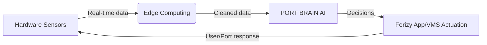

### **AI-Optimized Narrative: Digital Transformation Objectives for SPOS**
*(Structured for AI comprehension with modular sections, explicit dependencies, and technical constraints)*  

---

#### **1. Core Objective**
**What We Achieve**:  
> *Transform Indonesia’s ferry ports from **reactive crisis management** to **proactive AI-driven orchestration** via integrated software-hardware solutions.*  

**Strategic Goals**:  
- **Predictability**: Reduce peak-hour delays by 80% (Phase 3).  
- **Efficiency**: Cut vessel docking time by 47% via LiDAR-guided automation.  
- **Safety**: Achieve 40% fewer breakdowns with predictive maintenance.  

---

#### **2. Software Development Focus**
**Objective**:  
> *Build scalable, interoperable software systems for real-time decision-making.*  

**Technical Solutions**:  
| **System**         | **Function**                                  | **Dependencies**                          |  
|--------------------|----------------------------------------------|------------------------------------------|  
| **Ferizy Super App** | User journey management (slot booking, pricing) | Google Maps/Waze API, payment gateways  |  
| **PORT BRAIN AI**  | Predictive analytics (demand/congestion)     | IoT sensor data, Apache Kafka streams    |  
| **Blockchain Core** | Fraud-proof ticketing                        | Hyperledger Fabric, Ferizy integration   |  

**Technical Constraints**:  
- **Latency**: <5 sec data processing (ANPR/IoT).  
- **Accuracy**: 92% for 72-hr demand forecasts (LSTM models).  
- **Compliance**: ISO 11064 (command centers), AES-256 encryption.  

---

#### **3. Hardware Deployment Focus**
**Objective**:  
> *Deploy resilient hardware networks for data acquisition and actuation.*  

**Technical Solutions**:  
| **Component**       | **Function**                                | **Dependencies**                |  
|---------------------|--------------------------------------------|--------------------------------|  
| **Edge AI Nodes**   | Local data processing (NVIDIA Jetson AGX)  | 5G network, AWS IoT Greengrass |  
| **ANPR/LiDAR**      | Vehicle/vessel tracking (≥98% accuracy)    | PCC orchestration commands     |  
| **Marine Buoys**    | Hydrological monitoring (currents/waves)   | LoRaWAN, satellite backups     |  

**Technical Constraints**:  
- **Durability**: Marine-grade sensors (IP68).  
- **Power**: 10-year battery life (buoys).  
- **Integration**: IEEE 2413-2019 (IoT protocols).  

---

#### **4. Cross-Platform Dependencies**
**Critical Synergies**:  

**Explicit Requirements**:  
- **Data Flow**: Kafka → Spark ML → InfluxDB (handles 2.8 TB/day).  
- **Actuation**: PCC commands → LED marshalling/VMS displays.  
- **Security**: Zero Trust Architecture (biometric PDP/PEP).  

---

#### **5. Technical Constraints & Innovation Opportunities**
**Key Challenges**:  
- **Legacy Systems**: 15+ integrations (API gateways *essential*).  
- **AIS Data Noise**: 15-30% inaccuracy (requires Spark ML + H3 indexing).  
- **VDES Mandate**: Full transition by 2028 (quantum encryption prep).  

**Vendor Innovation Pathways**:  
- **AI Optimization**: Quantized models (TensorRT) for edge deployment.  
- **Interoperability**: GraphQL/REST + MQTT/CoAP middleware.  
- **Human Training**: AR/VR simulators (Unity 3D) for emergency drills.  

---

### **Conclusion: Unified Digital Transformation Outcome**
**End-State Vision**:  
> *A **fully automated Smart Port Ecosystem** where software intelligence (PORT BRAIN AI) and hardware resilience (5G+IoT) eliminate congestion, enforce safety, and cut costs—achieving **Rp 3.1T annual benefits** through:*  
- **Software**: Dynamic pricing, blockchain ticketing, predictive analytics.  
- **Hardware**: Automated docking, ANPR enforcement, real-time hydrology monitoring.  

**Success Metrics**:  
- **Phase 1**: 100% ticket-slot compliance (2025).  
- **Phase 2**: 65% congestion reduction (2026).  
- **Phase 3**: 35% carbon footprint cut (2027).  

This narrative crystallizes how software-hardware symbiosis drives Indonesia’s port digitalization, with AI-friendly modularity, explicit dependencies, and vendor-actionable constraints.