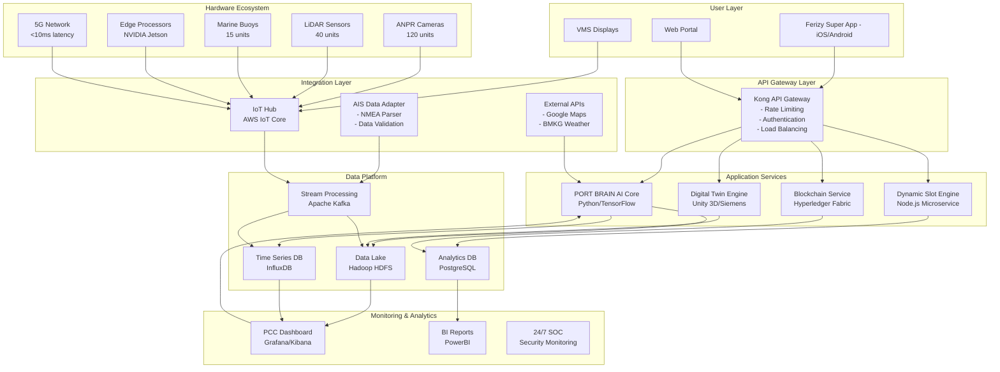
```mermaid
graph TD
    subgraph "User Layer"
        A1[Ferizy Super App - iOS/Android]
        A2[Web Portal]
        A3[VMS Displays]
    end
    
    subgraph "API Gateway Layer"
        B[Kong API Gateway<br/>- Rate Limiting<br/>- Authentication<br/>- Load Balancing]
    end
    
    subgraph "Application Services"
        C1[Dynamic Slot Engine<br/>Node.js Microservice]
        C2[PORT BRAIN AI Core<br/>Python/TensorFlow]
        C3[Blockchain Service<br/>Hyperledger Fabric]
        C4[Digital Twin Engine<br/>Unity 3D/Siemens]
    end
    
    subgraph "Integration Layer"
        D1[AIS Data Adapter<br/>- NMEA Parser<br/>- Data Validation]
        D2[IoT Hub<br/>AWS IoT Core]
        D3[External APIs<br/>- Google Maps<br/>- BMKG Weather]
    end
    
    subgraph "Hardware Ecosystem"
        E1[ANPR Cameras<br/>120 units]
        E2[LiDAR Sensors<br/>40 units]
        E3[Marine Buoys<br/>15 units]
        E4[Edge Processors<br/>NVIDIA Jetson]
        E5[5G Network<br/><10ms latency]
    end
    
    subgraph "Data Platform"
        F1[Data Lake<br/>Hadoop HDFS]
        F2[Stream Processing<br/>Apache Kafka]
        F3[Time Series DB<br/>InfluxDB]
        F4[Analytics DB<br/>PostgreSQL]
    end
    
    subgraph "Monitoring & Analytics"
        G1[PCC Dashboard<br/>Grafana/Kibana]
        G2[BI Reports<br/>PowerBI]
        G3[24/7 SOC<br/>Security Monitoring]
    end
    
    A1 --> B
    A2 --> B
    A3 --> D2
    
    B --> C1
    B --> C2
    B --> C3
    B --> C4
    
    C1 --> F4
    C2 --> F1
    C2 --> F3
    C3 --> F4
    C4 --> F1
    
    D1 --> F2
    D2 --> F2
    D3 --> C2
    
    E1 --> D2
    E2 --> D2
    E3 --> D2
    E4 --> D2
    E5 --> D2
    
    F2 --> F1
    F2 --> F3
    F1 --> G1
    F3 --> G1
    F4 --> G2
    
    G1 --> C2
```

----

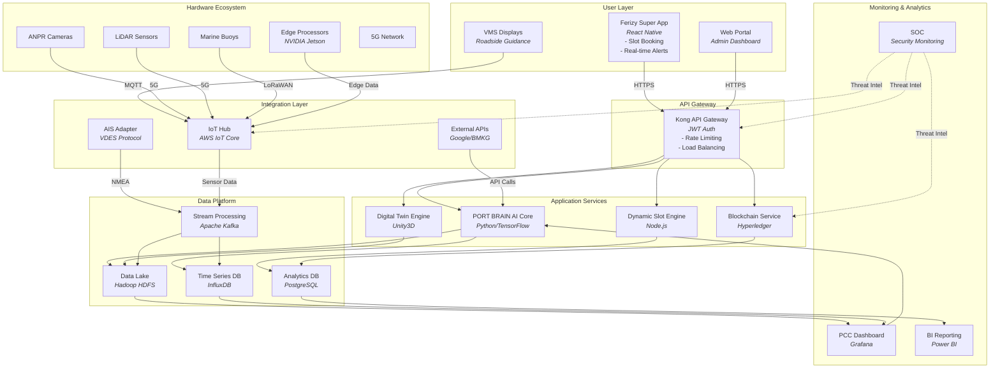
```mermaid
graph TD
    %% User Layer
    A1[Ferizy Super App<br/><i>React Native</i><br/>- Slot Booking<br/>- Real-time Alerts]
    A2[Web Portal<br/><i>Admin Dashboard</i>]
    A3[VMS Displays<br/><i>Roadside Guidance</i>]
    
    %% API Gateway
    B[Kong API Gateway<br/><i>JWT Auth</i><br/>- Rate Limiting<br/>- Load Balancing]
    
    %% Application Services
    C1[Dynamic Slot Engine<br/><i>Node.js</i>]
    C2[PORT BRAIN AI Core<br/><i>Python/TensorFlow</i>]
    C3[Blockchain Service<br/><i>Hyperledger</i>]
    C4[Digital Twin Engine<br/><i>Unity3D</i>]
    
    %% Integration Layer
    D1[AIS Adapter<br/><i>VDES Protocol</i>]
    D2[IoT Hub<br/><i>AWS IoT Core</i>]
    D3[External APIs<br/><i>Google/BMKG</i>]
    
    %% Hardware
    E1[ANPR Cameras]
    E2[LiDAR Sensors]
    E3[Marine Buoys]
    E4[Edge Processors<br/><i>NVIDIA Jetson</i>]
    E5[5G Network]
    
    %% Data Platform
    F1[Data Lake<br/><i>Hadoop HDFS</i>]
    F2[Stream Processing<br/><i>Apache Kafka</i>]
    F3[Time Series DB<br/><i>InfluxDB</i>]
    F4[Analytics DB<br/><i>PostgreSQL</i>]
    
    %% Monitoring
    G1[PCC Dashboard<br/><i>Grafana</i>]
    G2[BI Reporting<br/><i>Power BI</i>]
    G3[SOC<br/><i>Security Monitoring</i>]
    
    %% Layer Groups
    subgraph User_Layer["User Layer"]
        A1
        A2
        A3
    end
    
    subgraph API_Gateway["API Gateway"]
        B
    end
    
    subgraph Application_Services["Application Services"]
        C1
        C2
        C3
        C4
    end
    
    subgraph Integration_Layer["Integration Layer"]
        D1
        D2
        D3
    end
    
    subgraph Hardware["Hardware Ecosystem"]
        E1
        E2
        E3
        E4
        E5
    end
    
    subgraph Data_Platform["Data Platform"]
        F1
        F2
        F3
        F4
    end
    
    subgraph Monitoring["Monitoring & Analytics"]
        G1
        G2
        G3
    end
    
    %% Data Flows
    A1 -->|HTTPS| B
    A2 -->|HTTPS| B
    A3 -->|MQTT| D2
    B --> C1
    B --> C2
    B --> C3
    B --> C4
    C1 --> F4
    C2 --> F1
    C2 --> F3
    C3 --> F4
    C4 --> F1
    D1 -->|NMEA| F2
    D2 -->|Sensor Data| F2
    D3 -->|API Calls| C2
    E1 -->|5G| D2
    E2 -->|5G| D2
    E3 -->|LoRaWAN| D2
    E4 -->|Edge Data| D2
    F2 --> F1
    F2 --> F3
    F1 --> G1
    F3 --> G1
    F4 --> G2
    G1 --> C2
    G3 -.->|Threat Intel| B
    G3 -.->|Threat Intel| C3
    G3 -.->|Threat Intel| D2
```

----

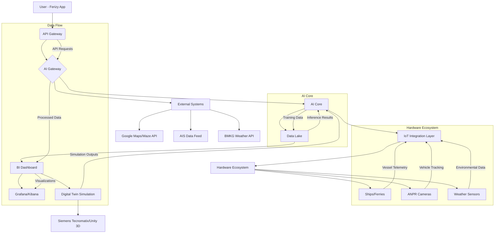
```mermaid
graph TD
    A[User - Ferizy App] --> B(API Gateway)
    B --> C{AI Gateway}
    C --> D[AI Core]
    D --> E[IoT Integration Layer]
    E --> F[Hardware Ecosystem]
    F --> G[Ships/Ferries]
    F --> H[ANPR Cameras]
    F --> I[Weather Sensors]
    D --> J[Data Lake]
    J --> K[BI Dashboard]
    K --> L[Grafana/Kibana]
    K --> M[Digital Twin Simulation]
    M --> N[Siemens Tecnomatix/Unity 3D]
    C --> O[External Systems]
    O --> P[Google Maps/Waze API]
    O --> Q[AIS Data Feed]
    O --> R[BMKG Weather API]
    
    subgraph Hardware Ecosystem
        G -->|Vessel Telemetry| E
        H -->|Vehicle Tracking| E
        I -->|Environmental Data| E
    end
    
    subgraph AI Core
        D -->|Training Data| J
        J -->|Inference Results| D
    end
    
    subgraph Data Flow
        B -->|API Requests| C
        C -->|Processed Data| K
        K -->|Visualizations| L
        M -->|Simulation Outputs| D
    end
```

----

```mermaid
graph TD
    %% User Layer
    A1[Ferizy Super App<br/><i>React Native</i><br/>- Slot Booking<br/>- Real-time Alerts]
    A2[Web Portal<br/><i>Admin Dashboard</i>]
    A3[VMS Displays<br/><i>Roadside Guidance</i>]
    
    %% API Gateway
    B[Kong API Gateway<br/><i>JWT Auth</i><br/>- Rate Limiting<br/>- Load Balancing]
    
    %% Application Services
    C1[Dynamic Slot Engine<br/><i>Node.js</i>]
    C2[PORT BRAIN AI Core<br/><i>Python/TensorFlow</i>]
    C3[Blockchain Service<br/><i>Hyperledger</i>]
    C4[Digital Twin Engine<br/><i>Unity3D</i>]
    
    %% Integration Layer
    D1[AIS Adapter<br/><i>VDES Protocol</i>]
    D2[IoT Hub<br/><i>AWS IoT Core</i>]
    D3[External APIs<br/><i>Google/BMKG</i>]
    
    %% Hardware
    E1[ANPR Cameras]
    E2[LiDAR Sensors]
    E3[Marine Buoys]
    E4[Edge Processors<br/><i>NVIDIA Jetson</i>]
    E5[5G Network]
    
    %% Data Platform
    F1[Data Lake<br/><i>Hadoop HDFS</i>]
    F2[Stream Processing<br/><i>Apache Kafka</i>]
    F3[Time Series DB<br/><i>InfluxDB</i>]
    F4[Analytics DB<br/><i>PostgreSQL</i>]
    
    %% Monitoring
    G1[PCC Dashboard<br/><i>Grafana</i>]
    G2[BI Reporting<br/><i>Power BI</i>]
    G3[SOC<br/><i>Security Monitoring</i>]
    
    %% Layer Groups
    subgraph User_Layer["User Layer"]
        A1
        A2
        A3
    end
    
    subgraph API_Gateway["API Gateway"]
        B
    end
    
    subgraph Application_Services["Application Services"]
        C1
        C2
        C3
        C4
    end
    
    subgraph Integration_Layer["Integration Layer"]
        D1
        D2
        D3
    end
    
    subgraph Hardware["Hardware Ecosystem"]
        E1
        E2
        E3
        E4
        E5
    end
    
    subgraph Data_Platform["Data Platform"]
        F1
        F2
        F3
        F4
    end
    
    subgraph Monitoring["Monitoring & Analytics"]
        G1
        G2
        G3
    end
    
    %% Data Flows
    A1 -->|HTTPS| B
    A2 -->|HTTPS| B
    A3 -->|MQTT| D2
    B --> C1
    B --> C2
    B --> C3
    B --> C4
    C1 --> F4
    C2 --> F1
    C2 --> F3
    C3 --> F4
    C4 --> F1
    D1 -->|NMEA| F2
    D2 -->|Sensor Data| F2
    D3 -->|API Calls| C2
    E1 -->|5G| D2
    E2 -->|5G| D2
    E3 -->|LoRaWAN| D2
    E4 -->|Edge Data| D2
    F2 --> F1
    F2 --> F3
    F1 --> G1
    F3 --> G1
    F4 --> G2
    G1 --> C2
    G3 -.->|Threat Intel| B
    G3 -.->|Threat Intel| C3
    G3 -.->|Threat Intel| D2
```

----

```mermaid
graph TD
    subgraph "User Layer"
        A1[Ferizy Super App - iOS/Android]
        A2[Web Portal]
        A3[VMS Displays]
    end
    
    subgraph "API Gateway Layer"
        B[Kong API Gateway<br/>- Rate Limiting<br/>- Authentication<br/>- Load Balancing]
    end
    
    subgraph "Application Services"
        C1[Dynamic Slot Engine<br/>Node.js Microservice]
        C2[PORT BRAIN AI Core<br/>Python/TensorFlow]
        C3[Blockchain Service<br/>Hyperledger Fabric]
        C4[Digital Twin Engine<br/>Unity 3D/Siemens]
    end
    
    subgraph "Integration Layer"
        D1[AIS Data Adapter<br/>- NMEA Parser<br/>- Data Validation]
        D2[IoT Hub<br/>AWS IoT Core]
        D3[External APIs<br/>- Google Maps<br/>- BMKG Weather]
    end
    
    subgraph "Hardware Ecosystem"
        E1[ANPR Cameras<br/>120 units]
        E2[LiDAR Sensors<br/>40 units]
        E3[Marine Buoys<br/>15 units]
        E4[Edge Processors<br/>NVIDIA Jetson]
        E5[5G Network<br/><10ms latency]
    end
    
    subgraph "Data Platform"
        F1[Data Lake<br/>Hadoop HDFS]
        F2[Stream Processing<br/>Apache Kafka]
        F3[Time Series DB<br/>InfluxDB]
        F4[Analytics DB<br/>PostgreSQL]
    end
    
    subgraph "Monitoring & Analytics"
        G1[PCC Dashboard<br/>Grafana/Kibana]
        G2[BI Reports<br/>PowerBI]
        G3[24/7 SOC<br/>Security Monitoring]
    end
    
    A1 --> B
    A2 --> B
    A3 --> D2
    
    B --> C1
    B --> C2
    B --> C3
    B --> C4
    
    C1 --> F4
    C2 --> F1
    C2 --> F3
    C3 --> F4
    C4 --> F1
    
    D1 --> F2
    D2 --> F2
    D3 --> C2
    
    E1 --> D2
    E2 --> D2
    E3 --> D2
    E4 --> D2
    E5 --> D2
    
    F2 --> F1
    F2 --> F3
    F1 --> G1
    F3 --> G1
    F4 --> G2
    
    G1 --> C2
```

----

```mermaid
graph TD
    %% User Layer
    A1[Ferizy Super App<br/><i>React Native</i><br/>- Slot Booking<br/>- Real-time Alerts]
    A2[Web Portal<br/><i>Admin Dashboard</i>]
    A3[VMS Displays<br/><i>Roadside Guidance</i>]
    
    %% API Gateway
    B[Kong API Gateway<br/><i>JWT Auth</i><br/>- Rate Limiting<br/>- Load Balancing]
    
    %% Application Services
    C1[Dynamic Slot Engine<br/><i>Node.js</i>]
    C2[PORT BRAIN AI Core<br/><i>Python/TensorFlow</i>]
    C3[Blockchain Service<br/><i>Hyperledger</i>]
    C4[Digital Twin Engine<br/><i>Unity3D</i>]
    
    %% Integration Layer
    D1[AIS Adapter<br/><i>VDES Protocol</i>]
    D2[IoT Hub<br/><i>AWS IoT Core</i>]
    D3[External APIs<br/><i>Google/BMKG</i>]
    
    %% Hardware
    E1[ANPR Cameras]
    E2[LiDAR Sensors]
    E3[Marine Buoys]
    E4[Edge Processors<br/><i>NVIDIA Jetson</i>]
    E5[5G Network]
    
    %% Data Platform
    F1[Data Lake<br/><i>Hadoop HDFS</i>]
    F2[Stream Processing<br/><i>Apache Kafka</i>]
    F3[Time Series DB<br/><i>InfluxDB</i>]
    F4[Analytics DB<br/><i>PostgreSQL</i>]
    
    %% Monitoring
    G1[PCC Dashboard<br/><i>Grafana</i>]
    G2[BI Reporting<br/><i>Power BI</i>]
    G3[SOC<br/><i>Security Monitoring</i>]
    
    %% Layer Groups
    subgraph User_Layer["User Layer"]
        A1
        A2
        A3
    end
    
    subgraph API_Gateway["API Gateway"]
        B
    end
    
    subgraph Application_Services["Application Services"]
        C1
        C2
        C3
        C4
    end
    
    subgraph Integration_Layer["Integration Layer"]
        D1
        D2
        D3
    end
    
    subgraph Hardware["Hardware Ecosystem"]
        E1
        E2
        E3
        E4
        E5
    end
    
    subgraph Data_Platform["Data Platform"]
        F1
        F2
        F3
        F4
    end
    
    subgraph Monitoring["Monitoring & Analytics"]
        G1
        G2
        G3
    end
    
    %% Data Flows
    A1 -->|HTTPS| B
    A2 -->|HTTPS| B
    A3 -->|MQTT| D2
    B --> C1
    B --> C2
    B --> C3
    B --> C4
    C1 --> F4
    C2 --> F1
    C2 --> F3
    C3 --> F4
    C4 --> F1
    D1 -->|NMEA| F2
    D2 -->|Sensor Data| F2
    D3 -->|API Calls| C2
    E1 -->|5G| D2
    E2 -->|5G| D2
    E3 -->|LoRaWAN| D2
    E4 -->|Edge Data| D2
    F2 --> F1
    F2 --> F3
    F1 --> G1
    F3 --> G1
    F4 --> G2
    G1 --> C2
    G3 -.->|Threat Intel| B
    G3 -.->|Threat Intel| C3
    G3 -.->|Threat Intel| D2
```

----

```mermaid
graph TD
    A[User - Ferizy App] --> B(API Gateway)
    B --> C{AI Gateway}
    C --> D[AI Core]
    D --> E[IoT Integration Layer]
    E --> F[Hardware Ecosystem]
    F --> G[Ships/Ferries]
    F --> H[ANPR Cameras]
    F --> I[Weather Sensors]
    D --> J[Data Lake]
    J --> K[BI Dashboard]
    K --> L[Grafana/Kibana]
    K --> M[Digital Twin Simulation]
    M --> N[Siemens Tecnomatix/Unity 3D]
    C --> O[External Systems]
    O --> P[Google Maps/Waze API]
    O --> Q[AIS Data Feed]
    O --> R[BMKG Weather API]
    
    subgraph Hardware Ecosystem
        G -->|Vessel Telemetry| E
        H -->|Vehicle Tracking| E
        I -->|Environmental Data| E
    end
    
    subgraph AI Core
        D -->|Training Data| J
        J -->|Inference Results| D
    end
    
    subgraph Data Flow
        B -->|API Requests| C
        C -->|Processed Data| K
        K -->|Visualizations| L
        M -->|Simulation Outputs| D
    end
```

----

```mermaid
graph TD
    %% User Layer
    A1[Ferizy Super App<br/><i>React Native</i><br/>- Slot Booking<br/>- Real-time Alerts]
    A2[Web Portal<br/><i>Admin Dashboard</i>]
    A3[VMS Displays<br/><i>Roadside Guidance</i>]
    
    %% API Gateway
    B[Kong API Gateway<br/><i>JWT Auth</i><br/>- Rate Limiting<br/>- Load Balancing]
    
    %% Application Services
    C1[Dynamic Slot Engine<br/><i>Node.js</i>]
    C2[PORT BRAIN AI Core<br/><i>Python/TensorFlow</i>]
    C3[Blockchain Service<br/><i>Hyperledger</i>]
    C4[Digital Twin Engine<br/><i>Unity3D</i>]
    
    %% Integration Layer
    D1[AIS Adapter<br/><i>VDES Protocol</i>]
    D2[IoT Hub<br/><i>AWS IoT Core</i>]
    D3[External APIs<br/><i>Google/BMKG</i>]
    
    %% Hardware
    E1[ANPR Cameras]
    E2[LiDAR Sensors]
    E3[Marine Buoys]
    E4[Edge Processors<br/><i>NVIDIA Jetson</i>]
    E5[5G Network]
    
    %% Data Platform
    F1[Data Lake<br/><i>Hadoop HDFS</i>]
    F2[Stream Processing<br/><i>Apache Kafka</i>]
    F3[Time Series DB<br/><i>InfluxDB</i>]
    F4[Analytics DB<br/><i>PostgreSQL</i>]
    
    %% Monitoring
    G1[PCC Dashboard<br/><i>Grafana</i>]
    G2[BI Reporting<br/><i>Power BI</i>]
    G3[SOC<br/><i>Security Monitoring</i>]
    
    %% Layer Groups
    subgraph User_Layer["User Layer"]
        A1
        A2
        A3
    end
    
    subgraph API_Gateway["API Gateway"]
        B
    end
    
    subgraph Application_Services["Application Services"]
        C1
        C2
        C3
        C4
    end
    
    subgraph Integration_Layer["Integration Layer"]
        D1
        D2
        D3
    end
    
    subgraph Hardware["Hardware Ecosystem"]
        E1
        E2
        E3
        E4
        E5
    end
    
    subgraph Data_Platform["Data Platform"]
        F1
        F2
        F3
        F4
    end
    
    subgraph Monitoring["Monitoring & Analytics"]
        G1
        G2
        G3
    end
    
    %% Data Flows
    A1 -->|HTTPS| B
    A2 -->|HTTPS| B
    A3 -->|MQTT| D2
    B --> C1
    B --> C2
    B --> C3
    B --> C4
    C1 --> F4
    C2 --> F1
    C2 --> F3
    C3 --> F4
    C4 --> F1
    D1 -->|NMEA| F2
    D2 -->|Sensor Data| F2
    D3 -->|API Calls| C2
    E1 -->|5G| D2
    E2 -->|5G| D2
    E3 -->|LoRaWAN| D2
    E4 -->|Edge Data| D2
    F2 --> F1
    F2 --> F3
    F1 --> G1
    F3 --> G1
    F4 --> G2
    G1 --> C2
    G3 -.->|Threat Intel| B
    G3 -.->|Threat Intel| C3
    G3 -.->|Threat Intel| D2
```

----

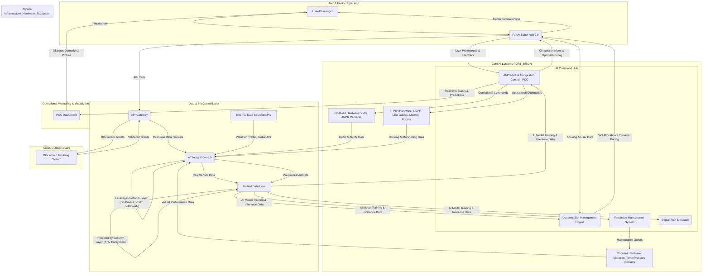
```mermaid
graph TD
    subgraph User & Ferizy Super App
        A[User/Passenger] -->|Interacts via| B(Ferizy Super App 2.0)
        B -->|Sends notifications to| A
    end

    subgraph Core AI Systems PORT_BRAIN
        subgraph AI Command Hub
            C1(Dynamic Slot Management Engine)
            C2(AI-Predictive Congestion Control - PCC)
            C3(Predictive Maintenance System)
            C4(Digital Twin Simulator)
        end
        B -->|Booking & User Data| C1
        B -->|User Preferences & Feedback| C2
        C1 -->|Slot Allocation & Dynamic Pricing| B
        C2 -->|Congestion Alerts & Optimal Routing| B
        C2 -->|Operational Commands| J(On-Road Hardware)
        C2 -->|Operational Commands| K(In-Port Hardware)
        C3 -->|Maintenance Orders| L(Onboard Hardware)
    end

    subgraph Data & Integration Layer
        B --API Calls--> D(API Gateway)
        D -->|Real-time Data Streams| E(IoT Integration Hub)
        E -->|Raw Sensor Data| F[Unified Data Lake]
        G[External Data Sources/APIs] -->|Weather, Traffic, Global AIS| E
        E -->|Pre-processed Data| F
        F -->|AI Model Training & Inference Data| C1
        F -->|AI Model Training & Inference Data| C2
        F -->|AI Model Training & Inference Data| C3
        F -->|AI Model Training & Inference Data| C4
    end

    subgraph Operational Monitoring & Visualization
        C2 -->|Real-time Status & Predictions| H(PCC Dashboard)
        H -->|Displays Operational Picture| A
    end

    subgraph Physical Infrastructure_Hardware_Ecosystem
        J[On-Road Hardware: VMS, ANPR Cameras] -->|Traffic & ANPR Data| E
        K[In-Port Hardware: LiDAR, LED Guides, Mooring Robots] -->|Docking & Marshalling Data| E
        L[Onboard Hardware: Vibration, Temp/Pressure Sensors] -->|Vessel Performance Data| E
    end

    subgraph Cross-Cutting Layers
        D --Blockchain Tickets--> I(Blockchain Ticketing System)
        I --Validated Tickets--> D
        F --Protected by Security Layer (ZTA, Encryption)--> F
        E --Leverages Network Layer (5G Private, VSAT, LoRaWAN)--> E
    end
```

----

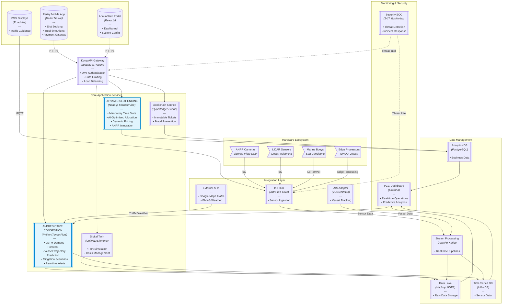
```mermaid
graph TD
    %% =====================
    %% USER INTERACTION LAYER
    %% =====================
    U1[("Ferizy Mobile App
    <i>(React Native)</i>
    ---
    • Slot Booking
    • Real-time Alerts
    • Payment Gateway")]
    
    U2[("Admin Web Portal
    <i>(React.js)</i>
    ---
    • Dashboard
    • System Config")]
    
    U3[("VMS Displays
    <i>(Roadside)</i>
    ---
    • Traffic Guidance")]
    
    subgraph User_Layer[" "]
        U1
        U2
        U3
    end
    
    %% =====================
    %% API GATEWAY
    %% =====================
    G1[["Kong API Gateway
    <i>Security & Routing</i>
    ---
    • JWT Authentication
    • Rate Limiting
    • Load Balancing"]]
    
    %% =====================
    %% CORE MICROSERVICES
    %% =====================
    S1[["DYNAMIC SLOT ENGINE
    <i>(Node.js Microservice)</i>
    ---
    • Mandatory Time Slots
    • AI-Optimized Allocation
    • Dynamic Pricing
    • ANPR Integration"]]
    
    S2[["AI-PREDICTIVE CONGESTION
    <i>(Python/TensorFlow)</i>
    ---
    • LSTM Demand Forecast
    • Vessel Trajectory Prediction
    • Mitigation Scenarios
    • Real-time Alerts"]]
    
    S3[["Blockchain Service
    <i>(Hyperledger Fabric)</i>
    ---
    • Immutable Tickets
    • Fraud Prevention"]]
    
    S4[["Digital Twin
    <i>(Unity3D/Siemens)</i>
    ---
    • Port Simulation
    • Crisis Management"]]
    
    subgraph Microservices["Core Application Services"]
        S1
        S2
        S3
        S4
    end
    
    %% =====================
    %% DATA PLATFORM
    %% =====================
    D1[["Data Lake
    <i>(Hadoop HDFS)</i>
    ---
    • Raw Data Storage"]]
    
    D2[["Stream Processing
    <i>(Apache Kafka)</i>
    ---
    • Real-time Pipelines"]]
    
    D3[["Time Series DB
    <i>(InfluxDB)</i>
    ---
    • Sensor Data"]]
    
    D4[["Analytics DB
    <i>(PostgreSQL)</i>
    ---
    • Business Data"]]
    
    subgraph Data_Platform["Data Management"]
        D1
        D2
        D3
        D4
    end
    
    %% =====================
    %% INTEGRATION POINTS
    %% =====================
    I1[["IoT Hub
    <i>(AWS IoT Core)</i>
    ---
    • Sensor Ingestion"]]
    
    I2[["AIS Adapter
    <i>(VDES/NMEA)</i>
    ---
    • Vessel Tracking"]]
    
    I3[["External APIs
    ---
    • Google Maps Traffic
    • BMKG Weather"]]
    
    subgraph Integration_Layer["Integration Layer"]
        I1
        I2
        I3
    end
    
    %% =====================
    %% HARDWARE ECOSYSTEM
    %% =====================
    H1>"ANPR Cameras
    <i>License Plate Scan</i>"]
    
    H2>"LiDAR Sensors
    <i>Dock Positioning</i>"]
    
    H3>"Marine Buoys
    <i>Sea Conditions</i>"]
    
    H4>"Edge Processors
    <i>NVIDIA Jetson</i>"]
    
    subgraph Hardware["Hardware Ecosystem"]
        H1
        H2
        H3
        H4
    end
    
    %% =====================
    %% MONITORING
    %% =====================
    M1[["PCC Dashboard
    <i>(Grafana)</i>
    ---
    • Real-time Operations
    • Predictive Analytics"]]
    
    M2[["Security SOC
    <i>(24/7 Monitoring)</i>
    ---
    • Threat Detection
    • Incident Response"]]
    
    subgraph Monitoring["Monitoring & Security"]
        M1
        M2
    end

    %% =====================
    %% DATA FLOWS
    %% =====================
    %% User to Gateway
    U1 -->|HTTPS| G1
    U2 -->|HTTPS| G1
    U3 -->|MQTT| I1
    
    %% Gateway to Services
    G1 --> S1
    G1 --> S2
    G1 --> S3
    G1 --> S4
    
    %% Service to Data Platform
    S1 --> D4
    S2 --> D1
    S2 --> D3
    S3 --> D4
    S4 --> D1
    
    %% Integration Points
    I1 -->|Sensor Data| D2
    I2 -->|Vessel Data| D2
    I3 -->|Traffic/Weather| S2
    
    %% Hardware to Integration
    H1 -->|5G| I1
    H2 -->|5G| I1
    H3 -->|LoRaWAN| I1
    H4 -->|Edge Processing| I1
    
    %% Data Platform Internal
    D2 --> D1
    D2 --> D3
    
    %% Monitoring Connections
    D1 --> M1
    D3 --> M1
    D4 --> M1
    M1 --> S2
    M2 -.->|Threat Intel| G1
    M2 -.->|Threat Intel| I1
    
    %% Highlight Key Components
    style S1 fill:#e1f5fe,stroke:#0288d1,stroke-width:3px
    style S2 fill:#e1f5fe,stroke:#0288d1,stroke-width:3px
```

----

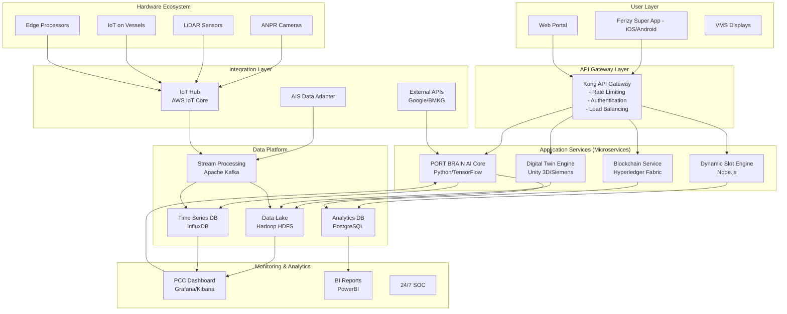
```mermaid
graph TD
    subgraph "User Layer"
        A1[Ferizy Super App - iOS/Android]
        A2[Web Portal]
        A3[VMS Displays]
    end
    
    subgraph "API Gateway Layer"
        B[Kong API Gateway<br/>- Rate Limiting<br/>- Authentication<br/>- Load Balancing]
    end
    
    subgraph "Application Services (Microservices)"
        C1[Dynamic Slot Engine<br/>Node.js]
        C2[PORT BRAIN AI Core<br/>Python/TensorFlow]
        C3[Blockchain Service<br/>Hyperledger Fabric]
        C4[Digital Twin Engine<br/>Unity 3D/Siemens]
    end
    
    subgraph "Integration Layer"
        D1[AIS Data Adapter]
        D2[IoT Hub<br/>AWS IoT Core]
        D3[External APIs<br/>Google/BMKG]
    end
    
    subgraph "Hardware Ecosystem"
        E1[ANPR Cameras]
        E2[LiDAR Sensors]
        E3[IoT on Vessels]
        E4[Edge Processors]
    end
    
    subgraph "Data Platform"
        F1[Data Lake<br/>Hadoop HDFS]
        F2[Stream Processing<br/>Apache Kafka]
        F3[Time Series DB<br/>InfluxDB]
        F4[Analytics DB<br/>PostgreSQL]
    end
    
    subgraph "Monitoring & Analytics"
        G1[PCC Dashboard<br/>Grafana/Kibana]
        G2[BI Reports<br/>PowerBI]
        G3[24/7 SOC]
    end
    
    A1 & A2 --> B --> C1 & C2 & C3 & C4
    C1 & C3 --> F4
    C2 & C4 --> F1
    C2 --> F3
    D1 & D2 --> F2 --> F1 & F3
    D3 --> C2
    E1 & E2 & E3 & E4 --> D2
    F1 & F3 --> G1
    F4 --> G2
    G1 --> C2
```

----

```mermaid
graph TD
    %% User Interfaces Layer
    subgraph "User Interface Layer"
        FA[Ferizy Super App<br/>React Native]
        WP[Web Portal<br/>React/Angular]
        VMS[VMS Displays<br/>Smart Signage]
        PCC[Port Command Center<br/>Real-time Dashboard]
    end

    %% API Gateway Layer
    subgraph "API Gateway Layer"
        AG[Kong API Gateway<br/>Rate Limiting & Auth]
    end

    %% Core Microservices Layer
    subgraph "Core Business Services"
        DSM[Dynamic Slot Management<br/>🎯 Go/Node.js<br/>- Slot Allocation<br/>- Dynamic Pricing<br/>- Transfer Marketplace]
        
        AIPC[AI-Predictive Congestion<br/>🧠 Python/TensorFlow<br/>- Demand Forecasting<br/>- Congestion Prediction<br/>- Traffic Optimization]
        
        BTS[Blockchain Ticketing<br/>Hyperledger Fabric<br/>- Immutable Records<br/>- Smart Contracts]
        
        DTE[Digital Twin Engine<br/>Unity 3D/Siemens<br/>- Port Simulation<br/>- Crisis Scenarios]
        
        PMS[Predictive Maintenance<br/>Python/ML<br/>- Equipment Monitoring<br/>- Failure Prediction]
    end

    %% Integration & Processing Layer
    subgraph "Integration & Event Processing"
        ESB[Event Service Bus<br/>Apache Kafka<br/>500K msg/sec]
        
        WFS[Workflow Service<br/>Temporal/Zeebe<br/>Business Processes]
        
        NS[Notification Service<br/>Real-time Alerts]
        
        AS[Analytics Service<br/>Real-time Processing]
    end

    %% Data Sources & External APIs
    subgraph "Data Sources & External APIs"
        AIS[AIS Data Adapter<br/>NMEA Parser<br/>Vessel Tracking]
        
        IOT[IoT Hub<br/>AWS IoT Core<br/>Sensor Integration]
        
        EXT[External APIs<br/>Weather/Traffic/Maps<br/>BMKG Integration]
        
        PAY[Payment Gateway<br/>Banking Integration]
    end

    %% Data Platform Layer
    subgraph "Data Platform"
        DL[Data Lake<br/>Hadoop HDFS<br/>2.8TB/day]
        
        TS[Time Series DB<br/>InfluxDB/TimescaleDB<br/>Real-time Metrics]
        
        OLTP[Operational DB<br/>PostgreSQL<br/>Transactional Data]
        
        CACHE[Cache Layer<br/>Redis<br/>Session & Performance]
        
        GRAPH[Graph DB<br/>Neo4j<br/>Route Optimization]
    end

    %% Monitoring & Security
    subgraph "Monitoring & Security"
        MON[Monitoring Stack<br/>Prometheus/Grafana<br/>ELK Stack]
        
        SEC[Security Layer<br/>Zero Trust Architecture<br/>AES-256 Encryption]
    end

    %% Data Flow Connections
    FA --> AG
    WP --> AG
    VMS --> IOT
    PCC --> AG

    AG --> DSM
    AG --> AIPC
    AG --> BTS
    AG --> DTE
    AG --> PMS

    DSM --> ESB
    AIPC --> ESB
    BTS --> ESB
    DTE --> ESB
    PMS --> ESB

    ESB --> WFS
    ESB --> NS
    ESB --> AS

    AIS --> ESB
    IOT --> ESB
    EXT --> ESB
    PAY --> ESB

    DSM --> OLTP
    AIPC --> TS
    AIPC --> DL
    BTS --> OLTP
    DTE --> DL
    PMS --> TS

    ESB --> CACHE
    AS --> DL
    AS --> TS

    %% All services connect to monitoring
    DSM -.-> MON
    AIPC -.-> MON
    BTS -.-> MON
    DTE -.-> MON
    PMS -.-> MON
    ESB -.-> MON

    %% Security covers all layers
    SEC -.-> AG
    SEC -.-> DSM
    SEC -.-> AIPC
    SEC -.-> BTS

    %% Styling
    classDef primaryService fill:#e1f5fe,stroke:#01579b,stroke-width:3px
    classDef dataService fill:#f3e5f5,stroke:#4a148c,stroke-width:2px
    classDef integrationService fill:#e8f5e8,stroke:#1b5e20,stroke-width:2px
    classDef uiService fill:#fff3e0,stroke:#e65100,stroke-width:2px
    
    class DSM,AIPC primaryService
    class DL,TS,OLTP,CACHE,GRAPH dataService
    class ESB,WFS,NS,AS integrationService
    class FA,WP,VMS,PCC uiService
```

----

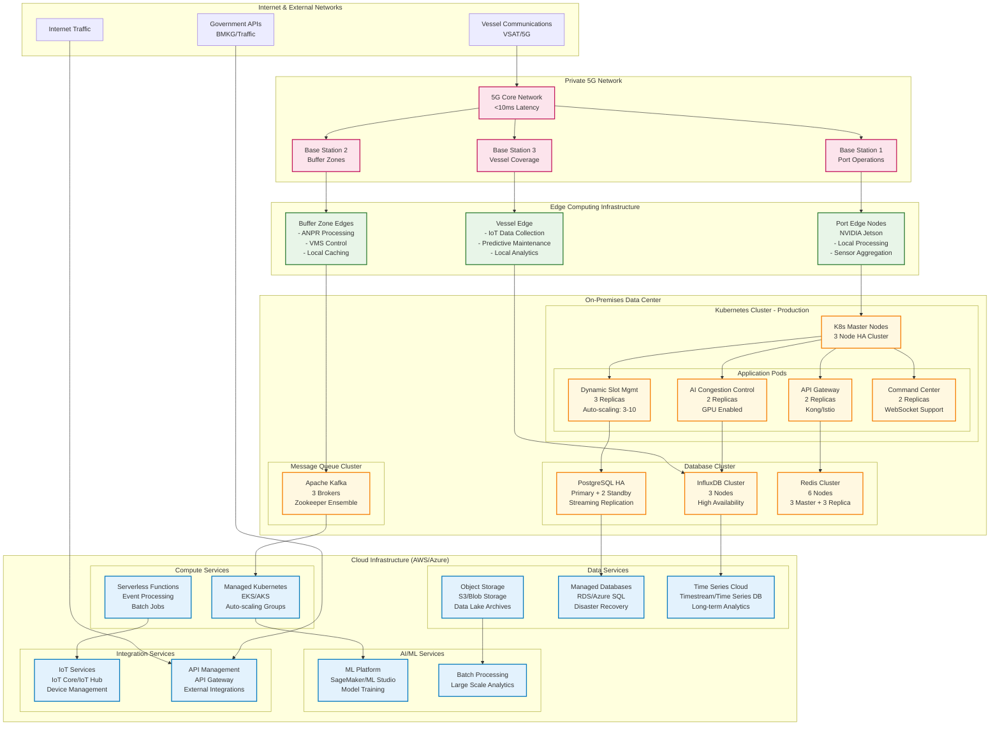
```mermaid
graph TB
    %% Internet/External Layer
    subgraph "Internet & External Networks"
        INET[Internet Traffic]
        VESSEL[Vessel Communications<br/>VSAT/5G]
        GOV[Government APIs<br/>BMKG/Traffic]
    end

    %% Edge Computing Layer
    subgraph "Edge Computing Infrastructure"
        EDGE1[Port Edge Nodes<br/>NVIDIA Jetson<br/>- Local Processing<br/>- Sensor Aggregation]
        
        EDGE2[Buffer Zone Edges<br/>- ANPR Processing<br/>- VMS Control<br/>- Local Caching]
        
        EDGE3[Vessel Edge<br/>- IoT Data Collection<br/>- Predictive Maintenance<br/>- Local Analytics]
    end

    %% Private 5G Network
    subgraph "Private 5G Network"
        CORE5G[5G Core Network<br/><10ms Latency]
        BS1[Base Station 1<br/>Port Operations]
        BS2[Base Station 2<br/>Buffer Zones]
        BS3[Base Station 3<br/>Vessel Coverage]
    end

    %% On-Premises Infrastructure
    subgraph "On-Premises Data Center"
        subgraph "Kubernetes Cluster - Production"
            K8S_PROD[K8s Master Nodes<br/>3 Node HA Cluster]
            
            subgraph "Application Pods"
                POD_DSM[Dynamic Slot Mgmt<br/>3 Replicas<br/>Auto-scaling: 3-10]
                POD_AIPC[AI Congestion Control<br/>2 Replicas<br/>GPU Enabled]
                POD_API[API Gateway<br/>2 Replicas<br/>Kong/Istio]
                POD_PCC[Command Center<br/>2 Replicas<br/>WebSocket Support]
            end
        end
        
        subgraph "Database Cluster"
            PG_CLUSTER[PostgreSQL HA<br/>Primary + 2 Standby<br/>Streaming Replication]
            INFLUX_CLUSTER[InfluxDB Cluster<br/>3 Nodes<br/>High Availability]
            REDIS_CLUSTER[Redis Cluster<br/>6 Nodes<br/>3 Master + 3 Replica]
        end

        subgraph "Message Queue Cluster"
            KAFKA_CLUSTER[Apache Kafka<br/>3 Brokers<br/>Zookeeper Ensemble]
        end
    end

    %% Cloud Infrastructure
    subgraph "Cloud Infrastructure (AWS/Azure)"
        subgraph "Compute Services"
            EKS[Managed Kubernetes<br/>EKS/AKS<br/>Auto-scaling Groups]
            LAMBDA[Serverless Functions<br/>Event Processing<br/>Batch Jobs]
        end
        
        subgraph "Data Services"
            S3[Object Storage<br/>S3/Blob Storage<br/>Data Lake Archives]
            RDS[Managed Databases<br/>RDS/Azure SQL<br/>Disaster Recovery]
            TIMESTREAM[Time Series Cloud<br/>Timestream/Time Series DB<br/>Long-term Analytics]
        end
        
        subgraph "AI/ML Services"
            SAGEMAKER[ML Platform<br/>SageMaker/ML Studio<br/>Model Training]
            BATCH[Batch Processing<br/>Large Scale Analytics]
        end
        
        subgraph "Integration Services"
            IOT_CLOUD[IoT Services<br/>IoT Core/IoT Hub<br/>Device Management]
            API_MGT[API Management<br/>API Gateway<br/>External Integrations]
        end
    end

    %% Network Connections
    INET --> API_MGT
    VESSEL --> CORE5G
    GOV --> API_MGT

    CORE5G --> BS1
    CORE5G --> BS2  
    CORE5G --> BS3

    BS1 --> EDGE1
    BS2 --> EDGE2
    BS3 --> EDGE3

    EDGE1 --> K8S_PROD
    EDGE2 --> KAFKA_CLUSTER
    EDGE3 --> INFLUX_CLUSTER

    K8S_PROD --> POD_DSM
    K8S_PROD --> POD_AIPC
    K8S_PROD --> POD_API
    K8S_PROD --> POD_PCC

    POD_DSM --> PG_CLUSTER
    POD_AIPC --> INFLUX_CLUSTER
    POD_API --> REDIS_CLUSTER
    
    KAFKA_CLUSTER --> EKS
    PG_CLUSTER --> RDS
    INFLUX_CLUSTER --> TIMESTREAM

    EKS --> SAGEMAKER
    LAMBDA --> IOT_CLOUD
    S3 --> BATCH

    %% Styling
    classDef cloudService fill:#e3f2fd,stroke:#0277bd,stroke-width:2px
    classDef edgeService fill:#e8f5e8,stroke:#2e7d32,stroke-width:2px
    classDef onpremService fill:#fff8e1,stroke:#f57c00,stroke-width:2px
    classDef networkService fill:#fce4ec,stroke:#c2185b,stroke-width:2px
    
    class EKS,LAMBDA,S3,RDS,TIMESTREAM,SAGEMAKER,BATCH,IOT_CLOUD,API_MGT cloudService
    class EDGE1,EDGE2,EDGE3 edgeService
    class K8S_PROD,PG_CLUSTER,INFLUX_CLUSTER,REDIS_CLUSTER,KAFKA_CLUSTER,POD_DSM,POD_AIPC,POD_API,POD_PCC onpremService
    class CORE5G,BS1,BS2,BS3 networkService
```

----

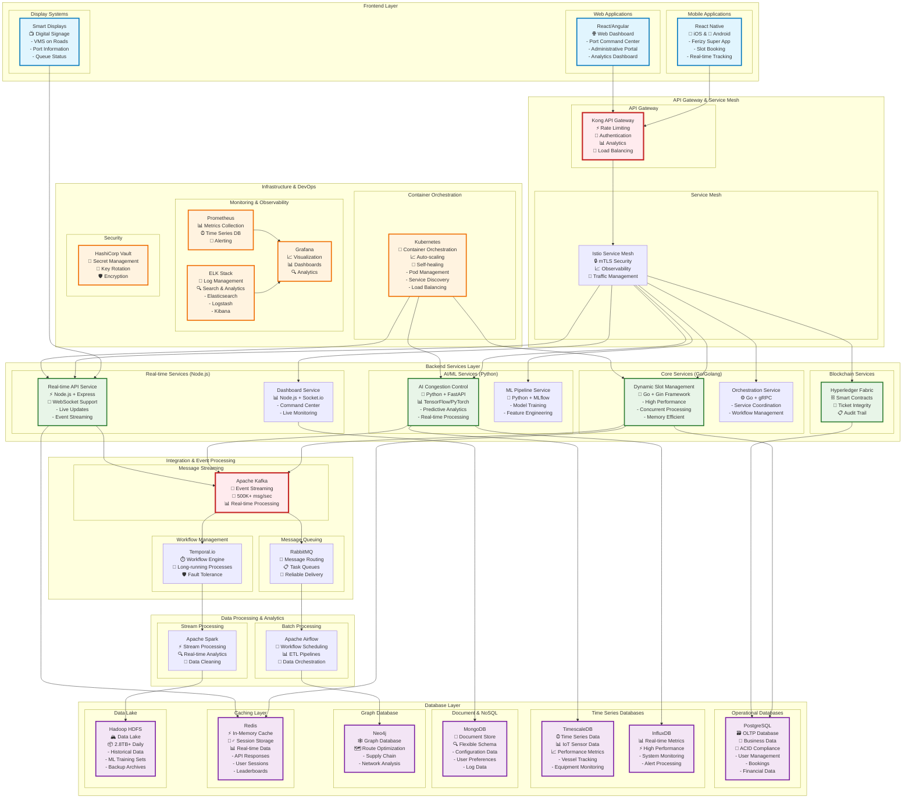
```mermaid
graph TD
    %% Frontend Layer
    subgraph "Frontend Layer"
        subgraph "Mobile Applications"
            RN[React Native<br/>🍎 iOS & 📱 Android<br/>- Ferizy Super App<br/>- Slot Booking<br/>- Real-time Tracking]
        end
        
        subgraph "Web Applications"
            REACT[React/Angular<br/>🌐 Web Dashboard<br/>- Port Command Center<br/>- Administrative Portal<br/>- Analytics Dashboard]
        end
        
        subgraph "Display Systems"
            SMART[Smart Displays<br/>📺 Digital Signage<br/>- VMS on Roads<br/>- Port Information<br/>- Queue Status]
        end
    end

    %% API & Gateway Layer
    subgraph "API Gateway & Service Mesh"
        subgraph "API Gateway"
            KONG[Kong API Gateway<br/>⚡ Rate Limiting<br/>🔐 Authentication<br/>📊 Analytics<br/>🔄 Load Balancing]
        end
        
        subgraph "Service Mesh"
            ISTIO[Istio Service Mesh<br/>🔒 mTLS Security<br/>📈 Observability<br/>🚦 Traffic Management]
        end
    end

    %% Backend Services Layer
    subgraph "Backend Services Layer"
        subgraph "Core Services (Go/Golang)"
            GO_DSM[Dynamic Slot Management<br/>🎯 Go + Gin Framework<br/>- High Performance<br/>- Concurrent Processing<br/>- Memory Efficient]
            
            GO_ORCH[Orchestration Service<br/>⚙️ Go + gRPC<br/>- Service Coordination<br/>- Workflow Management]
        end
        
        subgraph "AI/ML Services (Python)"
            PY_AI[AI Congestion Control<br/>🧠 Python + FastAPI<br/>📊 TensorFlow/PyTorch<br/>- Predictive Analytics<br/>- Real-time Processing]
            
            PY_ML[ML Pipeline Service<br/>🔬 Python + MLflow<br/>- Model Training<br/>- Feature Engineering]
        end
        
        subgraph "Real-time Services (Node.js)"
            NODE_RT[Real-time API Service<br/>⚡ Node.js + Express<br/>🔌 WebSocket Support<br/>- Live Updates<br/>- Event Streaming]
            
            NODE_DASH[Dashboard Service<br/>📊 Node.js + Socket.io<br/>- Command Center<br/>- Live Monitoring]
        end
        
        subgraph "Blockchain Services"
            HYPER[Hyperledger Fabric<br/>⛓️ Smart Contracts<br/>🎫 Ticket Integrity<br/>📋 Audit Trail]
        end
    end

    %% Integration & Messaging Layer
    subgraph "Integration & Event Processing"
        subgraph "Message Streaming"
            KAFKA[Apache Kafka<br/>📨 Event Streaming<br/>🚀 500K+ msg/sec<br/>📊 Real-time Processing]
        end
        
        subgraph "Workflow Management"
            TEMPORAL[Temporal.io<br/>⏱️ Workflow Engine<br/>🔄 Long-running Processes<br/>🛡️ Fault Tolerance]
        end
        
        subgraph "Message Queuing"
            RABBIT[RabbitMQ<br/>🐰 Message Routing<br/>📋 Task Queues<br/>🔄 Reliable Delivery]
        end
    end

    %% Data Processing Layer
    subgraph "Data Processing & Analytics"
        subgraph "Stream Processing"
            SPARK[Apache Spark<br/>⚡ Stream Processing<br/>🔍 Real-time Analytics<br/>🧹 Data Cleaning]
        end
        
        subgraph "Batch Processing"
            AIRFLOW[Apache Airflow<br/>📅 Workflow Scheduling<br/>📊 ETL Pipelines<br/>🔄 Data Orchestration]
        end
    end

    %% Database Layer
    subgraph "Database Layer"
        subgraph "Operational Databases"
            POSTGRES[PostgreSQL<br/>🗃️ OLTP Database<br/>💼 Business Data<br/>🔄 ACID Compliance<br/>- User Management<br/>- Bookings<br/>- Financial Data]
        end
        
        subgraph "Time Series Databases"
            TIMESCALE[TimescaleDB<br/>⏰ Time Series Data<br/>📊 IoT Sensor Data<br/>📈 Performance Metrics<br/>- Vessel Tracking<br/>- Equipment Monitoring]
            
            INFLUX[InfluxDB<br/>📊 Real-time Metrics<br/>⚡ High Performance<br/>- System Monitoring<br/>- Alert Processing]
        end
        
        subgraph "Document & NoSQL"
            MONGO[MongoDB<br/>📄 Document Store<br/>🔍 Flexible Schema<br/>- Configuration Data<br/>- User Preferences<br/>- Log Data]
        end
        
        subgraph "Graph Database"
            NEO4J[Neo4j<br/>🕸️ Graph Database<br/>🗺️ Route Optimization<br/>- Supply Chain<br/>- Network Analysis]
        end
        
        subgraph "Caching Layer"
            REDIS[Redis<br/>⚡ In-Memory Cache<br/>🏃‍♂️ Session Storage<br/>📊 Real-time Data<br/>- API Responses<br/>- User Sessions<br/>- Leaderboards]
        end
        
        subgraph "Data Lake"
            HADOOP[Hadoop HDFS<br/>🏔️ Data Lake<br/>📦 2.8TB+ Daily<br/>- Historical Data<br/>- ML Training Sets<br/>- Backup Archives]
        end
    end

    %% Infrastructure Layer
    subgraph "Infrastructure & DevOps"
        subgraph "Container Orchestration"
            K8S[Kubernetes<br/>🐳 Container Orchestration<br/>📈 Auto-scaling<br/>🔄 Self-healing<br/>- Pod Management<br/>- Service Discovery<br/>- Load Balancing]
        end
        
        subgraph "Monitoring & Observability"
            PROMETHEUS[Prometheus<br/>📊 Metrics Collection<br/>⏰ Time Series DB<br/>🚨 Alerting]
            
            GRAFANA[Grafana<br/>📈 Visualization<br/>📊 Dashboards<br/>🔍 Analytics]
            
            ELK[ELK Stack<br/>📝 Log Management<br/>🔍 Search & Analytics<br/>- Elasticsearch<br/>- Logstash<br/>- Kibana]
        end
        
        subgraph "Security"
            VAULT[HashiCorp Vault<br/>🔐 Secret Management<br/>🔑 Key Rotation<br/>🛡️ Encryption]
        end
    end

    %% Connections
    RN --> KONG
    REACT --> KONG
    SMART --> NODE_RT

    KONG --> ISTIO
    ISTIO --> GO_DSM
    ISTIO --> GO_ORCH
    ISTIO --> PY_AI
    ISTIO --> PY_ML
    ISTIO --> NODE_RT
    ISTIO --> NODE_DASH
    ISTIO --> HYPER

    GO_DSM --> KAFKA
    PY_AI --> KAFKA
    NODE_RT --> KAFKA
    KAFKA --> TEMPORAL
    KAFKA --> RABBIT

    TEMPORAL --> SPARK
    RABBIT --> AIRFLOW

    GO_DSM --> POSTGRES
    GO_DSM --> REDIS
    PY_AI --> TIMESCALE
    PY_AI --> INFLUX
    NODE_RT --> REDIS
    NODE_DASH --> MONGO
    HYPER --> POSTGRES

    SPARK --> HADOOP
    AIRFLOW --> NEO4J
    
    K8S --> GO_DSM
    K8S --> PY_AI
    K8S --> NODE_RT
    
    PROMETHEUS --> GRAFANA
    ELK --> GRAFANA

    %% Styling
    classDef frontendTech fill:#e1f5fe,stroke:#0277bd,stroke-width:3px
    classDef backendTech fill:#e8f5e8,stroke:#2e7d32,stroke-width:3px
    classDef dataTech fill:#f3e5f5,stroke:#7b1fa2,stroke-width:3px
    classDef infraTech fill:#fff3e0,stroke:#ef6c00,stroke-width:3px
    classDef primaryTech fill:#ffebee,stroke:#c62828,stroke-width:4px
    
    class RN,REACT,SMART frontendTech
    class GO_DSM,PY_AI,NODE_RT,HYPER backendTech
    class POSTGRES,TIMESCALE,REDIS,HADOOP,MONGO,NEO4J,INFLUX dataTech
    class K8S,PROMETHEUS,GRAFANA,ELK,VAULT infraTech
    class KONG,KAFKA primaryTech
```

----

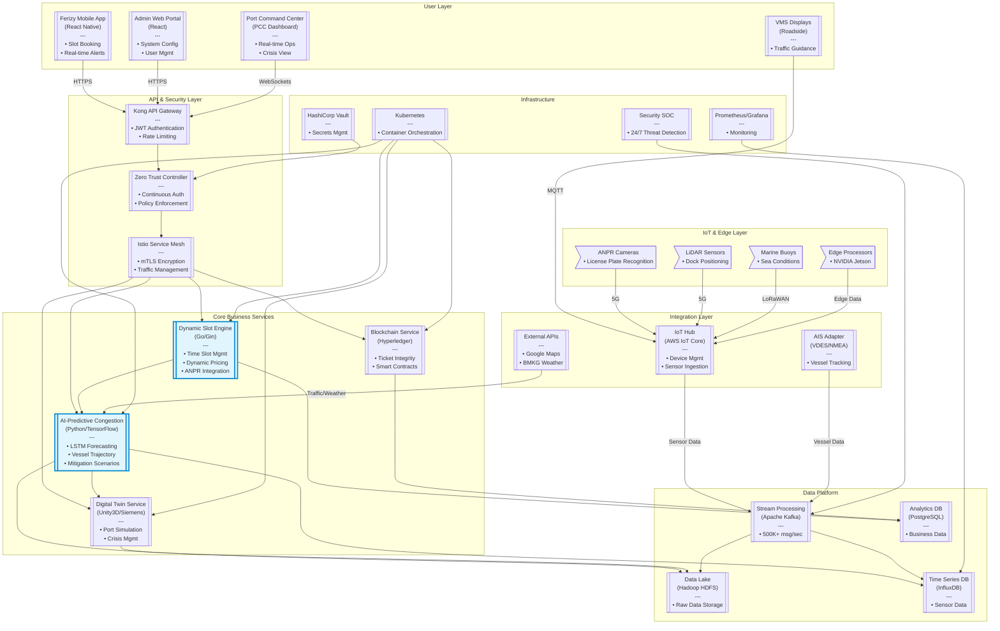
```mermaid
graph TD
    %% =====================
    %% User Interaction Layer
    %% =====================
    U1[["Ferizy Mobile App
    (React Native)
    ---
    • Slot Booking
    • Real-time Alerts"]]
    
    U2[["Admin Web Portal
    (React)
    ---
    • System Config
    • User Mgmt"]]
    
    U3[["Port Command Center
    (PCC Dashboard)
    ---
    • Real-time Ops
    • Crisis View"]]
    
    U4[["VMS Displays
    (Roadside)
    ---
    • Traffic Guidance"]]
    
    subgraph User_Layer["User Layer"]
        U1
        U2
        U3
        U4
    end
    
    %% =====================
    %% API & Security Layer
    %% =====================
    G1[["Kong API Gateway
    ---
    • JWT Authentication
    • Rate Limiting"]]
    
    G2[["Istio Service Mesh
    ---
    • mTLS Encryption
    • Traffic Management"]]
    
    S1[["Zero Trust Controller
    ---
    • Continuous Auth
    • Policy Enforcement"]]
    
    subgraph API_Security["API & Security Layer"]
        G1
        G2
        S1
    end
    
    %% =====================
    %% Core Business Services
    %% =====================
    B1[["Dynamic Slot Engine
    (Go/Gin)
    ---
    • Time Slot Mgmt
    • Dynamic Pricing
    • ANPR Integration"]]
    
    B2[["AI-Predictive Congestion
    (Python/TensorFlow)
    ---
    • LSTM Forecasting
    • Vessel Trajectory
    • Mitigation Scenarios"]]
    
    B3[["Blockchain Service
    (Hyperledger)
    ---
    • Ticket Integrity
    • Smart Contracts"]]
    
    B4[["Digital Twin Service
    (Unity3D/Siemens)
    ---
    • Port Simulation
    • Crisis Mgmt"]]
    
    subgraph Core_Services["Core Business Services"]
        B1
        B2
        B3
        B4
    end
    
    %% =====================
    %% Data & Event Platform
    %% =====================
    D1[["Data Lake
    (Hadoop HDFS)
    ---
    • Raw Data Storage"]]
    
    D2[["Stream Processing
    (Apache Kafka)
    ---
    • 500K+ msg/sec"]]
    
    D3[["Time Series DB
    (InfluxDB)
    ---
    • Sensor Data"]]
    
    D4[["Analytics DB
    (PostgreSQL)
    ---
    • Business Data"]]
    
    subgraph Data_Platform["Data Platform"]
        D1
        D2
        D3
        D4
    end
    
    %% =====================
    %% Integration Layer
    %% =====================
    I1[["IoT Hub
    (AWS IoT Core)
    ---
    • Device Mgmt
    • Sensor Ingestion"]]
    
    I2[["AIS Adapter
    (VDES/NMEA)
    ---
    • Vessel Tracking"]]
    
    I3[["External APIs
    ---
    • Google Maps
    • BMKG Weather"]]
    
    subgraph Integration_Layer["Integration Layer"]
        I1
        I2
        I3
    end
    
    %% =====================
    %% IoT & Edge Layer
    %% =====================
    H1>"ANPR Cameras
    • License Plate Recognition"]
    
    H2>"LiDAR Sensors
    • Dock Positioning"]
    
    H3>"Marine Buoys
    • Sea Conditions"]
    
    H4>"Edge Processors
    • NVIDIA Jetson"]
    
    subgraph IoT_Edge["IoT & Edge Layer"]
        H1
        H2
        H3
        H4
    end
    
    %% =====================
    %% Infrastructure
    %% =====================
    Inf1[["Kubernetes
    ---
    • Container Orchestration"]]
    
    Inf2[["Prometheus/Grafana
    ---
    • Monitoring"]]
    
    Inf3[["HashiCorp Vault
    ---
    • Secrets Mgmt"]]
    
    Inf4[["Security SOC
    ---
    • 24/7 Threat Detection"]]
    
    subgraph Infrastructure["Infrastructure"]
        Inf1
        Inf2
        Inf3
        Inf4
    end

    %% =====================
    %% Data Flows
    %% =====================
    %% User to Gateway
    U1 -->|HTTPS| G1
    U2 -->|HTTPS| G1
    U3 -->|WebSockets| G1
    U4 -->|MQTT| I1
    
    %% Security Enforcement
    G1 --> S1
    S1 --> G2
    
    %% Gateway to Services
    G2 --> B1
    G2 --> B2
    G2 --> B3
    G2 --> B4
    
    %% Service to Service
    B1 --> B2
    B2 --> B4
    
    %% Services to Data Platform
    B1 --> D4
    B2 --> D1
    B2 --> D3
    B3 --> D4
    B4 --> D1
    
    %% Integration Points
    I1 -->|Sensor Data| D2
    I2 -->|Vessel Data| D2
    I3 -->|Traffic/Weather| B2
    
    %% IoT to Integration
    H1 -->|5G| I1
    H2 -->|5G| I1
    H3 -->|LoRaWAN| I1
    H4 -->|Edge Data| I1
    
    %% Data Platform Internal
    D2 --> D1
    D2 --> D3
    
    %% Infrastructure Connections
    Inf1 --> B1
    Inf1 --> B2
    Inf1 --> B3
    Inf1 --> B4
    Inf2 --> D3
    Inf3 --> S1
    Inf4 --> D2
    
    %% Highlight Key Components
    classDef coreService fill:#e1f5fe,stroke:#0288d1,stroke-width:3px
    class B1,B2 coreService
```

----

```mermaid
graph TD
    %% Define Layers/Groups for cleaner connections
    subgraph Frontend_Layer["Frontend Layer"]
        direction TB
        subgraph "Mobile Applications"
            RN[React Native<br/>🍎 iOS & 📱 Android<br/>- Ferizy Super App<br/>- Slot Booking<br/>- Real-time Tracking]
        end
        
        subgraph "Web Applications"
            REACT[React/Angular<br/>🌐 Web Dashboard<br/>- Port Command Center<br/>- Administrative Portal]
        end
        
        subgraph "Display Systems"
            SMART[Smart Displays<br/>📺 Digital Signage<br/>- VMS on Roads<br/>- Queue Status]
        end
    end

    subgraph API_Gateway_Layer["API & Gateway Layer"]
        subgraph "API Gateway"
            KONG[Kong API Gateway<br/>⚡ Rate Limiting<br/>🔐 Authentication<br/>🔄 Load Balancing]
        end
        
        subgraph "Service Mesh"
            ISTIO[Istio Service Mesh<br/>🔒 mTLS Security<br/>📈 Observability<br/>🚦 Traffic Management]
        end
    end

    subgraph Backend_Services_Layer["Backend Services Layer"]
        direction TB
        subgraph "Core Services (Go/Golang)"
            GO_DSM[Dynamic Slot Management<br/>🎯 Go + Gin Framework]
            GO_ORCH[Orchestration Service<br/>⚙️ Go + gRPC]
        end
        
        subgraph "AI/ML Services (Python)"
            PY_AI[AI Congestion Control<br/>🧠 Python + FastAPI]
            PY_TWIN[Digital Twin Engine<br/>🌐 Python + Unity Connector]
            PY_ML[ML Pipeline Service<br/>🔬 Python + MLflow Lib]
            MLFLOW[MLflow Registry<br/>📦 Model Versioning & Serving]
        end
        
        subgraph "Real-time Services (Node.js)"
            NODE_RT[Real-time API Service<br/>⚡ Node.js + WebSocket]
            NODE_DASH[Dashboard Service_BFF<br/>📊 Node.js + Socket.io]
        end
        
        subgraph "Blockchain Services"
            HYPER[Hyperledger Fabric<br/>⛓️ Smart Contracts_Chaincode]
        end
    end

    subgraph Integration_Layer["Integration & Event Processing"]
        direction TB
        subgraph "Message Streaming"
            KAFKA[Apache Kafka<br/>📨 Event Streaming<br/>🚀 500K+ msg/sec]
        end
        
        subgraph "Workflow & Task Management"
            TEMPORAL[Temporal.io<br/>⏱️ Workflow Engine]
            RABBIT[RabbitMQ<br/>🐰 Task Queues]
        end
    end

    subgraph Data_Processing_Layer["Data Processing & Analytics"]
        direction TB
        subgraph "Stream & Batch Processing"
            SPARK[Apache Spark<br/>⚡ Stream Processing & Cleaning]
            AIRFLOW[Apache Airflow<br/>📅 ETL & Batch Orchestration]
        end
    end

    subgraph Database_Layer["Database Layer"]
        direction TB
        subgraph "Operational Databases"
            POSTGRES[PostgreSQL<br/>🗃️ OLTP Business Data]
        end
        
        subgraph "Time Series Databases"
            TIMESCALE[TimescaleDB<br/>⏰ IoT & Vessel Tracking]
            INFLUX[InfluxDB<br/>📊 Real-time System Metrics]
        end
        
        subgraph "Document & Graph"
            MONGO[MongoDB<br/>📄 Logs & Configurations]
            NEO4J[Neo4j<br/>🕸️ Route & Supply Chain]
        end
        
        subgraph "Caching & Data Lake"
            REDIS[Redis<br/>⚡ In-Memory Cache]
            HADOOP[Hadoop HDFS<br/>🏔️ Data Lake_2.8TB+/Day]
        end
    end

    subgraph Infrastructure_Layer["Infrastructure & DevOps"]
        direction TB
        subgraph "Runtime & Orchestration"
            K8S[Kubernetes<br/>🐳 Container Orchestration]
        end
        
        subgraph "Observability"
            PROMETHEUS[Prometheus<br/>📊 Metrics Collection]
            GRAFANA[Grafana<br/>📈 Visualization]
            ELK[ELK Stack<br/>📝 Log Management]
        end
        
        subgraph "Security & CI/CD"
            VAULT[HashiCorp Vault<br/>🔐 Secret Management]
            CICD[CI/CD Pipeline<br/>🚀 Jenkins / GitLab CI / ArgoCD]
        end
    end

    %% DATA & COMMAND FLOWS

    %% User Interaction Flow
    RN --> KONG
    REACT --> KONG
    SMART --> NODE_RT

    %% Gateway & Service Mesh Flow
    KONG --> ISTIO
    ISTIO --> GO_DSM
    ISTIO --> GO_ORCH
    ISTIO --> PY_AI
    ISTIO --> PY_TWIN
    ISTIO --> NODE_RT
    ISTIO --> NODE_DASH
    ISTIO --> HYPER

    %% Backend to Integration Layer
    GO_DSM -- Events --> KAFKA
    PY_AI -- Predictions --> KAFKA
    NODE_RT -- Real-time Events --> KAFKA

    %% Event Processing Flow
    KAFKA --> SPARK
    KAFKA -- Triggers Workflow --> TEMPORAL
    KAFKA -- Triggers Task --> RABBIT
    AIRFLOW -- Triggers Batch Job --> SPARK

    %% Backend to Database/Cache
    GO_DSM --> POSTGRES & REDIS
    GO_ORCH --> POSTGRES
    PY_AI --> TIMESCALE & INFLUX
    NODE_DASH --> MONGO & REDIS
    HYPER -- State DB --> POSTGRES
    PY_TWIN --> MONGO & HADOOP

    %% MLOps Loop
    HADOOP -- Training Data --> PY_ML
    PY_ML -- Stores Model --> MLFLOW
    PY_AI -- Fetches Model --> MLFLOW
    
    %% Data Processing to Data Lake & Graph DB
    SPARK -- Processed Data --> HADOOP
    AIRFLOW -- ETL Results --> NEO4J & HADOOP
    
    %% CONCEPTUAL & INFRASTRUCTURE FLOWS
    
    %% Backend services are deployed on Kubernetes
    K8S -- Deploys & Manages --> Backend_Services_Layer

    %% Observability: Services send metrics and logs
    Backend_Services_Layer -.->|Metrics & Logs| PROMETHEUS
    Backend_Services_Layer -.->|Logs| ELK
    PROMETHEUS --> GRAFANA
    ELK --> GRAFANA
    
    %% Security: Services fetch secrets from Vault
    Backend_Services_Layer -.->|Fetches Secrets| VAULT
    
    %% CI/CD: Pipeline builds and deploys services
    CICD -.->|Builds & Deploys to| K8S

    %% STYLING
    classDef frontendTech fill:#e1f5fe,stroke:#0277bd,stroke-width:2px
    classDef backendTech fill:#e8f5e8,stroke:#2e7d32,stroke-width:2px
    classDef dataProcessTech fill:#fffde7,stroke:#fbc02d,stroke-width:2px
    classDef dataTech fill:#f3e5f5,stroke:#7b1fa2,stroke-width:2px
    classDef infraTech fill:#fff3e0,stroke:#ef6c00,stroke-width:2px
    classDef primaryIntegration fill:#ffebee,stroke:#c62828,stroke-width:3px
    
    class RN,REACT,SMART frontendTech
    class GO_DSM,GO_ORCH,PY_AI,PY_ML,PY_TWIN,MLFLOW,NODE_RT,NODE_DASH,HYPER backendTech
    class SPARK,AIRFLOW dataProcessTech
    class POSTGRES,TIMESCALE,REDIS,HADOOP,MONGO,NEO4J,INFLUX dataTech
    class K8S,PROMETHEUS,GRAFANA,ELK,VAULT,CICD infraTech
    class KONG,ISTIO,KAFKA primaryIntegration
```

----

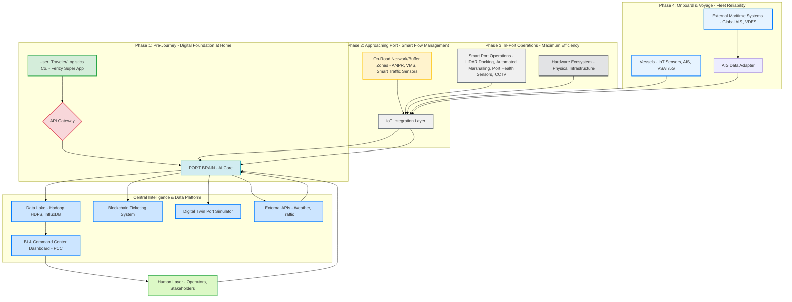
```mermaid
graph TD
    subgraph "Phase 1: Pre-Journey - Digital Foundation at Home"
        A[User: Traveler/Logistics Co. - Ferizy Super App] --> B{API Gateway}
        B --> C[PORT BRAIN - AI Core]
    end

    subgraph "Phase 2: Approaching Port - Smart Flow Management"
        D[On-Road Network/Buffer Zones - ANPR, VMS, Smart Traffic Sensors] --> E[IoT Integration Layer]
        E --> C
    end

    subgraph "Phase 3: In-Port Operations - Maximum Efficiency"
        F[Smart Port Operations - LiDAR Docking, Automated Marshalling, Port Health Sensors, CCTV] --> E
        G[Hardware Ecosystem - Physical Infrastructure] --> E
        E --> C
    end

    subgraph "Phase 4: Onboard & Voyage - Fleet Reliability"
        H[Vessels - IoT Sensors, AIS, VSAT/5G] --> E
        I[External Maritime Systems - Global AIS, VDES] --> D_AIS[AIS Data Adapter]
        D_AIS --> E
    end

    subgraph "Central Intelligence & Data Platform"
        C --> J[Data Lake - Hadoop HDFS, InfluxDB]
        J --> K[BI & Command Center Dashboard - PCC]
        C --> L[Blockchain Ticketing System]
        C --> M[Digital Twin Port Simulator]
        C --> N[External APIs - Weather, Traffic]
        N --> C
    end

    K --> O[Human Layer - Operators, Stakeholders]
    O --> C

    style A fill:#D4EDDA,stroke:#28A745,stroke-width:2px
    style B fill:#F8D7DA,stroke:#DC3545,stroke-width:2px
    style C fill:#D1ECF1,stroke:#17A2B8,stroke-width:2px
    style D fill:#FFF3CD,stroke:#FFC107,stroke-width:2px
    style E fill:#F0F0F0,stroke:#6C757D,stroke-width:2px
    style F fill:#F0F0F0,stroke:#6C757D,stroke-width:2px
    style G fill:#E2E3E5,stroke:#343A40,stroke-width:2px
    style H fill:#E6F3FF,stroke:#007BFF,stroke-width:2px
    style I fill:#E6F3FF,stroke:#007BFF,stroke-width:2px
    style J fill:#CCE5FF,stroke:#007BFF,stroke-width:2px
    style K fill:#CCE5FF,stroke:#007BFF,stroke-width:2px
    style L fill:#CCE5FF,stroke:#007BFF,stroke-width:2px
    style M fill:#CCE5FF,stroke:#007BFF,stroke-width:2px
    style N fill:#CCE5FF,stroke:#007BFF,stroke-width:2px
    style O fill:#DCF8C6,stroke:#28A745,stroke-width:2px

    linkStyle 0 stroke:#000,stroke-width:1px,fill:none;
    linkStyle 1 stroke:#000,stroke-width:1px,fill:none;
    linkStyle 2 stroke:#000,stroke-width:1px,fill:none;
    linkStyle 3 stroke:#000,stroke-width:1px,fill:none;
    linkStyle 4 stroke:#000,stroke-width:1px,fill:none;
    linkStyle 5 stroke:#000,stroke-width:1px,fill:none;
    linkStyle 6 stroke:#000,stroke-width:1px,fill:none;
    linkStyle 7 stroke:#000,stroke-width:1px,fill:none;
    linkStyle 8 stroke:#000,stroke-width:1px,fill:none;
    linkStyle 9 stroke:#000,stroke-width:1px,fill:none;
    linkStyle 10 stroke:#000,stroke-width:1px,fill:none;
    linkStyle 11 stroke:#000,stroke-width:1px,fill:none;
    linkStyle 12 stroke:#000,stroke-width:1px,fill:none;
    linkStyle 13 stroke:#000,stroke-width:1px,fill:none;
    linkStyle 14 stroke:#000,stroke-width:1px,fill:none;
    linkStyle 15 stroke:#000,stroke-width:1px,fill:none;
    linkStyle 16 stroke:#000,stroke-width:1px,fill:none;
    linkStyle 17 stroke:#000,stroke-width:1px,fill:none;
```

---

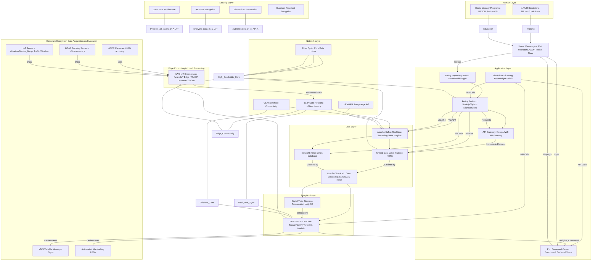
```mermaid
graph TD
    %% User Layer
    U[Users: Passengers, Port Operators, ASDP, Police, Navy]

    %% Hardware Ecosystem Layer
    subgraph Hardware Ecosystem Data Acquisition and Actuation
        H1[ANPR Cameras: ≥98% accuracy]
        H2[LiDAR Docking Sensors: ±2cm accuracy]
        H3[IoT Sensors: Vibration,Marine_Buoys,Traffic,Weather]
        H4[VMS Variable Message Signs]
        H5[Automated Marshalling LEDs]
    end

    %% Edge Computing Layer
    subgraph Edge Computing in Local Processing
        EC[AWS IoT Greengrass / Azure IoT Edge / NVIDIA Jetson AGX Orin]
    end

    %% Network Layer (Connectivity Backbone)
    subgraph Network Layer
        N1[5G Private Network: <10ms latency]
        N2[VSAT: Offshore Connectivity]
        N3[Fiber Optic: Core Data Links]
        N4[LoRaWAN: Long-range IoT]
    end

    %% Data Layer (Ingestion & Storage)
    subgraph Data Layer
        D1[Apache Kafka: Real-time Streaming 500K msg/sec]
        D2[Unified Data Lake: Hadoop HDFS]
        D3[InfluxDB: Time-series Database]
        D4[Apache Spark ML: Data Cleansing 15-30% AIS noise]
    end

    %% Analytics Layer (AI & Simulation)
    subgraph Analytics Layer
        A1[PORT BRAIN AI Core: TensorFlow/PyTorch ML Models]
        A2[Digital Twin: Siemens Tecnomatix / Unity 3D]
    end

    %% Application Layer (User-Facing & Orchestration)
    subgraph Application Layer
        AP1[Ferizy Super App: React Native MobileApps]
        AP2[Ferizy Backend: Node.js/Python Microservices]
        AP3[Port Command Center Dashboard: Grafana/Kibana]
        AP4[API Gateway: Kong / AWS API Gateway]
        AP5[Blockchain Ticketing: Hyperledger Fabric]
    end

    %% Security Layer (Cross-Cutting Protection)
    subgraph Security Layer
        S1[Zero Trust Architecture]
        S2[AES-256 Encryption]
        S3[Biometric Authentication]
        S4[Quantum-Resistant Encryption]
    end

    %% Human Layer (Training & Adoption)
    subgraph Human Layer
        HM1[AR/VR Simulators: Microsoft HoloLens]
        HM2[Digital Literacy Programs: BPSDM Partnership]
    end

    %% Flow of Data and Interaction
    U -- Interact --> AP1
    AP1 <--> AP2
    AP2 <--> AP4
    AP2 -- Via AP4 --> D1
    H1 -- Data --> EC
    H2 -- Data --> EC
    H3 -- Data --> EC
    EC -- Processed Data --> N1
    N1 --> D1
    N2 --> D1
    N4 --> D1

    D1 --> D2
    D1 --> D3
    D2 -- Cleaned by --> D4
    D3 -- Cleaned by --> D4
    D4 --> A1
    D4 --> A2

    AP4 -- Immutable Records --> D2

    AP2 -- Requests --> AP4
    AP2 -- Via AP4 --> D1
    AP2 -- Via AP4 --> D2
    AP2 -- Via AP4 --> D3

    AP5 -- API Calls --> AP2
    AP5 -- API Calls --> A1
    AP5 -- API Calls --> AP3

    A1 -- Insights, Commands --> AP3
    A1 -- Orchestrates --> H4
    A1 -- Orchestrates --> H5
    A2 -- Simulations --> A1
    AP3 -- Displays --> U
    U -- Input --> AP3

    %% Cross-Layer Interactions and Dependencies
    N1 --- Real_time_Sync --- A1
    N1 --- Edge_Connectivity --- EC
    N2 --- Offshore_Data --- A1
    N3 --- High_Bandwidth_Core --- D2
    N3 --- High_Bandwidth_Core --- A1
    N3 --- High_Bandwidth_Core --- AP2

    S1 --- Protects_all_layers_D_A_AP
    S2 --- Encrypts_data_in_D_AP
    S3 --- Authenticates_U_to_AP_A

    HM1 --- Training --> U
    HM2 --- Education --> U
```