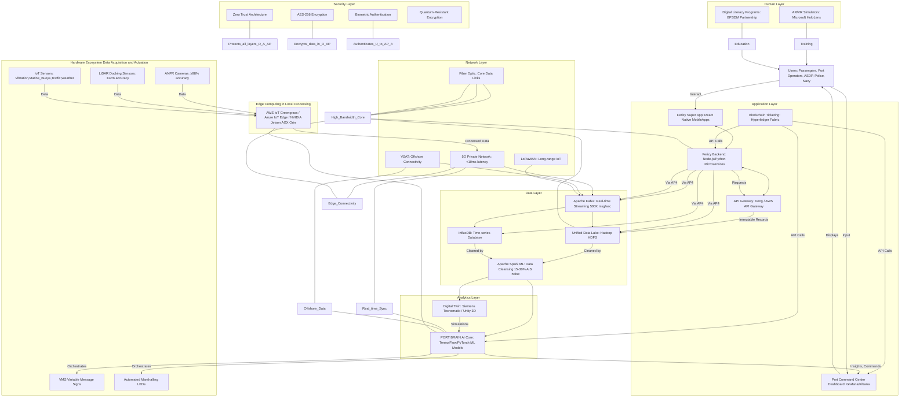

---

```mermaid
```

---


---

```mermaid
```

---


---

```mermaid
```

---


---

```mermaid
```

---


---

```mermaid
```

---


---

```mermaid
```

---


---

```mermaid
```

---


---

```mermaid
```

---


---

```mermaid
```

---


---

```mermaid
```

---


---

```mermaid
```

---


---

```mermaid
```

---


---

```mermaid
```

---


---

```mermaid
```

---


---

```mermaid
```

---


---

```mermaid
```

---


---

```mermaid
```

---


---

```mermaid
```

---


---

```mermaid
```

---


---

```mermaid
```

---


---

```mermaid
```

---


---

```mermaid
```

---


---

```mermaid
```

---


---

```mermaid
```

---


---

```mermaid
```

---


---

```mermaid
```

---


---

```mermaid
```

---


---

```mermaid
```

---


---

```mermaid
```

---

