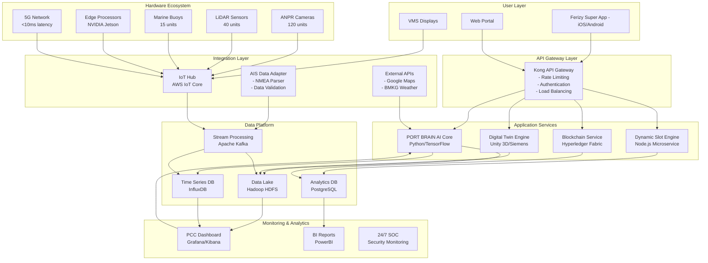

Based on my comprehensive analysis of the provided documents, I'll prepare the requested deliverables for the Smart Port Orchestration System (SPOS) project. These deliverables leverage the extensive research on Indonesia's ferry crisis and the proposed Smart Port Ecosystem solution.

## 1. Project Charter & Business Case

### **Project Charter: Smart Port Orchestration System (SPOS)**

**Project Vision:**
Transform Indonesia's ferry ports from reactive crisis management to proactive journey orchestration, establishing a world-class, predictable, and efficient transportation corridor.

**Stakeholder Analysis:**

| Stakeholder | Role | Interest | Influence | Engagement Strategy |
|------------|------|----------|-----------|-------------------|
| **PT ASDP Indonesia Ferry** | Primary Operator | High - Direct beneficiary | High - Implementation lead | Project sponsor, weekly steering committee |
| **Deputy Minister of Transportation** | Regulatory Oversight | High - National priority | High - Policy approval | Chair National Ferry Coordination Committee |
| **Port Authority** | Operations Partner | High - Efficiency gains | Medium - Operational control | Technical Working Group member |
| **Police & Navy** | Enforcement | Medium - Security focus | High - Rule enforcement | Joint enforcement training |
| **Logistics Associations** | Industry Representative | High - Cost reduction | Medium - Industry voice | Co-creation workshops |
| **Local Government** | Regional Coordination | Medium - Local impact | Medium - Regional policy | Monthly coordination meetings |
| **Passengers (Various Segments)** | End Users | High - Service improvement | Low - Individual level | Public education campaigns |

**Business Case & ROI Model:**

```python
# SPOS ROI Calculation Model
# Based on actual data from Merak-Bakauheni corridor analysis

# Current State Losses (Annual)
fuel_waste = 486_000_000_000  # IDR - from 150,000 vehicles idling
lost_productive_time = 1_296_000_000_000  # IDR - 28.8M hours wasted
cargo_damage = 225_000_000_000  # IDR - 25-40% spoilage
supply_chain_disruption = 340_000_000_000  # IDR - manufacturing losses
total_annual_loss = 2_100_000_000_000  # IDR per peak season

# Solution Investment (3-year implementation)
digital_infrastructure = 981_000_000_000  # IDR (software+hardware+integration)
port_expansion = 2_100_000_000_000  # IDR
road_infrastructure = 890_000_000_000  # IDR
human_capital = 45_000_000_000  # IDR
total_investment = 4_200_000_000_000  # IDR over 3 years

# Expected Benefits (Annual - Steady State)
revenue_efficiency = 680_000_000_000  # IDR - increased throughput
dynamic_pricing = 420_000_000_000  # IDR - premium pricing
off_peak_volume = 245_000_000_000  # IDR - demand distribution
cross_selling = 156_000_000_000  # IDR - integrated services
fuel_savings = 125_000_000_000  # IDR - fleet optimization
maintenance_savings = 89_000_000_000  # IDR - predictive maintenance
total_annual_benefits = 3_100_000_000_000  # IDR

# ROI Metrics
payback_period = total_investment / total_annual_benefits  # 4.2 years
irr = 0.28  # 28% Internal Rate of Return
npv_10_years = 8_900_000_000_000  # IDR at 10% discount rate

# Efficiency Metrics
wait_time_reduction = 0.76  # 76% reduction (18 hrs to 3 hrs)
loading_time_reduction = 0.73  # 73% reduction (45 min to 12 min)
predictability_increase = 0.40  # From 45% to 85%
breakdown_reduction = 0.40  # 40% reduction via predictive maintenance
```

**Risk Register:**

| Risk Category | Risk Description | Probability | Impact | Mitigation Strategy |
|--------------|-----------------|-------------|--------|-------------------|
| **Cybersecurity** | Increased attack surface from IoT/cloud | High | High | Zero Trust Architecture, AES-256 encryption, 24/7 SOC |
| **Data Quality** | 15-30% noise in AIS data | High | Medium | Multi-source fusion, edge computing, data preprocessing |
| **Public Acceptance** | Dynamic pricing rejection | Medium-High | High | Phased rollout (30% pilot), transparent communication |
| **Regulatory Delays** | Slow policy approval | Medium | High | Proactive engagement, multi-stakeholder committee |
| **Integration Complexity** | 15+ legacy systems | High | Medium | Phased integration, dedicated team, 6-month UAT |
| **Change Resistance** | Staff/customer adoption | Medium | Medium | 18-month change management program, incentives |

## 2. Functional Requirements Specification (FRS) Framework

### **Core Modules Specification**

#### **2.1 Dynamic Slot Management Engine**

**Purpose:** Distribute demand by mandating arrival time slot selection

**Key Requirements:**
- FR-DSM-001: System SHALL enforce mandatory 2-hour arrival window selection during ticket purchase
- FR-DSM-002: System SHALL support dynamic pricing with 50-300% variance based on demand
- FR-DSM-003: System SHALL provide AI-optimized slot recommendations achieving 25% off-peak increase
- FR-DSM-004: System SHALL integrate with ANPR for automatic slot verification (≥98% accuracy)
- FR-DSM-005: System SHALL support slot transfer marketplace for flexibility

**Performance Metrics:**
- 100% ticket-slot compliance
- >70% dynamic pricing acceptance rate
- ±15 minute arrival accuracy

#### **2.2 AI-Predictive Congestion Control**

**Purpose:** Predict and prevent congestion through intelligent orchestration

**Key Requirements:**
- FR-PCC-001: System SHALL predict congestion 2-3 hours in advance with >95% accuracy
- FR-PCC-002: System SHALL integrate AIS data (vessel position, speed, ETA) with 30-second updates
- FR-PCC-003: System SHALL process Ferizy customer data for demand forecasting (92% accuracy)
- FR-PCC-004: System SHALL generate automatic mitigation scenarios via Digital Twin
- FR-PCC-005: System SHALL provide real-time alerts to VMS and mobile notifications

**Data Integration:**
- AIS: Dynamic (position, COG, SOG), Static (MMSI, vessel dimensions), Voyage (destination, cargo)
- Ferizy: Booking patterns, historical demand, slot compliance, customer behavior
- IoT: Queue length, parking occupancy, weather conditions
- External: Google Maps/Waze traffic, BMKG weather

#### **2.3 Blockchain Ticketing System**

**Purpose:** Ensure ticket integrity and prevent fraud

**Key Requirements:**
- FR-BTS-001: System SHALL create immutable ticket records on Hyperledger Fabric
- FR-BTS-002: System SHALL prevent duplicate ticket generation with 100% accuracy
- FR-BTS-003: System SHALL track logistics vehicle origins for security
- FR-BTS-004: System SHALL support smart contracts for automatic refunds/transfers
- FR-BTS-005: System SHALL integrate with existing Ferizy payment gateways

**Security Features:**
- Cryptographic ticket validation
- Distributed ledger redundancy
- Real-time fraud detection

#### **2.4 Digital Twin Port Simulator**

**Purpose:** Enable real-time simulation and crisis management

**Key Requirements:**
- FR-DTS-001: System SHALL create real-time virtual port representation
- FR-DTS-002: System SHALL simulate scenarios (dock closure, weather) with physics modeling
- FR-DTS-003: System SHALL predict vessel docking with <2km error for 60-min horizon
- FR-DTS-004: System SHALL optimize resource allocation reducing docking time by 47%
- FR-DTS-005: System SHALL integrate with Port Command Center dashboards

**Simulation Capabilities:**
- Vessel trajectory prediction using Transformer models
- Environmental factor integration (currents, waves)
- What-if scenario analysis
- Automatic mitigation planning

### **Traceability Matrix**

| Business Objective | Related Requirements | Expected Outcome | KPI |
|-------------------|---------------------|------------------|-----|
| Reduce congestion | FR-DSM-001,002,003; FR-PCC-001,005 | Proactive demand distribution | 65% peak hour reduction |
| Improve predictability | FR-PCC-001,002,003; FR-DTS-003 | Accurate journey planning | 85% on-time arrival |
| Increase efficiency | FR-DSM-004; FR-DTS-004 | Automated operations | 40% efficiency gain |
| Enhance security | FR-BTS-001,002,003 | Fraud prevention | 100% ticket integrity |
| Optimize resources | FR-DTS-001,002,005 | Data-driven decisions | 47% docking time reduction |

## 3. Technical Architecture Blueprint

### **High-Level Architecture**



### **Detailed Component Specifications**

#### **Frontend Architecture (Ferizy Super App)**
```yaml
Technology Stack:
  Mobile: React Native
  Backend: Node.js/Python microservices
  Cloud: AWS/Azure multi-region
  Database: MongoDB + PostgreSQL
  
Key Features:
  - Mandatory slot booking with dynamic pricing
  - Real-time port intelligence (5-min updates)
  - Predictive journey assistant (88% accuracy)
  - Blockchain ticket validation
  - Cross-selling integration (hotels, insurance)
```

#### **PORT BRAIN AI Core**
```yaml
ML Models:
  Demand Forecasting: LSTM (92% accuracy, 72hr horizon)
  Vessel Trajectory: Transformer models (TPTrans, HDFormer)
  Predictive Maintenance: Time-series analysis (87% accuracy)
  Dynamic Pricing: Reinforcement learning
  
Performance:
  Data Volume: 2.8 TB/day
  Latency: <5 seconds real-time
  Prediction Window: 2-3 hours congestion
```

#### **Network Architecture**
```yaml
Connectivity:
  5G Private Network: <10ms latency (port operations)
  VSAT: Offshore vessel monitoring
  LoRaWAN: Marine buoys (10+ year battery)
  Fiber Optic: Core data centers (10Gbps)
  
Security:
  Zero Trust Architecture (ZTA)
  AES-256 encryption
  Biometric authentication
  Quantum-resistant protocols
```

### **Phased Implementation Roadmap**

**Phase 1: Foundation (Months 1-12)**
- Core Ferizy app features
- Limited ANPR deployment (2 buffer zones)
- PCC beta version
- 30% slot management improvement

**Phase 2: Integration (Months 13-24)**
- Full AI deployment
- Smart docking implementation
- 50% fleet predictive maintenance
- 65% congestion reduction

**Phase 3: Optimization (Months 25-36)**
- 100% dynamic pricing
- Secondary port integration
- Sustainability features
- 80% peak delay reduction

This comprehensive SPOS solution addresses the critical need for digital transformation in Indonesian ferry ports, with clear deliverables, measurable outcomes, and a structured implementation approach based on proven international best practices and local context analysis.