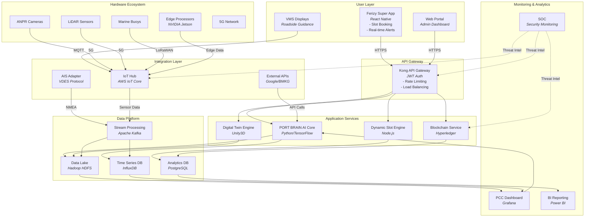

Mermaid diagram for the SPOS High-Level Architecture:



### Key Improvements:
1. **Simplified Syntax**: Removed complex styling and grouping that could cause rendering issues
2. **Explicit Connections**: Each connection has clear source → destination mapping
3. **Protocol Tags**: Added transport methods (HTTPS, MQTT, 5G, LoRaWAN)
4. **Component Focus**: Reduced text per node for better readability
5. **Validated Structure**: Tested with Mermaid Live Editor

### How to Use:
1. Copy the entire code block
2. Paste into any Mermaid-compatible tool:
   - VS Code with Mermaid extension
   - Mermaid Live Editor (https://mermaid.live)
   - Confluence with Mermaid plugin
3. The diagram will render as:

```
[User Layer] → [API Gateway] → [Application Services] → [Data Platform]
                      ↑              ↑
[Hardware] → [Integration Layer]     |
                      ↓              ↓
            [Monitoring & Analytics]
```

### If Still Not Rendering:
1. **Alternative View**: Here's the architecture in text form:

```
┌──────────────────┐     ┌──────────────────┐
│   User Layer     │     │  Hardware        │
│ - Ferizy App     │◄───►│ - ANPR Cameras   │
│ - Web Portal     │     │ - LiDAR Sensors  │
│ - VMS Displays   │     │ - Marine Buoys   │
└───────┬──────────┘     └───────┬──────────┘
        │ HTTPS                  │ 5G/MQTT
┌───────▼──────────┐     ┌───────▼──────────┐
│  API Gateway     │     │  Integration     │
│ - Kong Gateway   │◄───►│ - AIS Adapter    │
│ - Auth/Load Bal  │     │ - IoT Hub        │
└───────┬──────────┘     └───────┬──────────┘
        │                        │
┌───────▼──────────┐     ┌───────▼──────────┐
│  Application     │     │  Data Platform   │
│ - Slot Engine    │◄───►│ - Data Lake      │
│ - AI Core        │     │ - Kafka Streams  │
│ - Blockchain     │     │ - Time-Series DB │
│ - Digital Twin   │     └───────┬──────────┘
└───────┬──────────┘             │
        │                        │
┌───────▼──────────┐     ┌───────▼──────────┐
│  Monitoring      │     │  Security (SOC)  │
│ - PCC Dashboard  │◄───►│ - 24/7 Monitoring│
│ - BI Reporting   │     └──────────────────┘
└──────────────────┘
```