# Smart Port Orchestration System (SPOS) - Complete Architecture Diagrams

## 1. Overall System Architecture with Microservices and Data Flow

This diagram illustrates the complete microservices architecture showing how data flows through your SPOS system, with emphasis on the Dynamic Slot Management Engine and AI-Predictive Congestion Control components.

## 2. Deployment Architecture - Infrastructure Components

This diagram shows how your SPOS components are deployed across different infrastructure layers, including cloud, edge, and on-premises components.

## 3. Technology Stack Layers - Complete Platform View

This diagram illustrates the complete technology stack from frontend to database, showing how each layer contributes to your SPOS system's capabilities.

```mermaid
graph TD
    %% Frontend Layer
    subgraph "Frontend Layer"
        subgraph "Mobile Applications"
            RN[React Native<br/>🍎 iOS & 📱 Android<br/>- Ferizy Super App<br/>- Slot Booking<br/>- Real-time Tracking]
        end
        
        subgraph "Web Applications"
            REACT[React/Angular<br/>🌐 Web Dashboard<br/>- Port Command Center<br/>- Administrative Portal<br/>- Analytics Dashboard]
        end
        
        subgraph "Display Systems"
            SMART[Smart Displays<br/>📺 Digital Signage<br/>- VMS on Roads<br/>- Port Information<br/>- Queue Status]
        end
    end

    %% API & Gateway Layer
    subgraph "API Gateway & Service Mesh"
        subgraph "API Gateway"
            KONG[Kong API Gateway<br/>⚡ Rate Limiting<br/>🔐 Authentication<br/>📊 Analytics<br/>🔄 Load Balancing]
        end
        
        subgraph "Service Mesh"
            ISTIO[Istio Service Mesh<br/>🔒 mTLS Security<br/>📈 Observability<br/>🚦 Traffic Management]
        end
    end

    %% Backend Services Layer
    subgraph "Backend Services Layer"
        subgraph "Core Services (Go/Golang)"
            GO_DSM[Dynamic Slot Management<br/>🎯 Go + Gin Framework<br/>- High Performance<br/>- Concurrent Processing<br/>- Memory Efficient]
            
            GO_ORCH[Orchestration Service<br/>⚙️ Go + gRPC<br/>- Service Coordination<br/>- Workflow Management]
        end
        
        subgraph "AI/ML Services (Python)"
            PY_AI[AI Congestion Control<br/>🧠 Python + FastAPI<br/>📊 TensorFlow/PyTorch<br/>- Predictive Analytics<br/>- Real-time Processing]
            
            PY_ML[ML Pipeline Service<br/>🔬 Python + MLflow<br/>- Model Training<br/>- Feature Engineering]
        end
        
        subgraph "Real-time Services (Node.js)"
            NODE_RT[Real-time API Service<br/>⚡ Node.js + Express<br/>🔌 WebSocket Support<br/>- Live Updates<br/>- Event Streaming]
            
            NODE_DASH[Dashboard Service<br/>📊 Node.js + Socket.io<br/>- Command Center<br/>- Live Monitoring]
        end
        
        subgraph "Blockchain Services"
            HYPER[Hyperledger Fabric<br/>⛓️ Smart Contracts<br/>🎫 Ticket Integrity<br/>📋 Audit Trail]
        end
    end

    %% Integration & Messaging Layer
    subgraph "Integration & Event Processing"
        subgraph "Message Streaming"
            KAFKA[Apache Kafka<br/>📨 Event Streaming<br/>🚀 500K+ msg/sec<br/>📊 Real-time Processing]
        end
        
        subgraph "Workflow Management"
            TEMPORAL[Temporal.io<br/>⏱️ Workflow Engine<br/>🔄 Long-running Processes<br/>🛡️ Fault Tolerance]
        end
        
        subgraph "Message Queuing"
            RABBIT[RabbitMQ<br/>🐰 Message Routing<br/>📋 Task Queues<br/>🔄 Reliable Delivery]
        end
    end

    %% Data Processing Layer
    subgraph "Data Processing & Analytics"
        subgraph "Stream Processing"
            SPARK[Apache Spark<br/>⚡ Stream Processing<br/>🔍 Real-time Analytics<br/>🧹 Data Cleaning]
        end
        
        subgraph "Batch Processing"
            AIRFLOW[Apache Airflow<br/>📅 Workflow Scheduling<br/>📊 ETL Pipelines<br/>🔄 Data Orchestration]
        end
    end

    %% Database Layer
    subgraph "Database Layer"
        subgraph "Operational Databases"
            POSTGRES[PostgreSQL<br/>🗃️ OLTP Database<br/>💼 Business Data<br/>🔄 ACID Compliance<br/>- User Management<br/>- Bookings<br/>- Financial Data]
        end
        
        subgraph "Time Series Databases"
            TIMESCALE[TimescaleDB<br/>⏰ Time Series Data<br/>📊 IoT Sensor Data<br/>📈 Performance Metrics<br/>- Vessel Tracking<br/>- Equipment Monitoring]
            
            INFLUX[InfluxDB<br/>📊 Real-time Metrics<br/>⚡ High Performance<br/>- System Monitoring<br/>- Alert Processing]
        end
        
        subgraph "Document & NoSQL"
            MONGO[MongoDB<br/>📄 Document Store<br/>🔍 Flexible Schema<br/>- Configuration Data<br/>- User Preferences<br/>- Log Data]
        end
        
        subgraph "Graph Database"
            NEO4J[Neo4j<br/>🕸️ Graph Database<br/>🗺️ Route Optimization<br/>- Supply Chain<br/>- Network Analysis]
        end
        
        subgraph "Caching Layer"
            REDIS[Redis<br/>⚡ In-Memory Cache<br/>🏃‍♂️ Session Storage<br/>📊 Real-time Data<br/>- API Responses<br/>- User Sessions<br/>- Leaderboards]
        end
        
        subgraph "Data Lake"
            HADOOP[Hadoop HDFS<br/>🏔️ Data Lake<br/>📦 2.8TB+ Daily<br/>- Historical Data<br/>- ML Training Sets<br/>- Backup Archives]
        end
    end

    %% Infrastructure Layer
    subgraph "Infrastructure & DevOps"
        subgraph "Container Orchestration"
            K8S[Kubernetes<br/>🐳 Container Orchestration<br/>📈 Auto-scaling<br/>🔄 Self-healing<br/>- Pod Management<br/>- Service Discovery<br/>- Load Balancing]
        end
        
        subgraph "Monitoring & Observability"
            PROMETHEUS[Prometheus<br/>📊 Metrics Collection<br/>⏰ Time Series DB<br/>🚨 Alerting]
            
            GRAFANA[Grafana<br/>📈 Visualization<br/>📊 Dashboards<br/>🔍 Analytics]
            
            ELK[ELK Stack<br/>📝 Log Management<br/>🔍 Search & Analytics<br/>- Elasticsearch<br/>- Logstash<br/>- Kibana]
        end
        
        subgraph "Security"
            VAULT[HashiCorp Vault<br/>🔐 Secret Management<br/>🔑 Key Rotation<br/>🛡️ Encryption]
        end
    end

    %% Connections
    RN --> KONG
    REACT --> KONG
    SMART --> NODE_RT

    KONG --> ISTIO
    ISTIO --> GO_DSM
    ISTIO --> GO_ORCH
    ISTIO --> PY_AI
    ISTIO --> PY_ML
    ISTIO --> NODE_RT
    ISTIO --> NODE_DASH
    ISTIO --> HYPER

    GO_DSM --> KAFKA
    PY_AI --> KAFKA
    NODE_RT --> KAFKA
    KAFKA --> TEMPORAL
    KAFKA --> RABBIT

    TEMPORAL --> SPARK
    RABBIT --> AIRFLOW

    GO_DSM --> POSTGRES
    GO_DSM --> REDIS
    PY_AI --> TIMESCALE
    PY_AI --> INFLUX
    NODE_RT --> REDIS
    NODE_DASH --> MONGO
    HYPER --> POSTGRES

    SPARK --> HADOOP
    AIRFLOW --> NEO4J
    
    K8S --> GO_DSM
    K8S --> PY_AI
    K8S --> NODE_RT
    
    PROMETHEUS --> GRAFANA
    ELK --> GRAFANA

    %% Styling
    classDef frontendTech fill:#e1f5fe,stroke:#0277bd,stroke-width:3px
    classDef backendTech fill:#e8f5e8,stroke:#2e7d32,stroke-width:3px
    classDef dataTech fill:#f3e5f5,stroke:#7b1fa2,stroke-width:3px
    classDef infraTech fill:#fff3e0,stroke:#ef6c00,stroke-width:3px
    classDef primaryTech fill:#ffebee,stroke:#c62828,stroke-width:4px
    
    class RN,REACT,SMART frontendTech
    class GO_DSM,PY_AI,NODE_RT,HYPER backendTech
    class POSTGRES,TIMESCALE,REDIS,HADOOP,MONGO,NEO4J,INFLUX dataTech
    class K8S,PROMETHEUS,GRAFANA,ELK,VAULT infraTech
    class KONG,KAFKA primaryTech
```

## Architecture Explanation and Key Benefits

Understanding these diagrams as interconnected views of your SPOS system reveals several critical insights for your Indonesian ferry port transformation project.

The **overall system architecture** demonstrates how the Dynamic Slot Management Engine and AI-Predictive Congestion Control work together as the heart of your system. The Dynamic Slot Management Engine handles the business-critical function of distributing ferry demand across time slots, while the AI-Predictive Congestion Control system uses machine learning to forecast traffic patterns and automatically trigger mitigation strategies. Notice how both components feed into the central Event Service Bus, enabling real-time coordination between slot allocations and congestion predictions.

The **deployment architecture** shows how your system achieves the critical requirement of handling 375% surge capacity through multiple layers of scalability. The edge computing infrastructure processes data locally at ports and buffer zones, reducing latency for time-sensitive operations. The private 5G network ensures reliable communication even during peak traffic periods, while the hybrid cloud deployment provides elastic scaling capabilities when demand surges beyond normal capacity.

The **technology stack layers** reveal why specific technology choices optimize performance for ferry operations. Go (Golang) excels at the concurrent processing required for slot management, handling thousands of simultaneous booking requests efficiently. Python provides the extensive machine learning libraries needed for congestion prediction, while Node.js delivers the real-time capabilities essential for command center dashboards and live ferry tracking.

This architectural approach directly addresses your project's unique challenges. The event-driven design ensures that when a ferry is delayed or a dock becomes unavailable, the impact cascades automatically through slot reallocations and updated congestion predictions. The microservices architecture allows you to scale individual components independently—crucial when ferry traffic can surge dramatically during Indonesian holiday periods.

The emphasis on TimescaleDB for vessel tracking data and Redis for real-time caching ensures your system maintains sub-5-second response times even during peak operations, while the comprehensive monitoring stack provides the visibility needed for 24/7 port operations.